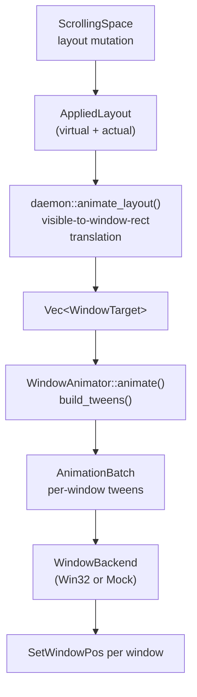
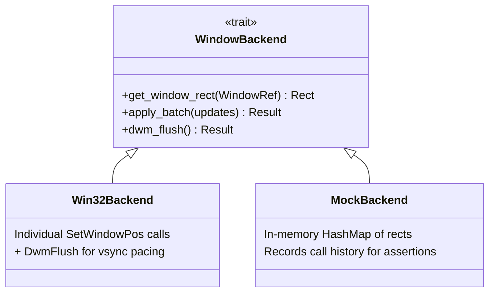

# Animation

The animation layer moves windows smoothly between layout positions. It is an
in-tree copy of a standalone `window-animation` crate, embedded directly into the
project rather than pulled as a dependency. This embedding strategy keeps the
animation code tightly coupled to the project's needs (specifically the
`InvisibleBounds` translation and the `AppliedLayout` bridge) while retaining a
clean backend abstraction for testing. See [design decisions](./design-decisions.md)
for the embedding rationale.

## Public API Surface

The animation layer exposes a small set of types through
[`src/animation/mod.rs`](../../src/animation/mod.rs):

- **`WindowAnimator`** — the main entry point. Owns a background worker thread
  that drives the frame loop. Submit animation batches with `animate()`.
- **`WindowTarget`** — desired final geometry for one window (window ref +
  target position + target size).
- **`WindowRef`** — opaque HWND wrapper (`isize` for `Send` safety).
- **`IVec2`** — 2D integer vector for positions and sizes.
- **`AnimRect`** — the animation engine's rectangle type, `{x, y, w, h}`.
- **`AnimatorConfig`** — duration, easing curves, interrupt policy, frame pacing.

The `AnimRect` type uses `{w, h}` for its size fields. This is intentionally
different from flow's `common::Rect` which uses `{width, height}`. The two types
coexist in different modules and are converted at integration boundaries. The
daemon bridge handles this conversion transparently.

## Data Flow

When a layout mutation produces an `AppliedLayout`, the daemon calls
`animate_layout()`, which converts the layout into animation targets and submits
them to the animator's worker thread.

## The Frame Loop

`WindowAnimator` spawns a dedicated worker thread at construction time. The
worker drives a continuous loop:

1. When idle, it blocks on a `crossbeam_channel` waiting for commands.
2. When an `Animate` command arrives, it builds per-window tweens (from rect,
   to rect) and enters the frame loop.
3. Each frame, it samples the normalised progress `t` from wall-clock elapsed
   time, computes the interpolated rect for each tween, and calls
   `backend.apply_batch()` to reposition the windows.
4. After applying, it calls `backend.dwm_flush()`, which blocks until the
   Desktop Window Manager completes its current composition cycle (~16ms at 60Hz).
   This is the frame-pacing mechanism: rather than a fixed `sleep` interval,
   `DwmFlush` synchronises the animation with the display refresh rate.
5. The batch is cleared only when `t` reaches exactly 1.0 — the frame that was
   applied at the precise target rect. This prevents the "resizing column width
   comes out wrong" bug where `progress()` ticks past 1.0 during the
   `SetWindowPos` round-trip and the batch is retired without ever applying
   the final frame.

Progress is clamped to `[0.0, 1.0]` and never exceeds 1.0, even if wall-clock
time far exceeds the animation duration. This invariant makes `t >= 1.0` a
precise and safe completion signal.

## Easing Functions

Position and size channels are eased independently. The animation module
([`src/animation/easing.rs`](../../src/animation/easing.rs)) provides a
comprehensive catalog of 31 named easing curves plus arbitrary CSS cubic-bezier
curves (solved via Newton-Raphson iteration):

| Category | Variants |
|----------|----------|
| Linear | `Linear` |
| Sine | `EaseInSine`, `EaseOutSine`, `EaseInOutSine` |
| Quadratic | `EaseInQuad`, `EaseOutQuad`, `EaseInOutQuad` |
| Cubic | `EaseInCubic`, `EaseOutCubic`, `EaseInOutCubic` |
| Quartic | `EaseInQuart`, `EaseOutQuart`, `EaseInOutQuart` |
| Quintic | `EaseInQuint`, `EaseOutQuint`, `EaseInOutQuint` |
| Exponential | `EaseInExpo`, `EaseOutExpo`, `EaseInOutExpo` |
| Circular | `EaseInCirc`, `EaseOutCirc`, `EaseInOutCirc` |
| Back | `EaseInBack`, `EaseOutBack`, `EaseInOutBack` |
| Elastic | `EaseInElastic`, `EaseOutElastic`, `EaseInOutElastic` |
| Bounce | `EaseInBounce`, `EaseOutBounce`, `EaseInOutBounce` |
| Custom | `CubicBezier(x1, y1, x2, y2)` |

The default config uses `EaseInOut` (maps to `EaseInOutCubic`) for position and
`Linear` for size. Position curves can be more expressive because resize-heavy
transitions look worse on Windows — window content must reflow each frame.

Size animation supports a `DisabledIfUnchanged` mode: when a window's width and
height already match the target, the size channels are skipped and the move is
treated as a pure translation. This avoids unnecessary content reflow.

## Batch Scheduling

The animation layer uses `AnimationBatch` ([`src/animation/batch.rs`](../../src/animation/batch.rs))
to manage all per-window tweens for one animation run. Key design points:

- **No-op filtering**: windows whose current rect already matches the target are
  silently excluded from the batch. This avoids wasting frames on windows that
  don't need to move.
- **Independent easing per channel**: position (x, y) and size (w, h) are eased
  with separate curves, allowing a fast position move combined with a slower
  size transition.
- **Wall-clock timing**: progress is computed from `Instant::now()` at batch
  start, not from frame counting. This makes animation duration independent of
  frame rate.

## Interrupt Policies

When a new `animate()` call arrives while an animation is already playing, the
configurable interrupt policy decides what happens:

| Policy | Behaviour |
|--------|-----------|
| `RetargetFromCurrent` (default) | Sample each window's current interpolated position, cancel the active batch, and start a new batch from those positions toward the new targets. Preserves visual continuity. |
| `QueueAfterCurrent` | Finish the current animation, then start the queued one. |
| `DropNew` | Silently discard the incoming request. |

The default `RetargetFromCurrent` policy is what enables smooth rapid-fire
operations (e.g., holding the scroll key). Each successive layout mutation
retargets windows from wherever they currently appear on screen, not from their
original position.

## The Two Backends

The `WindowBackend` trait ([`src/animation/backend/mod.rs`](../../src/animation/backend/mod.rs))
decouples the animation engine from Win32:

**`Win32Backend`** ([`src/animation/backend/win32.rs`](../../src/animation/backend/win32.rs))
uses individual `SetWindowPos` calls rather than the batch `DeferWindowPos` API.
This is a deliberate resilience choice: `DeferWindowPos` is atomic, so a single
elevated admin window (protected by UIPI) causes the entire batch to fail with
`ERROR_ACCESS_DENIED`. Individual calls mean one failure logs a warning but does
not block the remaining windows.

**`MockBackend`** ([`src/animation/backend/mock.rs`](../../src/animation/backend/mock.rs))
stores rects in a `HashMap` and records call history. Always compiled (no feature
gate) so both unit tests and integration tests can use it freely.

## The Bridge: daemon::animation

The daemon's animation bridge ([`src/daemon/animation.rs`](../../src/daemon/animation.rs))
is the integration point between the layout engine and the animation system. Its
responsibilities:

1. **Registry sync**: always calls `update_tiling_slots_from_layout()` and
   `update_tiled_rects()` on the registry, even when no windows physically moved.
   Logical positions (col/row) may change without pixel-level moves.

2. **Visible-rect to window-rect translation**: the layout engine computes
   visible rects (what the user sees), but `SetWindowPos` uses window rects
   (which include invisible borders). The bridge looks up each window's
   `InvisibleBounds` from the registry and calls `visible_to_window()` to
   translate. Without this, windows would appear with gaps larger than
   configured.

3. **Type conversion**: maps flow's `WindowId(isize)` to `WindowRef(isize)`,
   and the visible rect's `{width, height}` to `IVec2::new(width, height)`.

4. **Submit all windows**: every entry in `actual_layout` becomes a target,
   not just the ones that changed. The animator's `build_tweens` drops no-ops
   internally, but passing all windows ensures that mid-flight retargeting
   works correctly even when a window's target rect didn't change.

A standalone `animate_layout_raw()` function performs the same conversion but
takes `&mut WindowAnimator` directly. This is used during daemon construction
when `FlowWM` doesn't exist yet but the animator needs to snap
windows to their initial positions (with `Duration::ZERO` for an instant snap).

## Mid-Flight Retargeting

If a new layout arrives while a previous animation is still running, the
`RetargetFromCurrent` policy ensures smooth transitions. The worker samples
each window's current interpolated position from the active batch (using the
batch's frozen config for consistency) and starts a new batch from those
positions toward the new targets. This means rapid-fire operations like
scrolling or swapping produce continuous motion with no visible restarts.

## Cross-References

- [Layout pipeline](./layout/pipeline.md) — how `AppliedLayout` is produced by
  the mutate-then-project pipeline.
- [Event pipelines](./event-pipelines.md) — when `animate_layout` is called in
  response to hook events and IPC commands.
- [Window registry](./window-registry.md) — how `InvisibleBounds` is measured
  and stored per window.
