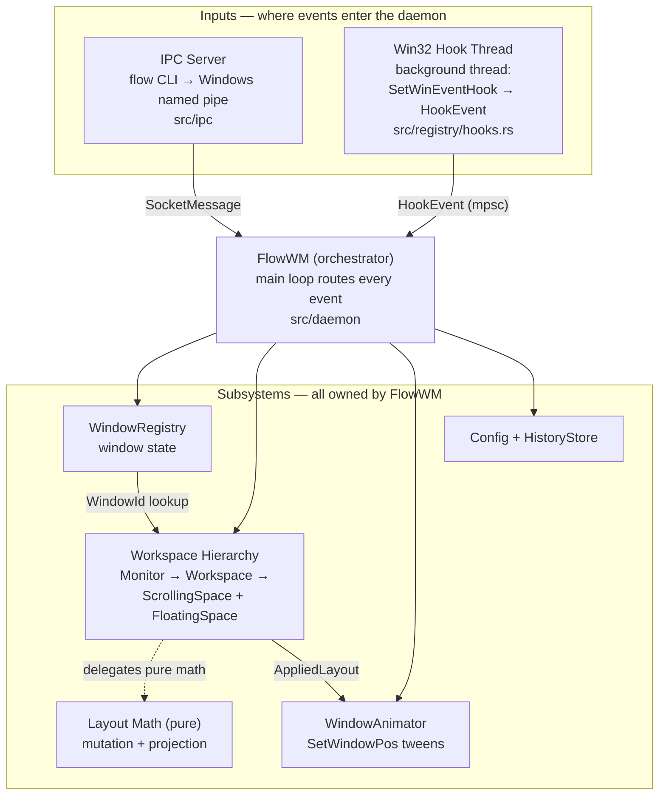
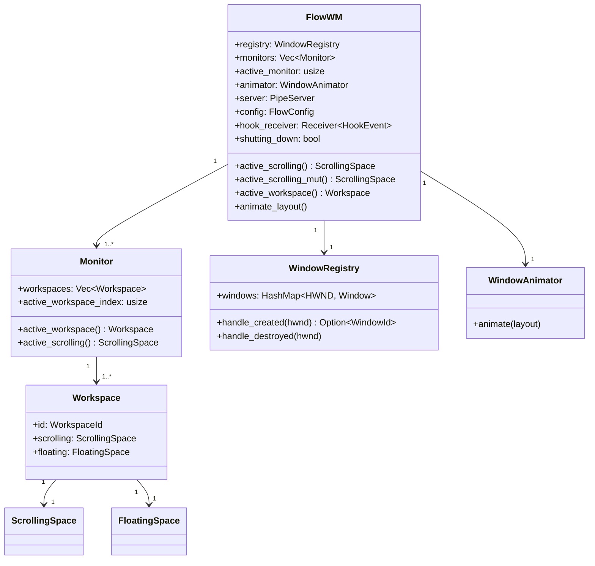

# Architecture

FlowWM (`flow`) is a tiling window manager for Windows built around an
infinite-horizontal-canvas layout model. Windows occupy columns on a virtual canvas
wider than any single monitor; the viewport slides left and right to bring them into
view. The entire system is a single Cargo package containing two binaries that share
one library crate, coordinated by a top-level orchestrator struct called
`FlowWM`.

## Binaries

| Binary | Role |
|--------|------|
| `flowd` | Background daemon — owns all state, manages windows, accepts IPC commands |
| `flow` | CLI client — sends commands to the daemon over a named pipe |

Both binaries share the library crate rooted at [`src/lib.rs`](../../src/lib.rs).
The daemon entry point is [`src/main.rs`](../../src/main.rs); the CLI lives in
[`src/bin/flow.rs`](../../src/bin/flow.rs).

## Subsystem Map

Everything runs inside the `flowd` process. Two **inputs** feed events into one
**orchestrator** — the `FlowWM` main loop — which routes each event to
the right **subsystem**. No subsystem knows about any other; the orchestrator is the
only glue. The `flow` CLI is an external binary that shares the library's IPC
types but holds no application state.

Read the diagram top-down: an event comes in from either input, the orchestrator
decides which subsystem(s) to touch, the registry feeds `WindowId`s into the
workspace, the workspace computes a layout using the pure math in `src/layout`, and
the resulting `AppliedLayout` becomes the animator's move targets.

### Inputs

- **IPC Server** (`src/ipc`) — accepts commands from the `flow` CLI over a Windows
  named pipe, parses each `SocketMessage` frame, and hands it to the orchestrator's
  `dispatch()`.
- **Win32 Hook Thread** (`src/registry/hooks.rs`) — a background thread that
  subscribes to `SetWinEventHook` for window create / destroy / focus / minimize /
  show / location events. It **never touches daemon state**: it only pushes
  lightweight `HookEvent` structs through an `mpsc` channel that the main loop
  drains. See [Threading Model](./threading-model.md).

### Core subsystems

- **WindowRegistry** (`src/registry`) — the authoritative source of truth for every
  tracked window: `HWND` ↔ `WindowId`, title, class, the tile / float / ignore
  classification, and recovery state. Hook events that create or destroy a window
  update this first; the resulting `WindowId` is what every other subsystem refers
  to. See [Window Registry](./window-registry.md).
- **Workspace Hierarchy** (`src/workspace`) — the nested layout state:
  `Vec<Monitor>` → `Vec<Workspace>` → one `ScrollingSpace` + one `FloatingSpace` per
  workspace. `ScrollingSpace` is the tiled half — the same thing that used to be
  called the `LayoutEngine`; it owns the list of columns and delegates the actual
  math to `src/layout`. `FloatingSpace` keeps non-tiled windows at literal pixel
  coordinates. The orchestrator always operates on the **active** monitor's
  **active** workspace. See [Workspace Hierarchy](./workspace.md).
- **Layout Math** (`src/layout`) — pure mutation and projection functions with **zero
  Win32 dependencies**. `ScrollingSpace` calls these to mutate the virtual layout and
  project it into concrete pixel rects (`AppliedLayout`). Being pure means it is fully
  unit-testable on any platform. See [Layout Overview](./layout/overview.md).
- **WindowAnimator** (`src/animation`) — takes an `AppliedLayout` (a target rect per
  window) and animates each window from its current on-screen rect to that target via
  `SetWindowPos` tweens paced by `DwmFlush`. See [Animation](./animation.md).

### Supporting subsystems

- **Config** (`src/config`) — loads `flow.toml` into [`FlowConfig`](../../src/config/types.rs),
  applies defaults (code is the single source of truth), and derives layout
  parameters at startup. See [Config & Persistence](./config-and-persistence.md).
- **HistoryStore** (`src/config/history.rs`) — persists the user's explicit
  `set-window` decisions (learned rules) to `history-flow-rules.toml` so the next
  window of the same app is classified automatically. See
  [Classification & Learned Rules](./classification.md). (A separate recovery-snapshot
  `persist` module is planned but not yet implemented — see the
  [Roadmap](./roadmap.md).)

## Ownership Model

[FlowWM](../../src/daemon/types.rs) owns every subsystem and routes
events between them. This is the most important structural invariant in the codebase:
**no subsystem knows about any other subsystem**. They only expose methods that take
inputs and return outputs. The daemon is the glue.

The daemon accesses the active scrolling space through accessor chains:
`self.active_scrolling()` delegates to `self.monitors[active_monitor]
.active_workspace().scrolling`. This indirection exists so that multi-monitor
and multi-workspace support can be added later without changing the call sites
in hook handlers and IPC dispatch — they always operate on "the active" scrolling
space.

## The Layout Pipeline

Layout computation follows a three-stage pipeline that runs whenever any event
changes the tiling state:

1. **Mutate** — a method on `ScrollingSpace` mutates the virtual layout (add a
   window, swap columns, scroll the viewport, resize a column). This produces a
   `LayoutDiff` describing what changed.
2. **Project** — a pure function in `src/layout/projection.rs` converts the full
   `VirtualLayout` into an `ActualLayout` with concrete pixel coordinates. Padding
   is applied here. Off-screen windows are "parked" at large negative/positive X
   offsets.
3. **Animate** — the `WindowAnimator` compares each window's target rect (from
   projection) against its current on-screen rect and issues smooth
   `SetWindowPos` transitions.

The layout math in `src/layout/` is entirely pure — it has zero Win32 dependencies
and can be unit-tested on any platform. `ScrollingSpace` in `src/workspace/`
orchestrates the three stages and is the only thing that touches all three layers.

For the full explanation, see [Layout Overview](./layout/overview.md) and
[Mutation Pipeline](./layout/pipeline.md).

## Repository Layout

The repository layout is covered in the [Developer Guide introduction](./README.md).
The two big ideas to internalise before reading any source file:

1. **The layout pipeline is pure.** `src/layout/` has zero Win32 dependencies and is
   fully unit-testable on any platform. `src/workspace/scrolling_space.rs` is the
   orchestrator that consumes it.
2. **The daemon is the single coordinator.** `FlowWM` owns every
   subsystem and routes events between them. No subsystem knows about any other
   subsystem.
