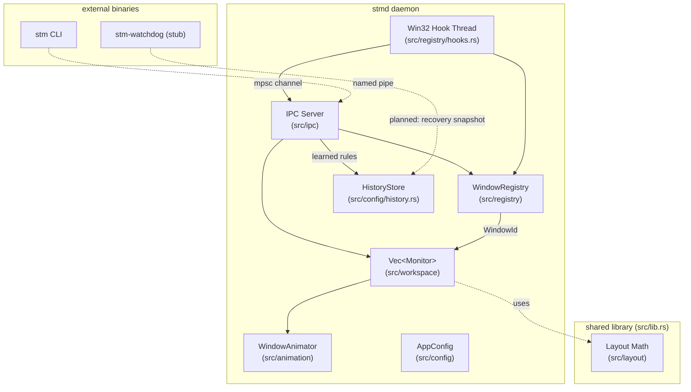
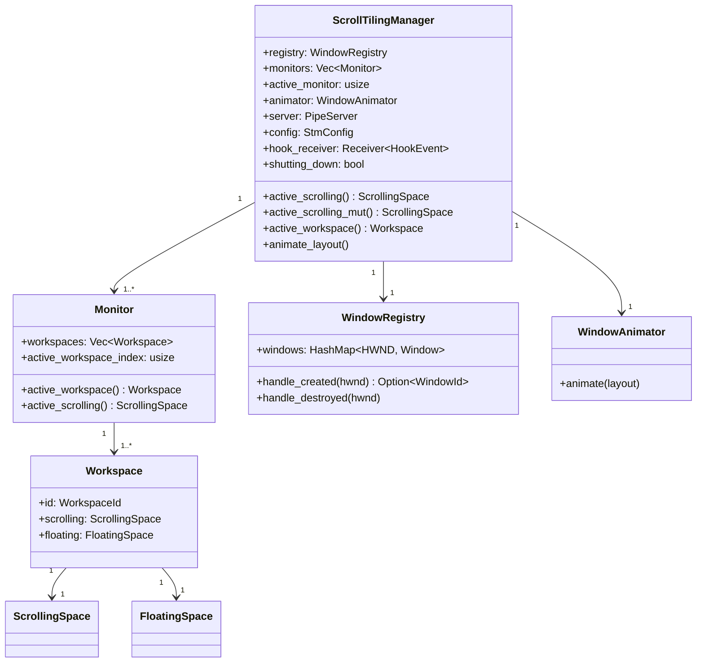
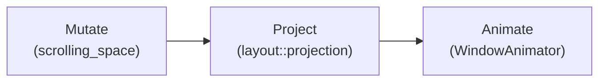

# Architecture

ScrollingTilingManager (`stm`) is a tiling window manager for Windows built around an
infinite-horizontal-canvas layout model. Windows occupy columns on a virtual canvas
wider than any single monitor; the viewport slides left and right to bring them into
view. The entire system is a single Cargo package containing three binaries that share
one library crate, coordinated by a top-level orchestrator struct called
`ScrollTilingManager`.

## Binaries

| Binary | Role |
|--------|------|
| `stmd` | Background daemon — owns all state, manages windows, accepts IPC commands |
| `stm` | CLI client — sends commands to the daemon over a named pipe |
| `stm-watchdog` | Crash-recovery helper — restores windows if the daemon dies unexpectedly |

All three binaries share the library crate rooted at [`src/lib.rs`](../../src/lib.rs).
The daemon entry point is [`src/main.rs`](../../src/main.rs); the other two live in
[`src/bin/stm.rs`](../../src/bin/stm.rs) and
[`src/bin/stm-watchdog.rs`](../../src/bin/stm-watchdog.rs).

## Subsystem Map

Every subsystem lives inside the `stmd` process. The `stm` CLI and `stm-watchdog`
only share the library's IPC message types and utility code — they never hold
application state.

### Subsystem Roles

- **IPC Server** (`src/ipc`) — accepts commands from the `stm` CLI over a Windows
  named pipe. Parses `SocketMessage` frames and dispatches to the orchestrator.
- **Win32 Hook Thread** (`src/registry/hooks.rs`) — a background thread that registers
  `SetWinEventHook` callbacks for window create/destroy/minimize/focus events. Sends
  lightweight `HookEvent` structs through an `mpsc` channel; never touches daemon
  state directly. See [Threading Model](./threading-model.md).
- **WindowRegistry** (`src/registry`) — the authoritative source of truth for every
  tracked window: HWND-to-`WindowId` mapping, title, class, tile/float/ignore
  classification, and recovery state. See [Window Registry](./window-registry.md).
- **Monitors / Workspaces** (`src/workspace`) — the hierarchy
  `Vec<Monitor>` -> `Vec<Workspace>` -> `ScrollingSpace` + `FloatingSpace`.
  The daemon tracks which monitor is active and routes all commands to the active
  workspace's scrolling space. See [Workspace Hierarchy](./workspace.md).
- **WindowAnimator** (`src/animation`) — animates window rectangles from their
  current on-screen position to the target position computed by the layout engine.
  See [Animation](./animation.md).
- **Config** (`src/config`) — loads `stm.toml`, applies defaults, derives layout
  parameters. See [Config & Persistence](./config-and-persistence.md).
- **HistoryStore** (`src/config/history.rs`) — persists the user's explicit
  `setwindow` decisions (learned rules) to `history-stm-rules.toml` so the next
  window of the same app is classified automatically. Owned as the `history`
  field on `ScrollTilingManager`. See
  [Classification & Learned Rules](./classification.md). (There is no separate
  `persist` module; the recovery-snapshot persistence used by the planned
  `stm-watchdog` is not yet implemented.)

## Ownership Model

[ScrollTilingManager](../../src/daemon/types.rs) owns every subsystem and routes
events between them. This is the most important structural invariant in the codebase:
**no subsystem knows about any other subsystem**. They only expose methods that take
inputs and return outputs. The daemon is the glue.

The daemon accesses the active scrolling space through accessor chains:
`self.active_scrolling()` delegates to `self.monitors[active_monitor]
.active_workspace().scrolling`. This indirection exists so that multi-monitor
and multi-workspace support can be added later without changing the call sites
in hook handlers and IPC dispatch — they always operate on "the active" scrolling
space.

## The Layout Pipeline

Layout computation follows a three-stage pipeline that runs whenever any event
changes the tiling state:

1. **Mutate** — a method on `ScrollingSpace` mutates the virtual layout (add a
   window, swap columns, scroll the viewport, resize a column). This produces a
   `LayoutDiff` describing what changed.
2. **Project** — a pure function in `src/layout/projection.rs` converts the full
   `VirtualLayout` into an `ActualLayout` with concrete pixel coordinates. Padding
   is applied here. Off-screen windows are "parked" at large negative/positive X
   offsets.
3. **Animate** — the `WindowAnimator` compares each window's target rect (from
   projection) against its current on-screen rect and issues smooth
   `SetWindowPos` transitions.

The layout math in `src/layout/` is entirely pure — it has zero Win32 dependencies
and can be unit-tested on any platform. `ScrollingSpace` in `src/workspace/`
orchestrates the three stages and is the only thing that touches all three layers.

For the full explanation, see [Layout Overview](./layout/overview.md) and
[Mutation Pipeline](./layout/pipeline.md).

## Repository Layout

The repository layout is covered in the [Developer Guide introduction](./README.md).
The two big ideas to internalise before reading any source file:

1. **The layout pipeline is pure.** `src/layout/` has zero Win32 dependencies and is
   fully unit-testable on any platform. `src/workspace/scrolling_space.rs` is the
   orchestrator that consumes it.
2. **The daemon is the single coordinator.** `ScrollTilingManager` owns every
   subsystem and routes events between them. No subsystem knows about any other
   subsystem.
