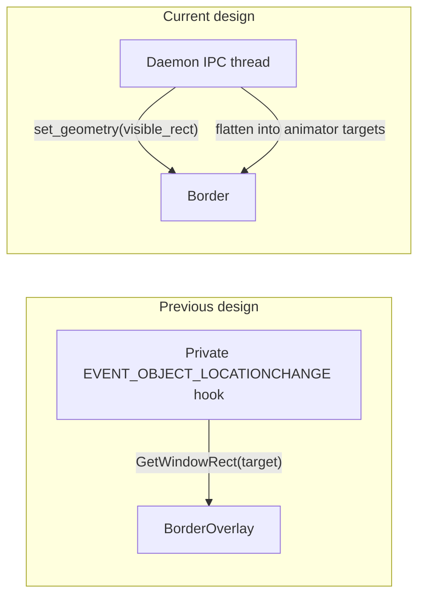
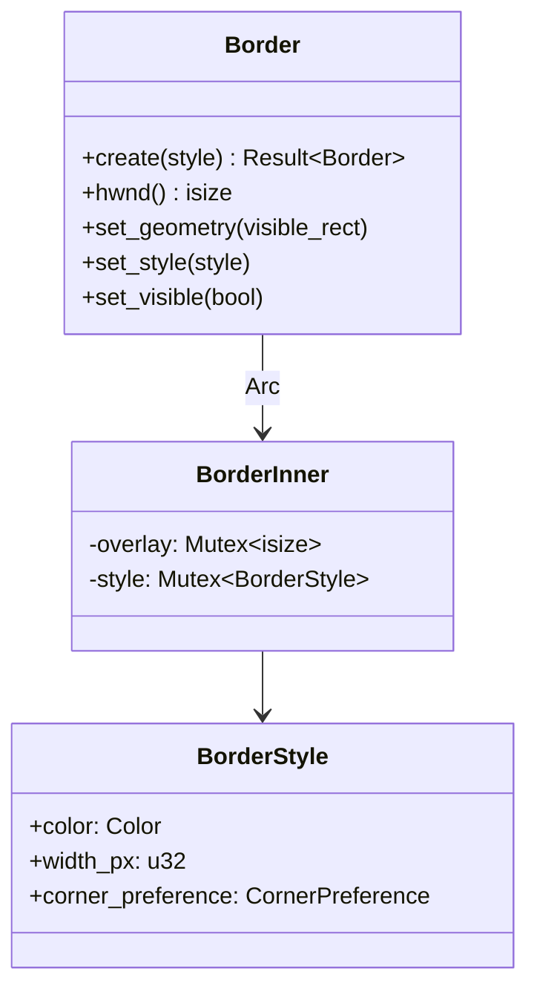

# Borders

STM draws komorebi/Hyprland-style colored borders around managed windows using
**click-through, topmost, layered overlay windows**. Each managed window can own
a [`Border`] (`Option<Border>` on the registry's [`Window`] struct) that renders
a thin colored ring just inside the window's visible content edge.

This chapter covers the border subsystem's architecture: the positioning model,
the coordinate-space fix, the lifecycle, and how borders participate in
animation without a dedicated hook thread.

## The Positioning Principle: Daemon Commands, Border Obeys

The border overlay **never queries the OS for its target's position**. Instead,
the daemon *commands* the border's geometry. This is the central design decision
and the defining difference from the previous architecture.



The daemon already knows where every window should be — it computed the layout,
it issued the `SetWindowPos`, and it tracks floating rects via its own
`EVENT_OBJECT_LOCATIONCHANGE` subscription. Having the border re-derive this
information from the OS is both redundant (a second hook) and incorrect (the OS
rect includes invisible borders — see [Coordinate Spaces](#coordinate-spaces)).

### Why Not a Private Hook?

The previous design gave `BorderManager` its own background thread
(`stm-borders-hook`) that subscribed to `EVENT_OBJECT_LOCATIONCHANGE` for *all*
desktop windows. Three problems motivated its removal:

1. **Wasted work.** Two `SetWinEventHook` registrations for the same event in
   one process means the OS fires the callback twice per location change. The
   border's hook was global (not filtered to managed windows), so it did work
   for every window on the desktop.

2. **Process-global state.** `SetWinEventHook` callbacks take no user data, so
   the hook reached the border state through a `static OnceLock<Arc<Inner>>`.
   This indirection is gone — the border now lives directly on `Window`.

3. **The misalignment bug.** The hook called `GetWindowRect(target)`, which
   returns the *full* window rect including the invisible DWM resize border.
   The colored ring was drawn at the HWND's outer edge, not at the visible
   content edge. See [Coordinate Spaces](#coordinate-spaces) for the fix.

## Coordinate Spaces

This is the subtle part. Two distinct rectangles describe each window:

| Rect | What it represents | Used for |
|------|-------------------|----------|
| **Window HWND rect** | The full `GetWindowRect` — includes invisible DWM resize borders | `SetWindowPos` (positions the actual window) |
| **Visible content rect** | What the user sees as the window's content area | Layout engine output, border positioning |

The layout engine computes **visible content rects** (`entry.rect` in
`ActualLayout`). The daemon's animation bridge translates these into window HWND
rects before issuing `SetWindowPos`, using each window's measured
`InvisibleBounds` (see [Window Registry](./window-registry.md)).

The border overlay is positioned at the **visible content rect directly** — no
translation, no invisible-bounds expansion:

```
   ┌─── window HWND rect (GetWindowRect) ───┐
   │ ▒ invisible DWM border (resize frame) ▒ │
   │ ┌─── border overlay (entry.rect) ─────┐ │   ← positioned at visible rect
   │ │█                                  █│ │      ring = thickness px
   │ │█  ┌── visible content ──────────┐ █│ │
   │ │█  │  (inset by border thickness)│ █│ │      window content lives here
   │ │█  │                             │ █│ │
   │ │█  └─────────────────────────────┘ █│ │
   │ │█                                  █│ │
   │ └───────────────────────────────────┘ │
   │ ▒▒▒▒▒▒▒▒▒▒▒▒▒▒▒▒▒▒▒▒▒▒▒▒▒▒▒▒▒▒▒▒▒▒▒▒ │
   └───────────────────────────────────────┘
```

The window target rect is computed as:

```
visible_to_window(entry.rect).inset(border_thickness)
```

This expands the visible rect out to the HWND rect, then shrinks it inward by
`thickness` on every side — leaving a gap exactly `thickness` px wide where the
border ring draws. The ring thus sits flush against the visible content edge.

The old design drew the ring at the HWND rect's outer edge (the invisible
border), producing a visible gap between the colored ring and the window
content.

## Lifecycle

A `Border` is created, recolored, repositioned, and destroyed entirely from the
daemon's IPC thread. No background thread, no callbacks.

```mermaid
stateDiagram-v2
    [*] --> None: Window::new
    None --> Active: refresh_border_for (create)
    Active --> Active: set_style (recolor on focus change)
    Active --> Active: set_geometry / animator (reposition)
    Active --> None: refresh_border_for (minimize/hide/destroy)
    None --> [*]: Window::drop → Border::drop → DestroyWindow
```

### Creation: `refresh_border_for`

[`daemon::borders::refresh_border_for`](../../src/daemon/borders.rs) is the
single entry point for border lifecycle changes. It resolves the desired
`BorderStyle` from the window's registry state, then:

- **`None`** (minimized / hidden / ignored) → sets `window.border = None`,
  dropping the `Border` and triggering `DestroyWindow` via `Drop`.
- **`Some(style)` + border exists** → calls `set_style(style)` to recolor
  in-place (no window recreation).
- **`Some(style)` + no border** → creates the overlay via `Border::create`,
  immediately calls `set_geometry(rect)` so it doesn't flash at `(0,0)`
  before the next animation frame, and assigns it to `window.border`.

That rect is read from the window's state: `tiled_rect` for active tiles, the
stored `rect` for active floats.

### Destruction: `Drop`

`Border` is `Arc<BorderInner>`. The overlay HWND is destroyed exactly once, when
the last `Arc` clone drops (`BorderInner::drop` → `DestroyWindow`). This happens
eagerly when `window.border = None`, or lazily when the `Window` itself leaves
the registry.

Setting `window.border = None` is the canonical "detach" operation — there is no
separate `detach` method. The old `BorderManager::detach(HWND)` is gone.

## Three Movement Paths

Borders move via three different mechanisms depending on the window's state:

| Path | When | How | Bitmap rebuild? |
|------|------|-----|-----------------|
| **Animator** | Tiled window animates | Border flattened into `Vec<WindowTarget>` alongside the window; `SetWindowPos` moves both in lockstep | No (size rarely changes mid-animation; `SetWindowPos` translates the bitmap) |
| **Float hook** | Floating window dragged | `store_float_rect` calls `set_geometry(visible_rect)` after updating the registry | Yes (`UpdateLayeredWindow` repaints at new size) |
| **Teleport** | Bystander workspace switch | `teleport_workspaces` calls `set_geometry(visible_rect)` directly (instant, no animation) | Yes |

### Why the animator path doesn't rebuild the bitmap

The animator calls `SetWindowPos` via its `WindowBackend` — it does *not* call
`UpdateLayeredWindow`. For a layered window, `SetWindowPos` translates the
existing bitmap (moves it) but does not resize the pixel buffer. This is fine
for tiled border movement because the border's size is determined by the layout
rect, which changes only at frame `t=1.0` (the final `SetWindowPos`). During
interpolation the ring translates with the window; at completion, the next
layout mutation triggers a full `set_geometry` (with bitmap rebuild) if the size
changed.

### Float hook integration

The daemon's existing `EVENT_OBJECT_LOCATIONCHANGE` subscription (filtered to
active-workspace floats — see [Event Pipelines](./event-pipelines.md)) already
tracks floating window positions. `store_float_rect` computes the visible rect
and mirrors it into `FloatingState::Active { rect }`. After that update, it now
also calls `border.set_geometry(visible_rect)` — reusing the same rect
computation, no extra OS query.

This means float borders follow the window in real time during drags, driven by
the *same* hook that already tracks the float rect. No second hook, no extra
traffic.

## Threading Model

Borders live entirely on the daemon's **single IPC thread**. There is no border
hook thread.

`Border`'s methods take `&self` and mutate through `Mutex` (interior
mutability). In practice the mutexes are uncontended — all access happens on one
thread. They exist because `Border` is reached via `Arc` clones held by the
registry's `Window`, and `&self` methods are more ergonomic than `&mut self`
when the daemon holds a `&mut Window` but wants to call multiple border methods.

The animator is the one exception: border HWNDs are flattened into
`WindowTarget`s and sent to the animator's worker thread as `WindowRef(isize)`.
But the animator only calls `SetWindowPos` on them — it never touches the
`Border` struct itself. The overlay HWND is a real window, so the animator's
`SetWindowPos`-based backend treats it like any other.

## The `Border` Type



`Border` is `Arc<BorderInner>` — `Clone` is a cheap refcount bump. This keeps
`Window: Clone` sound (the registry derives `Clone` for snapshots and queries)
while guaranteeing `DestroyWindow` runs exactly once.

When recoloring via `set_style` (on focus changes), the border queries its
*own* overlay position with `GetWindowRect` rather than remembering a commanded
rect. This is essential because the animator moves overlays via `SetWindowPos`
without going through `set_geometry` — so the overlay's actual position is the
only source of truth at repaint time. (`UpdateLayeredWindow` both rebuilds the
bitmap *and* repositions the layered window, so feeding it a stale rect would
snap the border back to its pre-animation location.) The border never queries
the *target* window — only its own overlay.

## Rendering Pipeline

Each border overlay is a `WS_EX_LAYERED` window painted via
`UpdateLayeredWindow` (the `ULW_ALPHA` mode). The render path:

1. **Build a 32-bit ARGB DIB section** sized to the current rect.
2. **Fill the border ring** — `fill_border_ring` (a pure, unit-tested function)
   writes the configured `Color` × alpha into the outer `thickness`-px ring of
   the pixel buffer, leaving the interior transparent.
3. **Upload** via `UpdateLayeredWindow` with `ULW_ALPHA` + a `BLENDFUNCTION`
   that uses `AC_SRC_ALPHA` per-pixel alpha.

The overlay's extended style makes it click-through (`WS_EX_TRANSPARENT`),
topmost (`WS_EX_TOPMOST`), and invisible to the taskbar/Alt+Tab
(`WS_EX_TOOLWINDOW`). It never takes focus (`WS_EX_NOACTIVATE`).

## Configuration

Borders are configured under the `[borders]` section in `stm.toml`:

```toml
[borders]
enabled = true
thickness = 3
focused_color = "#00AAFF"      # the focused/active window
unfocused_color = "#555555"    # tiled but not focused
floating_color = "#AA00FF"     # floating windows
```

| Field | Type | Default | Notes |
|-------|------|---------|-------|
| `enabled` | `bool` | `true` | Master switch. `false` prevents overlay creation and detaches existing overlays. |
| `thickness` | `u32` | `3` | Ring width in px, uniform on all sides. Capped at 50 by `validate()`. |
| `focused_color` | `Color` | `#00AAFF` | Color for the OS-foreground window. |
| `unfocused_color` | `Color` | `#555555` | Color for tiled-but-not-focused windows. |
| `floating_color` | `Color` | `#AA00FF` | Color for floating windows (komorebi convention: floats always use this regardless of focus). |

The daemon resolves which color applies via `style_for_state(cfg, state)`,
mapping its internal `WindowState` onto the three-bucket `BorderState` enum
(`Focused` / `Unfocused` / `Floating`). Minimized, hidden, and ignored windows
produce no border at all.

### Config-defaults rule

Code is the single source of truth. The `Default` impl in
[`src/config/types.rs`](../../src/config/types.rs) defines the actual runtime
defaults; `default-config.toml` is a hand-written example synced by a
compile-time test. See [config and persistence](./config-and-persistence.md).

## Cross-References

- [Threading Model](./threading-model.md) — why all border mutations happen on
  the single IPC thread.
- [Animation](./animation.md) — how the animator's `WindowBackend` moves border
  overlays as `WindowTarget`s (the animator doesn't know an HWND is an overlay).
- [Event Pipelines](./event-pipelines.md) — the `EVENT_OBJECT_LOCATIONCHANGE`
  hook path that drives float borders.
- [Floating Space](./floating-space.md) — `store_float_rect`, where float
  borders get their geometry.
- [Window Registry](./window-registry.md) — `InvisibleBounds`, the `Window`
  struct, and `WindowState`.
- [Config & Persistence](./config-and-persistence.md) — `BorderConfig` defaults
  and the dual-edit rule.
