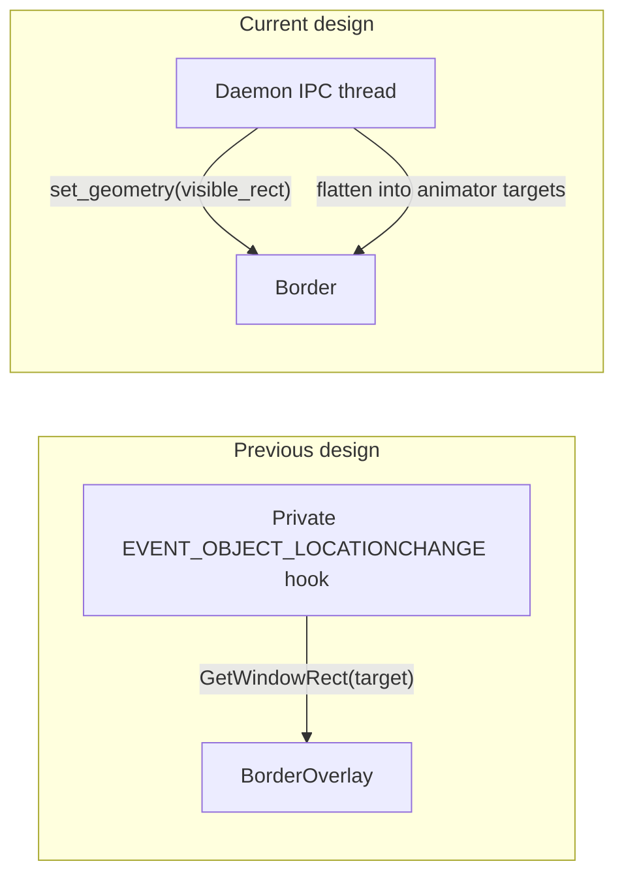
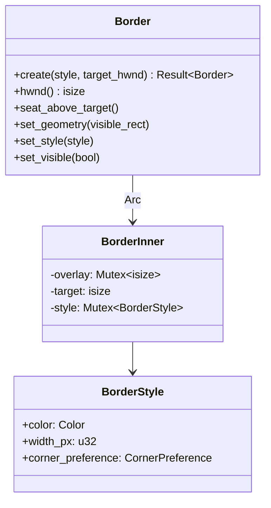

# Borders

STM draws komorebi/Hyprland-style colored borders around managed windows using
**click-through, layered overlay windows**. Each border is seated *just above
its target window* in z-order (not globally topmost), so overlapping windows —
floats and ignored windows — correctly cover it. Each managed window can own a
[`Border`] (`Option<Border>` on the registry's [`Window`] struct) that renders a
thin colored ring just inside the window's visible content edge.

This chapter covers the border subsystem's architecture: the positioning model,
the coordinate-space fix, the lifecycle, and how borders participate in
animation without a dedicated hook thread.

## The Positioning Principle: Daemon Commands, Border Obeys

The border overlay **never queries the OS for its target's position**. Instead,
the daemon *commands* the border's geometry. This is the central design decision
and the defining difference from the previous architecture.



The daemon already knows where every window should be — it computed the layout,
it issued the `SetWindowPos`, and it tracks floating rects via its own
`EVENT_OBJECT_LOCATIONCHANGE` subscription. Having the border re-derive this
information from the OS is both redundant (a second hook) and incorrect (the OS
rect includes invisible borders — see [Coordinate Spaces](#coordinate-spaces)).

### Why Not a Private Hook?

The previous design gave `BorderManager` its own background thread
(`stm-borders-hook`) that subscribed to `EVENT_OBJECT_LOCATIONCHANGE` for *all*
desktop windows. Three problems motivated its removal:

1. **Wasted work.** Two `SetWinEventHook` registrations for the same event in
   one process means the OS fires the callback twice per location change. The
   border's hook was global (not filtered to managed windows), so it did work
   for every window on the desktop.

2. **Process-global state.** `SetWinEventHook` callbacks take no user data, so
   the hook reached the border state through a `static OnceLock<Arc<Inner>>`.
   This indirection is gone — the border now lives directly on `Window`.

3. **The misalignment bug.** The hook called `GetWindowRect(target)`, which
   returns the *full* window rect including the invisible DWM resize border.
   The colored ring was drawn at the HWND's outer edge, not at the visible
   content edge. See [Coordinate Spaces](#coordinate-spaces) for the fix.

## Coordinate Spaces

This is the subtle part. Two distinct rectangles describe each window:

| Rect | What it represents | Used for |
|------|-------------------|----------|
| **Window HWND rect** | The full `GetWindowRect` — includes invisible DWM resize borders | `SetWindowPos` (positions the actual window) |
| **Visible content rect** | What the user sees as the window's content area | Layout engine output, border positioning |

The layout engine computes **visible content rects** (`entry.rect` in
`ActualLayout`). The daemon's animation bridge translates these into window HWND
rects before issuing `SetWindowPos`, using each window's measured
`InvisibleBounds` (see [Window Registry](./window-registry.md)).

The border overlay is positioned at the **visible content rect directly** — no
translation, no invisible-bounds expansion:

```
   ┌─── window HWND rect (GetWindowRect) ───┐
   │ ▒ invisible DWM border (resize frame) ▒ │
   │ ┌─── border overlay (entry.rect) ─────┐ │   ← positioned at visible rect
   │ │█                                  █│ │      ring = thickness px
   │ │█  ┌── visible content ──────────┐ █│ │
   │ │█  │ (inset by thickness-overlap)│ █│ │      window content lives here
   │ │█  │                             │ █│ │
   │ │█  └─────────────────────────────┘ █│ │
   │ │█                                  █│ │
   │ └───────────────────────────────────┘ │
   │ ▒▒▒▒▒▒▒▒▒▒▒▒▒▒▒▒▒▒▒▒▒▒▒▒▒▒▒▒▒▒▒▒▒▒▒▒ │
   └───────────────────────────────────────┘
```

The window target rect is computed as:

```
visible_to_window(entry.rect).inset(border_thickness - border_overlap)
```

This expands the visible rect out to the HWND rect, then shrinks it inward by
`(thickness - overlap)` on every side. The ring is the outer `thickness` px of
`entry.rect`, so it overlaps the visible content by `overlap` px on each edge.
With the default `overlap = 1`, this single pixel closes the 1px DWM
client-edge hairline that otherwise shows between an unfocused ring and the
window content. `overlap = 0` leaves a gap exactly `thickness` px wide (ring
flush against the content edge — the pre-overlap behavior); `overlap =
thickness` fills the whole layout slot with content sitting under the ring.

The old design drew the ring at the HWND rect's outer edge (the invisible
border), producing a visible gap between the colored ring and the window
content.

## Lifecycle

A `Border` is created, recolored, repositioned, and destroyed entirely from the
daemon's IPC thread. No background thread, no callbacks.

```mermaid
stateDiagram-v2
    [*] --> None: Window::new
    None --> Active: refresh_border_for (create)
    Active --> Active: set_style (recolor on focus change)
    Active --> Active: set_geometry / animator (reposition)
    Active --> None: refresh_border_for (minimize/hide/destroy)
    None --> [*]: Window::drop → Border::drop → DestroyWindow
```

### Creation: `refresh_border_for`

[`daemon::borders::refresh_border_for`](../../src/daemon/borders.rs) is the
single entry point for border lifecycle changes. It resolves the desired
`BorderStyle` from the window's registry state, then:

- **`None`** (minimized / hidden / ignored) → sets `window.border = None`,
  dropping the `Border` and triggering `DestroyWindow` via `Drop`.
- **`Some(style)` + border exists** → re-seats the overlay just above its target
  (`seat_above_target`), then calls `set_style(style)`. `set_style` compares the
  new style against the current one and **short-circuits when they are equal** —
  no `UpdateLayeredWindow`, no repaint. This makes no-op recolors free.
- **`Some(style)` + no border** → creates the overlay via
  `Border::create(style, target_hwnd)`, immediately calls `set_geometry(rect)`
  so it doesn't flash at `(0,0)` before the next animation frame, and assigns it
  to `window.border`. `create` seeds the z-order by seating the overlay just
  above `target_hwnd`.

That rect is read from the window's state: `tiled_rect` for active tiles; for
active floats the stored `rect` is outset by `(thickness − overlap)` via
`float_border_rect`, so a float border's ring sits in the surrounding gap like
a tiled border's, even before the first drag.

### Focus changes are O(1)

A focus switch repaints **only the two affected overlays** — the window losing
focus and the window gaining it — not every managed window. `on_focus_changed`
captures the previous focused HWND, updates the registry's focus, then calls
`refresh_border_for` on just those two HWNDs. Combined with the `set_style`
short-circuit, a focus change that lands on an already-correctly-colored window
costs nothing. (The full O(N) `refresh_all_border_styles` survives only for the
one-time init pass.)

### Init highlight

At daemon startup, `new` queries the OS foreground window and calls
`registry.set_focused(fg)` *before* the init `refresh_all_border_styles`. This
ensures the window that was already foreground when the daemon launched is
colored `Focused` from the first paint, rather than waiting for the first
`EVENT_SYSTEM_FOREGROUND`.

### Late-detected windows (Windows Terminal)

Windows Terminal (and other late-titling apps) is not caught by
`EVENT_OBJECT_CREATE`: its title arrives later, so classification defers to the
`NAMECHANGE` / `SHOW` recovery path, which re-runs `on_window_created` (see
[Event Pipelines](./event-pipelines.md)). The problem: by the time the window is
finally tracked, its `EVENT_SYSTEM_FOREGROUND` has already fired, so the
registry's `focused` HWND is stale and the freshly-created border paints
`Unfocused`. `on_window_created` now reconciles: when a newly tracked window is
the live OS foreground (`GetForegroundWindow()`), it calls
`registry.set_focused(hwnd)` before `refresh_border_for`, so the recovery path
paints `Focused` immediately.

### Destruction: `Drop`

`Border` is `Arc<BorderInner>`. The overlay HWND is destroyed exactly once, when
the last `Arc` clone drops (`BorderInner::drop` → `DestroyWindow`). This happens
eagerly when `window.border = None`, or lazily when the `Window` itself leaves
the registry.

Setting `window.border = None` is the canonical "detach" operation — there is no
separate `detach` method. The old `BorderManager::detach(HWND)` is gone.

## Three Movement Paths

Borders move via three different mechanisms depending on the window's state.
All three share the same repaint mechanism: when `SetWindowPos` changes the
overlay's size, Win32 sends `WM_SIZE`, whose handler rebuilds the bitmap.
Move-only `SetWindowPos` calls (same size) do not trigger `WM_SIZE` — the
compositor simply translates the cached bitmap.

| Path | When | How | Bitmap rebuild? |
|------|------|-----|-----------------|
| **Animator** | Tiled window animates | Border flattened into `Vec<WindowTarget>` alongside the window; `SetWindowPos` moves both in lockstep | Yes if size changes (`WM_SIZE` → `on_wm_size`); no for move-only frames |
| **Float hook** | Floating window dragged | `store_float_rect` calls `set_geometry(visible_rect)` after updating the registry | Same: `set_geometry` calls `SetWindowPos`, which triggers `WM_SIZE` if resized |
| **Teleport** | Bystander workspace switch | `teleport_workspaces` calls `set_geometry(visible_rect)` directly (instant, no animation) | Same |

### The overlay is self-sufficient: `WM_SIZE` drives repaint

The overlay's window procedure (`overlay_wnd_proc`) handles `WM_SIZE` by
retrieving the `BorderInner` back-pointer from `GWLP_USERDATA` and calling
`on_wm_size`, which queries the overlay's current rect via `GetWindowRect` and
calls `paint`. Because the size changed (the precondition for `WM_SIZE`),
`paint` rebuilds the bitmap via `CachedSurface::build` and re-uploads it via
`UpdateLayeredWindow`.

This eliminates the stale-bitmap bug that previously occurred during resize
animations (`expand-column`, `shrink-column`). Before the `WM_SIZE` handler
existed, `SetWindowPos` updated the overlay's outer rect but left the cached
bitmap at the old size — the new edge area had no pixels, so the border edge
disappeared mid-animation. The author worked around this for
`teleport_workspaces` by calling `set_geometry` explicitly (which called
`paint` directly), but the animator path was missed. With `WM_SIZE` handling,
both paths — and any future caller — automatically get a correct bitmap.

### Float hook integration

The daemon's existing `EVENT_OBJECT_LOCATIONCHANGE` subscription (filtered to
active-workspace floats — see [Event Pipelines](./event-pipelines.md)) already
tracks floating window positions. `store_float_rect` computes the visible rect
and mirrors it into `FloatingState::Active { rect }`. After that update, it
seats the overlay via `float_border_rect(visible_rect)` — the visible rect
outset by `(thickness − overlap)` so the ring lands in the surrounding gap,
matching the ring geometry of a tiled border (whose content the animator insets
by the same amount). The same helper is used at border creation in
`refresh_border_for`, so a freshly created float border matches one mid-drag.

This means float borders follow the window in real time during drags, driven by
the *same* hook that already tracks the float rect. No second hook, no extra
traffic.

## Threading Model

Borders live entirely on the daemon's **single IPC thread**. There is no border
hook thread.

`Border`'s methods take `&self` and mutate through `Mutex` (interior
mutability). In practice the mutexes are uncontended — all access happens on one
thread. They exist because `Border` is reached via `Arc` clones held by the
registry's `Window`, and `&self` methods are more ergonomic than `&mut self`
when the daemon holds a `&mut Window` but wants to call multiple border methods.

The animator is the one exception: border HWNDs are flattened into
`WindowTarget`s and sent to the animator's worker thread as `WindowRef(isize)`.
But the animator only calls `SetWindowPos` on them — it never touches the
`Border` struct itself. The overlay HWND is a real window, so the animator's
`SetWindowPos`-based backend treats it like any other.

When a cross-thread `SetWindowPos` resizes the overlay, Win32 dispatches
`WM_SIZE` via `SendMessage` to the thread that created the overlay (the IPC
thread). The IPC thread's message pump (`run.rs::pump_messages`) drains the
queue on every loop wake, so `on_wm_size` → `paint` runs on the IPC thread even
though the animator triggered it. The animator blocks inside `SetWindowPos`
until the IPC thread processes the message. This adds a small per-frame cost
during resize animations (~0.5-1 ms per border for the repaint), well within
the ~14 ms headroom the animator has at 60 Hz.

## The `Border` Type



`Border` is `Arc<BorderInner>` — `Clone` is a cheap refcount bump. This keeps
`Window: Clone` sound (the registry derives `Clone` for snapshots and queries)
while guaranteeing `DestroyWindow` runs exactly once.

When recoloring via `set_style` (on focus changes), the border queries its
*own* overlay position with `GetWindowRect` rather than remembering a commanded
rect. This is essential because the animator moves overlays via `SetWindowPos`
without going through `set_geometry` — so the overlay's actual position is the
only source of truth at repaint time. (`UpdateLayeredWindow` both rebuilds the
bitmap *and* repositions the layered window, so feeding it a stale rect would
snap the border back to its pre-animation location.) The border never queries
the *target* window — only its own overlay.

### Z-order: seated above the target

The overlay is **not** `WS_EX_TOPMOST`. Instead, each `Border` remembers its
target HWND (the `target` field on `BorderInner`) and seats itself *just above*
that sibling via `SetWindowPos(overlay, hwndInsertAfter = target, …)` — see
`seat_above_target`. `hwndInsertAfter` places the overlay immediately above the
named sibling in z-order, which is exactly the relationship we want: the border
rides on top of the one window it decorates.

This matters because the border ring wraps the *outside* of the window — there
is no overlap with the target itself — but other windows *do* overlap the ring
region. With `WS_EX_TOPMOST` every border floated above float windows and
ignored windows; a float dragged over a tiled border covered nothing. Seated
above the target, a float (which is itself above the tiled window) correctly
covers the tiled window's border.

Z-order is established once at `create` / re-asserted at `set_geometry`
(`seat_above_target`), and the animator preserves it: the animator's
`SetWindowPos` uses `SWP_NOZORDER`, so it only translates the overlay without
disturbing its place in the z-stack. `set_geometry` deliberately drops
`SWP_NOZORDER` so it can re-assert the seat on every size/position command.

## Rendering Pipeline

Each border overlay is a `WS_EX_LAYERED` window painted via
`UpdateLayeredWindow` (the `ULW_ALPHA` mode). The render path:

1. **Build a 32-bit ARGB DIB section** sized to the current rect.
2. **Fill the border ring** — `fill_border_ring` (a pure, unit-tested function)
   writes the configured `Color` × alpha into the outer `thickness`-px ring of
   the pixel buffer, leaving the interior transparent. On Windows 11 the ring is
   **rounded to match the target window's corner preference** (queried via
   `DwmGetWindowAttribute(DWMWA_WINDOW_CORNER_PREFERENCE)`), so the border hugs
   the window's rounded corners instead of drawing a square halo. See
   [Corner preference](#corner-preference).
3. **Upload** via `UpdateLayeredWindow` with `ULW_ALPHA` + a `BLENDFUNCTION`
   that uses `AC_SRC_ALPHA` per-pixel alpha. `AC_SRC_ALPHA` requires the source
   bitmap to carry **premultiplied** ARGB: each RGB channel must already be
   scaled by its pixel's alpha/255, because the compositor's over-operator is
   `result = src.RGB + dst.RGB·(1 − src.α)` and does not re-scale the source
   channels. Every pixel writer in the pipeline (`fill_border_ring`,
   `blit_corner`, `recolor_pixel`) encodes via `pack_premultiplied`, so
   partial-coverage pixels at corner arcs blend to the correct perceptual
   colour rather than producing a bright fringe where the unscaled RGB is
   added at full intensity. Opaque fills (α=255) are identity under
   premultiplication and use the simpler `pack_bgra`.

The overlay's extended style makes it click-through (`WS_EX_TRANSPARENT`) and
invisible to the taskbar/Alt+Tab (`WS_EX_TOOLWINDOW`). It never takes focus
(`WS_EX_NOACTIVATE`) and is a plain `WS_POPUP` — it is *not* `WS_EX_TOPMOST`;
its z-order comes from being [seated above its target](#z-order-seated-above-the-target),
not from a global topmost flag.

### Corner preference

`BorderStyle` carries a `corner_preference: CornerPreference` (`Default` /
`Square` / `Rounded` / `RoundedSmall`). Rather than expose this as a config
knob, the daemon **auto-detects** it per window by reading the target's live DWM
corner preference (`DwmGetWindowAttribute` with
`DWMWA_WINDOW_CORNER_PREFERENCE`) inside `border_style_for`. This is intentionally
"rendering-only" (Option A): the border *matches* whatever corner shape the
window already has; it never forces a window square or rounded.

`corner_radius_px` turns that preference into a pixel radius for the **outer**
edge of the ring, then subtracts `thickness` for the inner edge so the ring
stays a uniform `thickness` wide around a concentric arc:

| Preference | Window radius | Ring outer radius |
|------------|---------------|-------------------|
| `Square`   | 0             | 0 (square fast-path) |
| `Rounded`  | 8 px          | 8 + `thickness`    |
| `RoundedSmall` | 4 px       | 4 + `thickness`    |
| `Default`  | treated as 8 px (Win11 default) | 8 + `thickness` |

`fill_border_ring` has a **square fast-path** (radius 0: a slice-fill — exact,
because the edges are pixel-aligned) and a **rounded path**. The rounded path
anti-aliases the corner arcs — the only edges that aren't pixel-aligned — using
**exact pixel-circle area integration** rather than stochastic supersampling.
For each pixel in the `[0, r] × [0, r]` corner tile, coverage is computed
analytically as `area(pixel ∩ outer circle) − area(pixel ∩ inner circle)`, both
circles concentric at the arc centre `(r, r)` with radii `r` and
`r − thickness` respectively. The area formula is closed-form, built on the
antiderivative `G(y) = (y·√(R²−y²) + R²·asin(y/R)) / 2`; quick-reject and
quick-accept tests on the pixel's nearest and farthest corners short-circuit
the common fully-inside and fully-outside cases. This yields a continuous
256-level gradient at the fringe (versus the 17 discrete levels a 4×4
supersample grid would produce), avoiding banding on long arcs without pulling
in a Direct2D/DirectComposition dependency.

The per-tile cost is paid once per `(radius, thickness)` pair and cached. Three
of the four corners are reproduced by reflection, because the annulus is
symmetric about the arc centre. `composite_ring` (the production hot path)
blits the cached tiles plus solid straight-band fills; `fill_border_ring`
(the test reference oracle) recomputes the same coverage per pixel via the
shared `corner_pixel_alpha` helper, keeping the two paths byte-identical.
Recolors swap the RGB channels in place via `recolor_pixel` while preserving
each pixel's coverage alpha. The DWM read fails open (returns `Default`) if the
attribute can't be read. Microsoft does not document the exact pixel radii;
8 px / 4 px are the observed Win11 values.

## Configuration

Borders are configured under the `[borders]` section in `stm.toml`:

```toml
[borders]
enabled = true
thickness = 3
overlap = 1                    # px the ring overlaps content per edge (closes the DWM hairline)
focused_color = "#00AAFF"      # the focused/active window
unfocused_color = "#555555"    # tiled but not focused
floating_color = "#AA00FF"     # floating windows
```

| Field | Type | Default | Notes |
|-------|------|---------|-------|
| `enabled` | `bool` | `true` | Master switch. `false` prevents overlay creation and detaches existing overlays. |
| `thickness` | `u32` | `3` | Ring width in px, uniform on all sides. Capped at 50 by `validate()`. |
| `overlap` | `u32` | `1` | Pixels the ring overlaps the visible content per edge. `0` = ring entirely in the reserved gap (window shrinks by the full `thickness`); `thickness` = content fills the layout slot under the ring. Capped at `thickness` by `validate()`. |
| `focused_color` | `Color` | `#00AAFF` | Color for the OS-foreground window. |
| `unfocused_color` | `Color` | `#555555` | Color for tiled-but-not-focused windows. |
| `floating_color` | `Color` | `#AA00FF` | Color for floating windows (komorebi convention: floats always use this regardless of focus). |

> **No `corner_preference` field.** Corner shape is **auto-detected** per window
> from DWM (see [Corner preference](#corner-preference)), not set in config. The
> border always matches the window's existing corner shape.

The daemon resolves which color applies via `style_for_state(cfg, state)`,
mapping its internal `WindowState` onto the three-bucket `BorderState` enum
(`Focused` / `Unfocused` / `Floating`). Minimized, hidden, and ignored windows
produce no border at all.

### Config-defaults rule

Code is the single source of truth. The `Default` impl in
[`src/config/types.rs`](../../src/config/types.rs) defines the actual runtime
defaults; `default-config.toml` is a hand-written example synced by a
compile-time test. See [config and persistence](./config-and-persistence.md).

## Cross-References

- [Threading Model](./threading-model.md) — why all border mutations happen on
  the single IPC thread.
- [Animation](./animation.md) — how the animator's `WindowBackend` moves border
  overlays as `WindowTarget`s (the animator doesn't know an HWND is an overlay).
- [Event Pipelines](./event-pipelines.md) — the `EVENT_OBJECT_LOCATIONCHANGE`
  hook path that drives float borders.
- [Floating Space](./floating-space.md) — `store_float_rect`, where float
  borders get their geometry.
- [Window Registry](./window-registry.md) — `InvisibleBounds`, the `Window`
  struct, and `WindowState`.
- [Config & Persistence](./config-and-persistence.md) — `BorderConfig` defaults
  and the dual-edit rule.
