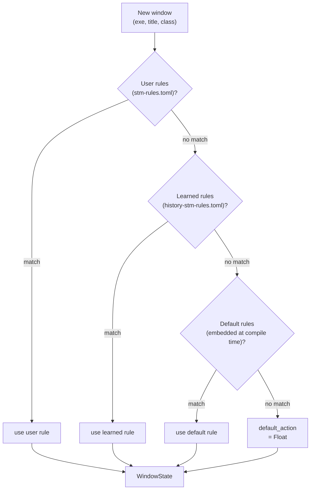
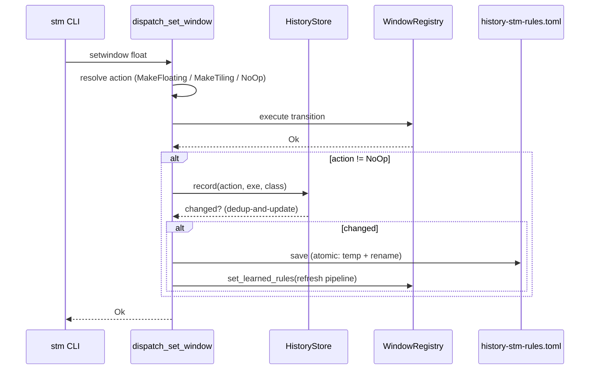

# Classification & Learned Rules

STM classifies every new window as **tiling**, **floating**, or **ignored**. This
chapter covers *why* the default is float, *how* STM learns from the user's
explicit `setwindow` decisions, and *where* that learned state lives on disk.
For the rule-matching algorithm itself — the Win32 pre-filters, the per-layer
first-match-wins evaluation, and the regex/field semantics — see
[Window Registry](./window-registry.md).

## The Whitelist Model: Float by Default

Most tiling window managers take a **blacklist** approach: every window tiles
unless the user adds a rule to float it. STM inverts this. **Every window
floats unless the user promotes it to tiling** — either with an explicit rule
in `stm-rules.toml` or by running `stm dispatch setwindow tile` on it once.

This whitelist model is encoded in a single value: the `default_action` field
of `WindowRulesConfig` defaults to `Float` (see
[`src/config/types.rs`](../../src/config/types.rs)). When no rule at any layer
matches a window, the pipeline returns `Float` rather than `Tile`. The bundled
`default-stm-rules.toml` carries `default_action = "float"` to match.

The rationale: on a scrolling-canvas tiler like STM, most application windows
(notably transients, dialogs, and small utilities) look wrong in a tile column.
Tiling is most useful for a small set of "main" apps the user actively works
in — and the user is the best judge of which apps those are.

## The Four-Layer Priority Chain

Every classification consults four layers in priority order. The first layer to
match wins; layers below it are not consulted:

The four layers, from highest to lowest priority:

1. **User rules** — hand-written in `stm-rules.toml`. Always win. The escape
   hatch for "I want this app to behave this way regardless of what STM
   learned."
2. **Learned rules** — machine-written to `history-stm-rules.toml`. See
   [Learned Rules](#learned-rules) below.
3. **Default rules** — embedded into the binary at compile time from
   [`default-stm-rules.toml`](../../default-stm-rules.toml). Catch well-known
   system windows (taskbar, Chromium helper windows, dialogs).
4. **`default_action`** — the unconditional fallback, now `Float`.

User rules outrank learned rules deliberately: if STM's learned behavior
conflicts with the user's intent, the user's `stm-rules.toml` entry wins and
the learned rule is never consulted for that app.

## Learned Rules

Learned rules are STM's memory of the user's explicit float/tile decisions.
When the user runs `stm dispatch setwindow float` or `stm dispatch setwindow
tile` on a window, STM records the decision keyed on that app's identity. The
next time a window of the same app appears, it is classified automatically —
no rule writing required.

### What Triggers a Recording

Only **actual transitions** are recorded. A `setwindow` call that resolves to a
no-op (the window was already in the requested mode) records nothing. This
keeps the history file free of redundant entries and makes repeated commands
idempotent.

The recording happens inside `dispatch_set_window`, after the transition
succeeds:

The pipeline refresh (`set_learned_rules`) is what makes the new decision take
effect immediately — the very next window of that app is classified using the
updated learned layer, with no daemon restart.

### App Identity: `exe` + `class`

The identity key for a learned rule is the app's **executable name** plus its
**Win32 window class name** (e.g. `chrome.exe` + `Chrome_WidgetWin_1`). Both
fields are used when the class is non-empty; when the class is empty, the key
falls back to `exe` alone.

Title is deliberately **not** part of the key. A window's title changes
constantly (the document name, the current tab, the cursor position), so keying
on it would fragment one app into dozens of "different" apps. The exe + class
pair is stable for the lifetime of an application version.

### Dedup-and-Update, Not Append

When the user toggles an app's mode repeatedly — float it, then tile it, then
float it again — STM does **not** append a new rule each time. Instead, the
existing learned rule for that `exe + class` is updated in place. This keeps
the history file bounded and makes the most recent decision authoritative.

If append were used instead, first-match-wins evaluation would keep returning
the *first* recorded (stale) decision forever, and the file would grow without
bound. Dedup-and-update avoids both problems.

### The History File

Learned rules persist to `history-stm-rules.toml` in the config directory
(default `%USERPROFILE%\.config\stm\`, overridable via `STM_CONFIG_DIR`). The
file uses the same schema as `stm-rules.toml` — a `default_action` field and a
`[[rules]]` array — so it is human-readable and human-editable. STM writes it
atomically (write to `.toml.tmp`, then rename) so a crash mid-write cannot
corrupt the existing file.

The `default_action` field in the history file is ignored at load time; only
the `rules` array is read. (The field exists only because the schema is shared
with `stm-rules.toml`.)

### Clearing or Overriding Learned State

To forget everything STM has learned:

- **Delete `history-stm-rules.toml`** — STM recreates it (empty) on the next
  recorded transition. Until then, classification falls through to the default
  rules and `default_action = Float`.

- **Delete a single app's entry** — open the file in a text editor and remove
  the matching `[[rules]]` block. STM will not re-add it until the user runs
  `setwindow` on that app again.

- **Override a learned rule permanently** — add an explicit rule for the app in
  `stm-rules.toml`. User rules outrank learned rules, so the user's choice
  always wins regardless of what the history file says.

> The `ForgetApp` / `ForgetAllApps` IPC commands (declared in
> [`src/ipc/message.rs`](../../src/ipc/message.rs)) are intended as a
> programmatic way to clear learned state without touching the file by hand.
> They are not yet implemented.

## Where the Code Lives

| Concern | Location |
|---------|----------|
| History store (load, record, dedup, save) | [`src/config/history.rs`](../../src/config/history.rs) |
| History file path resolution | `history_rules_path[_in]` in [`src/config/dirs.rs`](../../src/config/dirs.rs) |
| `default_action = Float` default | `Default` impl for `WindowRulesConfig` in [`src/config/types.rs`](../../src/config/types.rs) |
| Four-layer pipeline evaluation | `ClassificationPipeline::classify` in [`src/registry/classification.rs`](../../src/registry/classification.rs) |
| Runtime pipeline refresh | `set_learned_rules` on `ClassificationPipeline` and `WindowRegistry` |
| Capture on `setwindow` transition | `record_learned_transition` in [`src/daemon/dispatch.rs`](../../src/daemon/dispatch.rs) |
| Daemon-owned history store | `history` field on `ScrollTilingManager`, loaded in `new()` |

## Cross-References

- [Window Registry](./window-registry.md) — the full classification algorithm:
  Win32 pre-filters, the rule-pipeline flow diagram, and per-field match
  semantics.
- [Config & Persistence](./config-and-persistence.md) — the `stm-rules.toml`
  format for user-defined rules and the "code is the source of truth" config
  philosophy.
- [Floating Space](./floating-space.md) — where float-classified windows live
  and how tile↔float transitions are animated.
