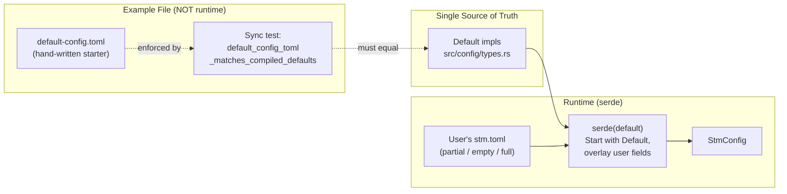
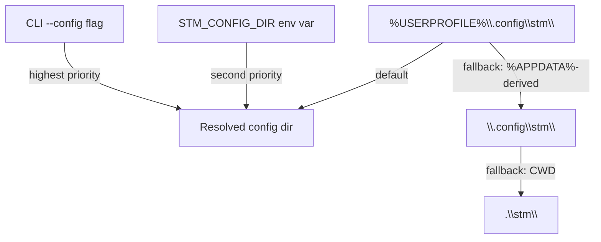
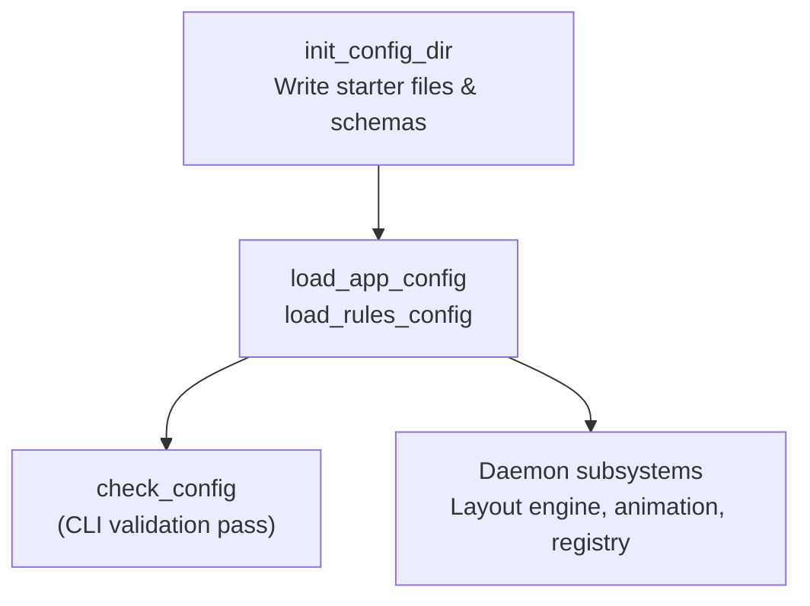

# Config and Persistence

How STM resolves, loads, validates, and applies user configuration -- with code as the single source of truth for all default values.

## Design Philosophy: Code Is the Source of Truth

STM's configuration model makes a deliberate choice: **compiled Rust `Default` impls are the canonical default values, not any TOML file.** Every config struct in `src/config/types.rs` carries `#[serde(default)]` at the container level, so serde starts with a full `Default` instance and then overlays only the fields present in the user's TOML. This means a user's `stm.toml` may be partial, empty, or even nested-partial -- serde fills every gap automatically.

A previous design used a two-layer TOML merge (shipped defaults + user overlay) at the `toml::Value` level before deserialization. That model silently fell back to stale compiled-in defaults when the shipped file was absent during development -- the build never copied it next to `stmd.exe`. Moving defaults into code eliminated that failure mode entirely.

### The Dual-Edit Rule

When adding or changing a config field, you must update **both**:

1. The `Default` impl in `src/config/types.rs` -- this is the actual runtime default.
2. `default-config.toml` in the repo root -- this is the human-readable example copied to users by `stm config init`.

The `default_config_toml_matches_compiled_defaults` test (in `src/config/types.rs`) enforces they stay in sync: it deserializes the example file and asserts it equals `StmConfig::default()`. If you change a default in code and forget the TOML, CI fails.

The example file is **never read at runtime.** It exists solely as a commented starter template so first-time users understand what fields are available. Users can trim it, add comments, or even empty it entirely -- serde will still produce a fully valid config from code defaults.

## Config File Split

Configuration lives in two separate TOML files inside the config directory:

| File | Struct | Purpose |
|------|--------|---------|
| `stm.toml` | `StmConfig` | Application settings: column sizing, padding, animation, minimize-restore behavior |
| `stm-rules.toml` | `WindowRulesConfig` | Window classification rules and default action |

This separation lets users edit rules frequently (adding ignore patterns for new apps) without risking their application settings, and vice-versa. Both files are documented at `src/config/types.rs`.

## Config Directory Resolution

The config directory is resolved by `src/config/dirs.rs` using a three-level priority chain:

The default path `%USERPROFILE%\.config\stm\` follows the XDG Base Directory convention (`$XDG_CONFIG_HOME/appname/`), which is well-known to developers and increasingly expected on all platforms. The older `%APPDATA%` path was rejected because it hides configs inside a `Roaming` directory that most users never browse.

If `%USERPROFILE%` is unset (broken service account), the module falls back to `%APPDATA%` with the `\AppData\Roaming` suffix stripped, then ultimately to the current working directory. All fallbacks are logged. The directory is created on first resolution if it does not exist.

## The Four-Phase Lifecycle

Defined in `src/config/lifecycle.rs`, the config system follows four phases:

### 1. Init -- `init_config_dir`

Creates the config directory and writes default files if they do not already exist:

- `stm.toml` -- the fully-commented example template (`default-config.toml`), including its own `#:schema` header.
- `stm-rules.toml` -- default `WindowRulesConfig` as TOML with a `#:schema` header prepended.
- `schemas/stm-config.schema.json` -- JSON Schema for `StmConfig`.
- `schemas/stm-rules.schema.json` -- JSON Schema for `WindowRulesConfig`.

**Existing files are never overwritten.** This makes `init_config_dir` safe to call on every daemon startup.

### 2. Load -- `load_app_config` / `load_rules_config`

Reads TOML from disk and deserializes into the respective config struct. All load functions are **resilient** -- they never panic or propagate errors:

| Condition | Behavior |
|-----------|----------|
| File not found | Returns `Default`, logs at `debug` |
| Parse error | Returns `Default`, logs error with parse failure |
| Success | Validates semantically, logs warnings but still returns loaded config |

After loading `stm.toml`, the daemon calls `StmConfig::validate()` to catch semantically invalid values (negative padding, `min_column_width_px` exceeding `column_width`). Validation failures produce warnings but do not prevent the daemon from running.

### 3. Validate -- `check_config`

Used by `stm config check` to validate config files without loading them into the daemon. Missing files are not errors -- they simply mean defaults will be used. Logs nothing (designed for pure CLI output).

### 4. Use -- daemon subsystems

The daemon extracts fields from `StmConfig` into the layout engine. The `ConfigEasing` enum is converted to the animation engine's `EasingStyle` in the `daemon/` layer (see `src/config/types.rs` for the design rationale on module dependency ordering).

## Application Config Fields

All defaults are from `StmConfig::default()` in `src/config/types.rs`:

| Field / Group | Type | Default | Description |
|---------------|------|---------|-------------|
| `columns_per_screen` | `u32` | `4` | Number of columns per monitor; daemon computes pixel width at runtime |
| `column_width` | `Option<u32>` | `None` | Fixed pixel-width override; skips auto-computation when set |
| `min_column_width_px` | `u32` | `640` | Minimum allowed column width |
| `padding.window_gap` | `i32` | `16` | Uniform gap between all elements |
| `padding.up` | `i32` | `16` | Top screen margin |
| `padding.down` | `i32` | `16` | Bottom screen margin |
| `animation.enabled` | `bool` | `true` | Enable layout transition animations |
| `animation.duration_ms` | `u32` | `240` | Animation duration in milliseconds |
| `animation.easing` | `ConfigEasing` | `ease-out-expo` | Easing curve (31 named variants) |
| `minimize_restore.strategy` | `enum` | `original_slot` | Where restored windows are placed |

### Column Sizing Model

The primary sizing mode uses `columns_per_screen`: the daemon computes the actual pixel width at startup as `base_content_width = (monitor_width - (N+1) * window_gap) / N` where `N = columns_per_screen`. Setting `column_width` to a fixed pixel value overrides this computation entirely.

## Window Classification Rules

Rules are defined in `stm-rules.toml` and evaluated **top-to-bottom, first match wins** against new windows. If no rule matches, `default_action` (default: `float`) is used. See [window registry](window-registry.md) for how rules feed the classification pipeline, and [classification & learned rules](classification.md) for the whitelist model and the machine-written `history-stm-rules.toml`.

### Match Criteria

All fields in a match clause use AND logic -- unspecified fields are ignored. Three matching modes are supported:

| Mode | Fields | Case Sensitivity |
|------|--------|------------------|
| Exact | `exe`, `title`, `class`, `process_path` | exe/process_path: insensitive; title/class: sensitive |
| Substring | `title_contains` | Sensitive |
| Regex | `exe_regex`, `title_regex`, `class_regex`, `process_path_regex` | exe/process_path: insensitive; title/class: sensitive (use `(?i)` to override) |

The `exe` and `process_path` fields are case-insensitive because Windows paths are case-insensitive. Window class names and titles are application-controlled strings and matched case-sensitively.

### Actions

| Action | Behavior |
|--------|----------|
| `tile` | Managed by the layout engine |
| `float` | Free-floating, user-positioned |
| `ignore` | Excluded from tiling entirely |

### Default Rules

`default-stm-rules.toml` in the project root ships sensible defaults for common Windows system windows (taskbar, Search UI, system dialogs, Task Manager, on-screen keyboard, Chromium legacy windows, etc.). This file is **embedded into the binary at compile time** via `include_str!` in `src/config/lifecycle.rs` -- it is never read from disk at runtime, so it cannot be accidentally deleted or corrupted by end users. Users override these defaults through their own `stm-rules.toml`, which the classification pipeline checks first.

## JSON Schema Generation

`src/config/schema.rs` generates JSON Schemas from the Rust type definitions using the `schemars` crate. Two schemas are produced:

- `schemas/stm-config.schema.json` -- for `StmConfig`
- `schemas/stm-rules.schema.json` -- for `WindowRulesConfig`

These are written into a `schemas/` subdirectory inside the config directory during `init_config_dir`. Each TOML config file carries a `#:schema` comment header pointing to its schema, enabling autocomplete and validation in editors that support the taplo TOML language server (VS Code, Neovim).

The schemas are generated at init time (not build time), so they always reflect the exact types compiled into the running binary. The schemas in the repo root (`schemas/`) are checked-in artifacts for development convenience.

## Dependency Management

When adding dependencies to the config module (or anywhere in the project), use `cargo add` to handle versions and `Cargo.toml` edits. Do not hand-edit `Cargo.toml` for dependency changes.
