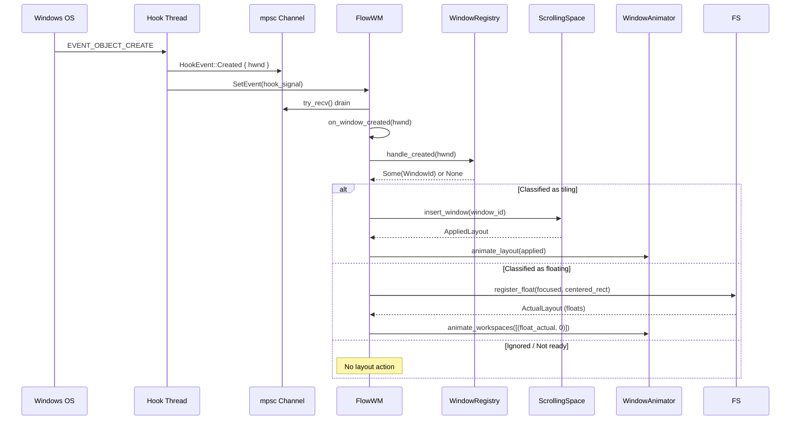
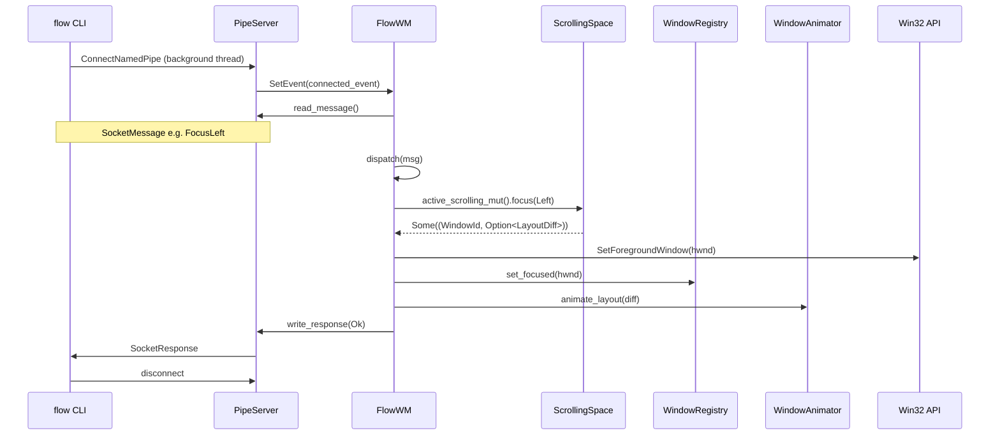

# Event Pipelines

Every layout change in `flow` is driven by one of two flows: a Win32 hook event
(from the OS reacting to window lifecycle changes) or an IPC command (from the
`flow` CLI). Both flows converge on the same three-stage pipeline: mutate the
virtual layout, project to actual pixel coordinates, and animate the result.
This chapter traces each flow end-to-end and documents the per-event behavior
of the hook handlers.

## The Win32 Hook Pipeline

When the OS creates, destroys, minimizes, or focuses a window, the event travels
through the hook thread's `mpsc` channel and into the daemon's event loop.

The full pipeline for a created window:

1. The hook callback sends `HookEvent::Created { hwnd }` and signals the main
   thread.
2. `on_window_created()` calls `registry.handle_created(hwnd)`, which runs the
   full classification pipeline: visibility check, title check, Alt-Tab visibility,
   owner check, rule evaluation. Returns `Some(WindowId)` if the window is
   classified as tiling; `None` otherwise (the handler then inspects the
   registry to distinguish a fresh float from ignored / not-ready).
3. If tiling, `ScrollingSpace::insert_window()` places the new column
   immediately after the focused window, shifts right-side columns, and moves
   focus to the new window.
4. If freshly classified as floating, the handler completes the same float setup
   an explicit `set-window float` performs — `centered_rect` →
   `FloatingSpace::add` → registry state `Floating(Active { rect })` →
   `add_float_hwnd` tracking → `animate_workspaces` → border attach — so a
   rule-classified float is indistinguishable from a toggled one. See
   [Floating Space](./floating-space.md).
5. `animate_layout()` / `animate_workspaces()` convert the result into animation
   targets and submit them to the `WindowAnimator`.

If classification fails (window not yet visible or titled), the hwnd is added to
`pending_creations` and retried on subsequent loop iterations until it passes or
the retry budget is exhausted.

## The IPC Command Pipeline

The `flow` CLI connects to the daemon's named pipe, sends a JSON command, and
reads the response.

Every IPC command follows the same pattern:

1. `dispatch()` matches on the `SocketMessage` variant and calls the appropriate
   subsystem method.
2. Layout commands call `active_scrolling_mut()` to reach the `ScrollingSpace`,
   mutate the virtual layout, and receive an `AppliedLayout` or `Option<LayoutDiff>`.
3. Some commands require OS-level side effects (e.g. `FocusLeft` calls
   `SetForegroundWindow` and syncs the registry's focus tracking).
4. `animate_layout()` converts the result to animation targets.
5. A `SocketResponse` is written back to the CLI.

Commands that close windows (`CloseWindow`) take a different path — they only
queue `WM_CLOSE` and let the `EVENT_OBJECT_DESTROY` hook handle the actual
layout removal, avoiding a race between the synchronous IPC response and the
asynchronous window destruction.

## The `animate_layout` Bridge

`animate_layout()` in [`src/daemon/animation.rs`](../../src/daemon/animation.rs) is
the conversion point between the layout engine's output and the animation
system's input:

| Layout type | Animation type | Notes |
|-------------|----------------|-------|
| `WindowId(isize)` | `WindowRef(isize)` | Direct passthrough |
| `Rect { x, y, width, height }` position | `IVec2::new(x, y)` | Visible rect translated to window rect |
| `Rect { x, y, width, height }` size | `IVec2::new(width, height)` | Visible rect translated to window rect |

The layout engine produces **visible rects** (content area coordinates), but
`SetWindowPos` uses **window rects** (which include invisible borders like
shadows and resize hit-test areas). The bridge translates each entry using the
window's stored `InvisibleBounds` so that windows land exactly where the layout
engine intended.

All windows in the actual layout are submitted as targets (not just "changed"
ones). The animator compares each target against the window's current on-screen
position and drops no-ops. This ensures windows mid-flight from a previous
interrupted animation are correctly retargeted.

The bridge also syncs the registry's tiling state (column/row indices and tiled
rects) from the new layout on every call, even when no pixel-level movement
occurred — a logical swap can change a window's position without triggering an
animation if the columns are the same width.

## Per-Event Behavior

### Created (`EVENT_OBJECT_CREATE`)

| Condition | Action |
|-----------|--------|
| Not visible / no title / not Alt-Tab visible | Defer to `pending_creations`, retry later |
| Owned by another window (tooltip, etc.) | Skip |
| Already tracked (de-dup) | Skip |
| Matches an ignore rule (maximized, fullscreen, explicit) | Register as `Ignored`, no layout |
| Classified as floating | Register as `Floating`, add to active `FloatingSpace` (centered), animate, attach border |
| Classified as tiling | Register as `Tiling::Active`, `insert_window()` next to focused, animate |

### Destroyed (`EVENT_OBJECT_DESTROY`)

| Condition | Action |
|-----------|--------|
| Not tracked | Skip |
| Was tiling (active or minimized) | `remove_window()` with focus successor resolution, `remove_from_layout_and_registry()`, animate |
| Was floating or ignored | `registry.remove_window()` only |

The successor window is chosen by `next_available_window`: prefer the left
column, then the right. If the removed window was focused, the successor gets
OS-level foreground via `SetForegroundWindow` and registry focus tracking is
synced.

### Minimized (`EVENT_SYSTEM_MINIMIZESTART`)

| Condition | Action |
|-----------|--------|
| Not tracked | Skip |
| Was `Tiling::Active` | Registry updates to `Tiling::Minimized`, `remove_from_layout_and_refocus()`, animate |
| Was `Tiling::Minimized` or not tiling | Registry state update only, no layout change |

### Restored (`EVENT_SYSTEM_MINIMIZEEND`)

| Condition | Action |
|-----------|--------|
| Not tracked | Skip |
| Now `Tiling::Active` | `add_window()` (appends at far right), animate |
| Not tiling | Registry state update only |

Restored windows are appended at the far right of the canvas rather than
inserted at the old position. This avoids the complexity of tracking and
restoring saved virtual slots for all cases (minimize + destroy interleaving).

### Foreground (`EVENT_SYSTEM_FOREGROUND`)

| Condition | Action |
|-----------|--------|
| Any tracked window | `registry.set_focused(hwnd)` + `layout.set_focus(WindowId)` if tiling |

Focus changes do not produce an `AppliedLayout` — they only update internal focus
tracking. The next layout mutation uses the correct focus.

### Hidden / Shown (`EVENT_OBJECT_HIDE` / `EVENT_OBJECT_SHOW`)

These events handle tray-hide ("close to system tray") and DWM-cloak behaviors
that `EVENT_SYSTEM_MINIMIZESTART/END` do not cover.

**Hidden:** If the window was `Tiling::Active` and the state actually changed
to `Hidden` (via `reconcile_visibility`), the window is removed from layout
with focus successor resolution — identical to the minimize path. The
`is_tiling_active` check (not `is_tiling`) prevents double-removal since Win32
fires both `MINIMIZESTART` and `HIDE` for ordinary minimizes.

**Shown:** Two paths:
1. **Recovery** — if the window is not yet tracked (created invisible, e.g.
   `wt -p PowerShell`), re-run the full creation pipeline. By this point the
   window is visible and titled, so classification succeeds.
2. **Re-show** — if the window was `Hidden` and now transitions to `Shown`,
   re-add to layout via `add_window()`.

### State Change (`EVENT_OBJECT_STATECHANGE`)

Handles recovery for windows that launched maximized or fullscreen. When a
tracked `Ignored(Maximized|Fullscreen)` window has its `WS_MAXIMIZE` bit
cleared (the user restores it), `reclassify_os_state()` re-runs the classifier.
If the window now qualifies as tiling, it is appended to the layout via
`add_window()`.

The handler only acts on windows currently in `Ignored(Maximized|Fullscreen)`
state, so the common case (no recoverable windows) costs a single `HashMap`
lookup.

### Name Change (`EVENT_OBJECT_NAMECHANGE`)

Handles recovery for windows whose title arrives asynchronously (most notably
Windows Terminal). If the window is **not already tracked**, the full creation
pipeline is re-attempted — by this point the title is set, so the title-empty
gate passes. Already-tracked windows are ignored to avoid layout churn on every
title update (e.g. terminal prompt changes).
