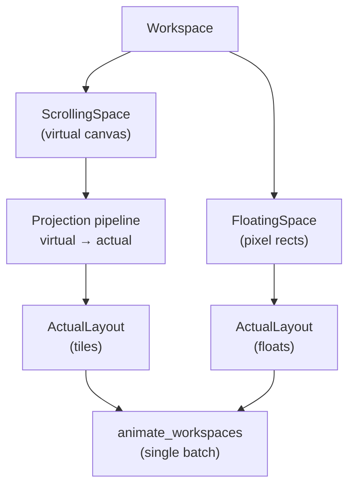
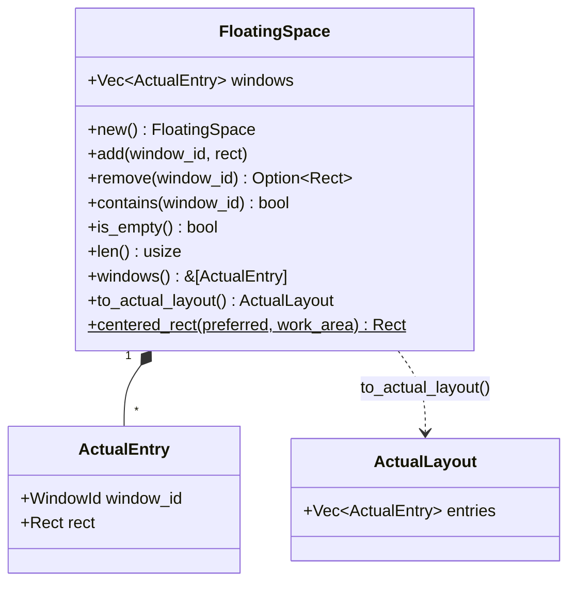
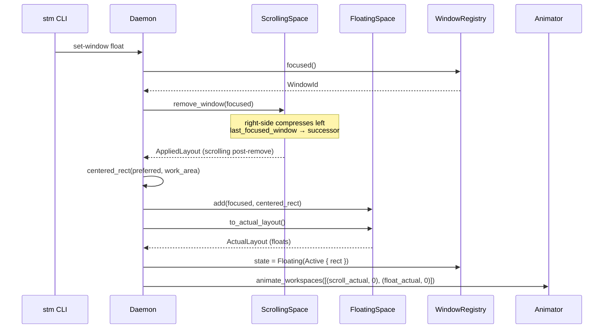
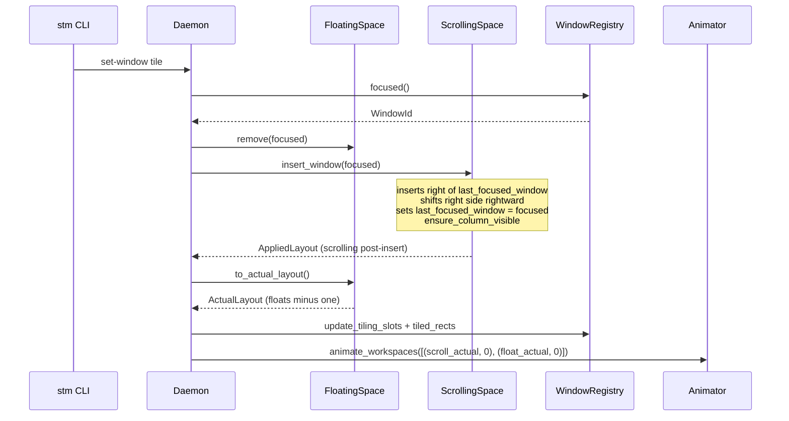
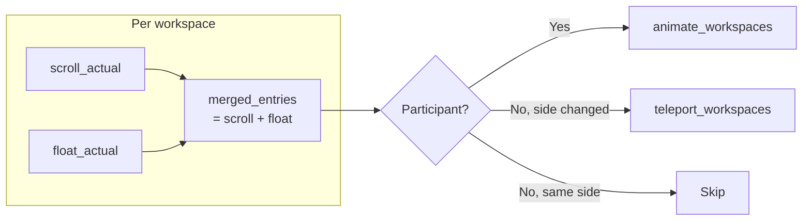
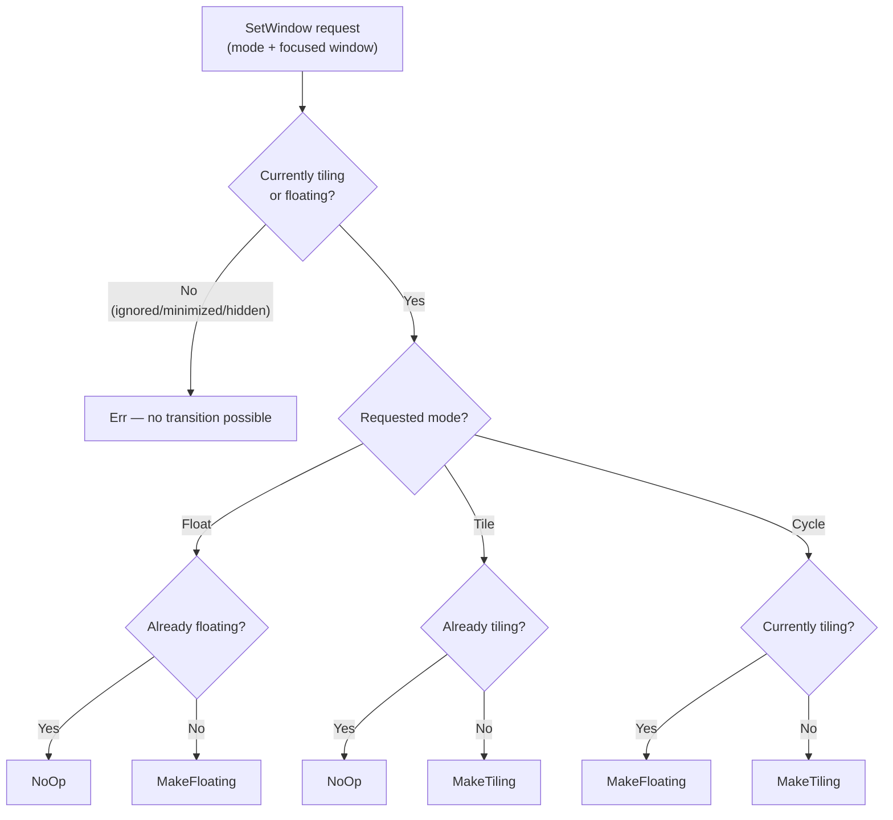

# Floating Space

Floating windows live in **literal on-screen pixel coordinates** (the *actual*
layer). Unlike `ScrollingSpace`, which models an infinite virtual canvas and
projects tiles into screen rects, `FloatingSpace` stores each window's position
directly as an `ActualEntry` — the same type the animation layer consumes. This
means floating windows never pass through the virtual-to-actual projection
pipeline; they are already where they need to be.

This chapter covers the architecture of the floating-space subsystem: its data
model, the tile-to-float and float-to-tile transitions, how animation batches
are coordinated, and how floating windows participate in workspace switching.

## Two Coordinate Spaces — Where FloatingSpace Sits

Each workspace is split between two spatial models (see [layout
overview](./layout/overview.md) for the full virtual/actual pipeline):

- **ScrollingSpace** — infinite horizontal virtual canvas. Windows live in
  columns; the projection pipeline maps virtual geometry to on-screen pixel
  rectangles. This is the tiling engine.
- **FloatingSpace** — direct on-screen pixel rectangles. No virtual canvas, no
  projection, no camera. What you store is what you animate.

The two spaces are structurally independent but share the same animation
pipeline. Every mutation that touches either side produces an `ActualLayout`
that is submitted to `animate_workspaces` in a single coordinated batch.



## Data Model

`FloatingSpace` ([`src/workspace/floating_space.rs`](../../src/workspace/floating_space.rs))
holds an ordered `Vec<ActualEntry>`. Later entries render on top (z-order). The
struct is pure data and math — no Win32, no side effects.



### Why `ActualEntry`?

`FloatingSpace` uses the same `ActualEntry` type as the projection pipeline's
output. This makes `to_actual_layout()` a trivial clone-and-wrap — no
coordinate conversion needed. The animation layer always receives the same
type regardless of whether a window is tiled or floating.

### The `centered_rect` Algorithm

When a window is floated for the first time, it needs a default position.
`centered_rect` is a pure function that computes this:

1. Clamp `preferred.width` to `[0, work_area.width]` (same for height).
2. Center horizontally: `x = work_area.x + (work_area.width - w) / 2`.
3. Center vertically: `y = work_area.y + (work_area.height - h) / 2`.

The result is a `Rect` guaranteed to fit within `work_area`. Oversized windows
are clamped rather than scaled — their dimensions are simply capped.

The *preferred* size comes from the window's `last_natural_size` (the visible
content rect measured at registration time). If that's unavailable or zero, the
config fraction fallback (`FloatingConfig.default_width/height` × work area
dimensions) is used. See [Configuration](#configuration) for the defaults.

## Tile ↔ Float Transitions

The two transitions are the heart of the floating-space subsystem. Both
operate on the **OS-focused window** (`registry.focused()`). The window that
was focused before the transition is the same window that's focused after — the
transition changes the window's *space*, not its *focus*.

### Tile → Float: Pop to Center

1. `ScrollingSpace::remove_window(focused)` — removes the tile from the
   virtual canvas. This already handles right-side compression and focus
   succession: `last_focused_window` moves to `next_available_window`.
2. Compute a centered float rect using `last_natural_size` (preferred) or
   config fraction fallback.
3. `FloatingSpace::add(focused, rect)` — appends to the floating list
   (newest on top of z-order).
4. Animate both the post-removal scrolling layout and the updated floating
   layout in a single batch.



Key point: **OS focus stays on the same window**. It pops to center while
the scrolling grid rearranges behind it. `ScrollingSpace::last_focused_window`
(see [Focus model](#focus-model-clarification)) moves to the next tile, but
the user's foreground window doesn't change.

### Float → Tile: Snap to Grid

1. `FloatingSpace::remove(focused)` — removes the window from the floating
   list, returning its old rect.
2. `ScrollingSpace::insert_window(focused)` — inserts a new column
   immediately after `last_focused_window`, shifts right-side columns
   rightward, sets `last_focused_window = focused`, and calls
   `ensure_column_visible`.
3. Animate both the post-insertion scrolling layout and the remaining
   floating layout in a single batch.



Key point: the window snaps from its floating rect into a tile slot.
`last_focused_window` is set to the newly tiled window so the next
insert will go to its right.

### Side-by-Side Comparison

| | Tile → Float | Float → Tile |
|---|---|---|
| **Moved window** | Pops to centered rect | Snaps into new tile slot right of `last_focused_window` |
| **Scrolling layout** | `remove_window`: right-side compresses left, `last_focused_window` → successor | `insert_window`: new column added right of `last_focused_window`, right side shifts right |
| **Floating space** | `add(focused, centered_rect)` — new entry appended | `remove(focused)` — entry removed |
| **OS focus** | Unchanged (same window stays foreground) | Unchanged (same window stays foreground) |
| **`last_focused_window`** | Moves to `next_available_window` via remove-window succession | Set to the moved window (it's now the most recently interacted-with tile) |
| **Registry state** | `Tiling(Active)` → `Floating(Active { rect })` | `Floating(Active)` → `Tiling(Active { col, row })` (auto-synced by `update_tiling_slots_from_layout`) |

## Animation Batch Merging

`dispatch_set_window` submits a **single** `animate_workspaces` call with two
`(ActualLayout, y_offset)` pairs at `y_offset = 0` (same workspace):

```
[(scroll_actual, 0), (float_actual, 0)]
```

This is the same pattern used by `dispatch_move_window_to_workspace`. Both the
scrolling and floating layouts are submitted together so the animator's
`RetargetFromCurrent` policy coordinates the entire transition in lockstep —
tiles slide to fill the gap while the floated window simultaneously moves to
center (or vice versa). Submitting them separately would cause a visible
desynchronisation where one side animates before the other.

## Workspace Switching with Floats

`dispatch_switch_workspace` extends naturally: for each workspace on the active
monitor, the daemon merges the scrolling `ActualLayout` and the floating
`ActualLayout` into one combined layout before partitioning into the
animate/teleport/skip buckets.



Why merge rather than submit separate batches? Two reasons:

1. **y-offset coherence** — every window in a workspace shares the same
   y-offset for the workspace switch. Separate batches could place tiles and
   their workspace's floating windows at different offsets mid-animation.
2. **Per-workspace stacking invariant** — the animator processes windows in
   batch order. Merging keeps all windows from one workspace together, which
   matters when `RetargetFromCurrent` compares current against target
   positions.

## Focus Model Clarification

Three distinct "focus" concepts exist in the codebase. Conflating them caused
bugs during early development of the floating-space feature, so the naming
was deliberately differentiated.

| Concept | Owner | Scope | Used for |
|---------|-------|-------|----------|
| **OS focus** (`registry.focused()`) | `WindowRegistry` | Global — the actual Win32 foreground window | Determining which window `set-window` acts on; `SetForegroundWindow` calls |
| **`ScrollingSpace::last_focused_window`** | `ScrollingSpace` | Per-space — most recently interacted-with **tile** | Insert-after-focused, remove-with-succession, monocle target |
| **(none for floats)** | — | — | `set-window` operates on OS focus regardless of which space the window is in |

### Why `last_focused_window` (not `focused`)

The original field was named `focused`, which implied OS-level foreground. This
caused confusion when implementing `set-window`: is "the focused window" the
OS-foreground window or the scrolling space's internal cursor? Renaming to
`last_focused_window` makes the "history cursor" semantics explicit — it tracks
the most recently interacted-with **tile within this space**, not the global
Win32 foreground.

Floating windows have no separate cursor because the OS focus is sufficient:
`dispatch_set_window` reads `registry.focused()` to find the target window, then
inspects its `WindowState` to decide what transition to apply. The scrolling
space's cursor is irrelevant for this lookup.

## Configuration

The `[floating]` section in `stm.toml` controls default floating window
dimensions:

```toml
[floating]
# default_width = 1200    # explicit pixel width (optional)
# default_height = 800    # explicit pixel height (optional)
```

Both fields are optional explicit pixel sizes (`Option<i32>`). When omitted
(the default), the daemon uses a built-in fallback: 60% × 80% of the monitor's
work area, capped at approximately 1536 × 1152 pixels (derived from a QHD
2560×1440 reference). The cap ensures ultrawide and 4K monitors don't produce
absurdly large popups. An explicit pixel value is always respected as-is — the
cap applies only to the fallback. The fallback constants live in
[`src/daemon/dispatch.rs`](../../src/daemon/dispatch.rs).

These defaults are used as a **fallback** when a window has no
`last_natural_size`. Most windows *do* have a natural size (measured from their
DWM visible rect at registration time), so the fallback is only consulted for
edge cases where the natural size is zero or unavailable.

### Config-defaults rule

Code is the single source of truth. The `Default` impl in
[`src/config/types.rs`](../../src/config/types.rs) defines the actual runtime
defaults; `default-config.toml` is a hand-written example synced by a
compile-time test. See [config and persistence](./config-and-persistence.md)
for the full design rationale.

## IPC + CLI

### Command Surface

```
stm dispatch set-window float     # float the focused window
stm dispatch set-window tile      # tile the focused window
stm dispatch set-window cycle     # toggle based on current state
```

The IPC wire format:

```json
{"type": "set_window", "mode": "float"}
{"type": "set_window", "mode": "tile"}
{"type": "set_window", "mode": "cycle"}
```

`SocketMessage::ToggleFloat` is aliased to `dispatch_set_window(Cycle)` —
the legacy toggle name and the new cycle mode are semantically identical.

### The Decision Function

`resolve_set_window_action` is a pure `const fn` extracted from
`dispatch_set_window` so the full mode × state decision table is unit-testable
without constructing a `ScrollTilingManager` (which owns Win32 handles).



Full decision table:

| mode | currently tiling | currently floating | result |
|------|------------------|--------------------|--------|
| Float | true | false | MakeFloating |
| Float | false | true | NoOp |
| Tile | true | false | NoOp |
| Tile | false | true | MakeTiling |
| Cycle | true | false | MakeFloating |
| Cycle | false | true | MakeTiling |
| *any* | false | false | Err (ignored / minimized / hidden) |

## Future Work

Several enhancements are planned but not yet implemented:

- **Smart placement** — cascade floating windows so they don't fully overlap,
  or offset new floats by a fixed delta from the previously floated window.
- **Per-window float size memory** — remember each window's last floating
  rect and restore it on subsequent tile→float transitions, rather than
  re-centering every time.
- **Z-order raising** — use `place_above` (via `SetWindowPos` with
  `HWND_TOPMOST` / restore) to bring the focused floating window to the top
  of the z-order, matching the expected "click to focus" behavior.
- **Floating gap management** — reserve padding around floating windows so
  they don't visually collide with tiled windows at workspace edges.

## Cross-References

- [Workspace Hierarchy](./workspace.md) — where `FloatingSpace` fits in the
  monitor → workspace → space tree.
- [Layout Overview](./layout/overview.md) — the virtual/actual projection
  pipeline that `FloatingSpace` deliberately bypasses.
- [Window Registry](./window-registry.md) — `WindowState::Floating`, focus
  tracking, and `last_natural_size`.
- [Animation](./animation.md) — how `animate_workspaces` processes the merged
  batch.
- [IPC & Watchdog](./ipc-and-watchdog.md) — the full `SocketMessage` catalog
  and named-pipe transport.
- [Config & Persistence](./config-and-persistence.md) — config resolution,
  the code-is-source-of-truth model, and the dual-edit rule.
