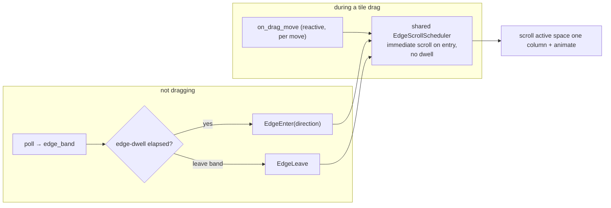

# Hover — Focus-Follows-Mouse & Edge-Hover-Scroll

Flow is a keyboard-and-drag tiling window manager. The **hover subsystem** adds
two pointer-driven behaviors that let a user navigate the whole workspace with
the mouse alone:

1. **Focus-follows-mouse (FFM)** — rest the cursor on an eligible managed
   window for a short dwell and that window receives focus through the existing
   focus path (inheriting scroll-to-reveal, border recolor, and workspace
   switching for free).
2. **Edge-hover-scroll** — rest the cursor in a screen edge band for a short
   edge-dwell and the tile viewport scrolls one column immediately, then glides
   at the shared edge-scroll cadence until the cursor leaves the band or the
   content edge is reached.

Both behaviors share **one low-rate cursor poll** and **one** edge-scroll
auto-repeat scheduler. They ship **on by default** — a deliberate trade-off
pinned in [ADR-0001](../adr/0001-hover-subsystem.md); the configuration rename
that gave edge-scroll its own block is [ADR-0002](../adr/0002-edge-scroll-config-block.md).

This page is the architecture narrative. The per-item contracts live in
docstrings; the pure decision logic lives in the [`hover`](../../hover/index.html)
module (`HoverController`, `edge_band_direction`).

## Why a poll, not a hook

The cursor source is **`GetCursorPos` polled on the main loop**, not a
`WH_MOUSE_LL` low-level mouse hook. A low-level hook fires at the mouse hardware
reporting rate (up to 8000 Hz on gaming mice) and needs its own thread — exactly
the cost this daemon exists to avoid. Polling lets us choose the rate and keep
it independent of the user's hardware. The default interval is **25 ms** (~40 Hz),
clamped to an 8 ms floor at load so a configuration typo cannot busy-loop.

The poll is folded into the main loop's existing wait-timeout `min`-reduce (see
[Tile Drag § Edge Scroll](./tile-drag.md) and `compute_wait_timeout_inner` in
`src/daemon/run.rs`), alongside the pending-creations, float-resume,
foreground-sync, and edge-scroll deadlines. The poll deadline is **armed only
while at least one behavior flag is on and no tile drag is in progress**. When
both flags are off there is no poll deadline and the loop sleeps indefinitely —
the daemon's long-standing zero-CPU-while-idle property is preserved when the
feature is disabled.

## The poll pipeline

Each poll classifies the cursor into exactly one outcome and feeds the pure
[`HoverController`](../../hover/controller/struct.HoverController.html), which
emits the actions the wiring then translates into Win32 calls. The controller
holds all the decision logic; the wiring (`src/daemon/hover.rs`) only translates.

```mermaid
flowchart TD
    A["main-loop wake"] --> B{"any hover flag on<br/>and not dragging?'}
    B -- no --> Z["no poll, no deadline"]
    B -- yes --> C["GetCursorPos"]
    C --> D["edge_band_direction(cursor, work_area, band_width)"]
    C --> E["WindowFromPoint → GetAncestor(GA_ROOT)<br/>→ tracked && not foreground?"]
    D --> F["HoverPoll { cursor, edge_band, target }"]
    E --> F
    F --> G["controller.on_poll(...) -> Vec<HoverAction>"]
    G --> H["apply each action:<br/>Focus / ArmDwell / CancelDwell /<br/>ArmEdgeDwell / CancelEdgeDwell /<br/>EdgeEnter / EdgeLeave"]
```

Two pure inputs are resolved per poll:

- **`edge_band`** — a horizontal-only, screen-edge geometric test
  ([`edge_band_direction`](../../hover/edge_band/fn.edge_band_direction.html))
  of the cursor against the active workspace's monitor work area and the shared
  `band_width`. It deliberately does **not** reuse the drag's drop-zone resolver
  (that is drag-coupled and returns column/row drop targets hover does not care
  about).
- **`target`** — the window under the cursor via `WindowFromPoint`, **walked to
  its top-level ancestor** (`GetAncestor(GA_ROOT)`) before the registry
  membership check. Without the walk, child controls inside a window would read
  as untracked and defeat FFM. `Some(hwnd)` only when that top-level window is a
  tracked managed window (tiling **or** floating) that is not already the
  foreground; `None` otherwise.

**Edge-band takes precedence:** when the cursor is in a band, the edge path runs
and any pending FFM dwell is cancelled. `target` is consulted only off-band.

## Focus-follows-mouse: the movement-gate

The non-obvious part of FFM is defeating the classic **alt-tab steal-back** —
you alt-tab to a window, and the window your mouse happens to sit on immediately
steals focus back. The usual fixes (keyboard detection, a cooldown timer,
forcibly moving the cursor) are all rejected (ADR-0001). Instead the controller
uses a **movement-gate**:

- The dwell **arms only** when a poll observes the cursor at a position
  **different from the previous poll** *and* that position is over an eligible
  window, and **any motion restarts it**. That makes the dwell a *sweep
  debounce*: a cursor actively moving across windows keeps pushing the deadline
  past the next poll and never fires, so only the window the cursor *stops* on
  is focused. This is why the default dwell is one poll — 25 ms — rather than a
  deliberate "rest to focus" pause. For the sweep protection to hold, keep
  `focus_dwell_ms ≥ poll_interval_ms`; lower it toward 0 for instant "sloppy"
  focus at the cost of flash-focusing windows mid-sweep.
- The dwell is **cancelled by any foreground change** — the existing
  `on_focus_changed` handler feeds `controller.on_foreground_change()`, which
  cancels a pending dwell.

After an alt-tab, the cursor has not moved, so the dwell never re-arms until the
user moves the mouse. No keyboard detection, no timer, no forced movement.

There is **no defocus**: hovering an untracked window or the taskbar yields
`target = None`, the controller emits `CancelDwell`, and focus simply stays
where it was. On dwell expiry, `Focus(hwnd)` is delivered through the **existing
focus path** — `set_foreground_window`, which triggers `EVENT_SYSTEM_FOREGROUND`
→ `on_focus_changed`, so scroll-to-reveal, border recolor, and workspace
switching are inherited uniformly rather than reimplemented.

## Edge-hover-scroll: one scheduler, two feed sites

Edge-hover-scroll does **not** own a second state machine. There is a **single**
edge-scroll auto-repeat scheduler held on the orchestrator
(`FlowWM::edge_scroll`), promoted to crate visibility by [ticket 01]. It is the
existing immediate-then-first-gap-then-repeat machine with content-edge
feedback, unchanged in behavior. It is fed from two sites that **never run at the
same time**:



- **Drag feed** (co-located with drop-zone resolution in `on_drag_move`): the
  band check rides the drag's existing per-move cursor read for free, and stays
  reactive because the screen-edge band geometrically overlaps the first/last
  column's insert band — scroll-versus-insert priority must be resolved
  **atomically from one cursor read**. The drag's first scroll is **immediate**
  (dragging is high intent; no dwell).
- **Hover feed** (`src/daemon/hover.rs`): when not dragging, the poll feeds band
  transitions into the same scheduler, gated behind an **edge-dwell** (default
  150 ms — intentionally longer than the 25 ms focus dwell) so brushing the
  edge does not jump the viewport. On expiry the controller emits
  `EdgeEnter(direction)`; the wiring arms the shared scheduler (immediate scroll
  + first-gap + repeat). Leaving the band emits `EdgeLeave`, which stops the
  scheduler and clears the edge-dwell deadline.

They never collide: `poll_hover` bails the moment a drag starts
(`drag_state.is_some()`), and `on_drag_start` clears any armed edge-dwell. With
edge-scroll off but FFM on, `edge_band` is `None` and the controller only ever
runs the FFM path — edge-hover does nothing.

## Configuration

Two blocks govern the feature. Defaults live in the `Default` impls in
`src/config/types.rs`; `default-config.toml` is a hand-written example kept in
sync by `default_config_toml_matches_compiled_defaults`.

### `[hover]`

| Field | Type | Default | Meaning |
|-------|------|---------|---------|
| `focus_follows_mouse` | `bool` | `true` | Master switch for FFM. |
| `focus_dwell_ms` | `u32` | `25` | Sweep debounce before FFM focuses; any motion restarts it. Keep ≥ `poll_interval_ms`. |
| `edge_scroll` | `bool` | `true` | Master switch for edge-hover-scroll. |
| `edge_dwell_ms` | `u32` | `150` | Rest time in a band before the first edge-scroll; longer than the focus dwell (edge-scroll needs intent). |
| `poll_interval_ms` | `u32` | `25` | Shared poll interval; clamped to an 8 ms floor. |

### `[edge_scroll]` (shared with drag — ADR-0002)

| Field | Type | Default | Meaning |
|-------|------|---------|---------|
| `band_width` | `i32` | `30` | Pixel width of the left/right edge bands. |
| `initial_delay_ms` | `u32` | `500` | Gap from the immediate entry scroll to the first repeat. |
| `repeat_interval_ms` | `u32` | `240` | Gap between successive column scrolls. |

These three parameters were promoted **out of `[drag]`** into their own block
because, once hover reuses the same band and cadence, they are genuinely shared
rather than drag-owned. This is a **breaking rename**: existing user configs
that customized them under `[drag]` silently revert to the defaults. `[drag]`
now retains only its drag-specific column-insert hit-band parameters
(`col_edge_ratio`, `col_edge_max_px`).

## The default-on trade-off

Enabling either behavior (both ship **on**) means the daemon polls forever at
the configured interval, so the zero-CPU-while-idle property no longer holds by
default. This is deliberate (ADR-0001): the poll interval, focus dwell, and edge
dwell are the three knobs governing the cost/responsiveness trade-off, and all
are user-configurable. Flipping both flags to default-off is a one-line,
low-risk reversal if it proves too costly in practice; with both off the idle
invariant is fully restored.

## Suppression and edge cases

- The **entire** hover subsystem is suspended while a tile drag is in progress
  (`poll_hover` early-returns).
- FFM during a **floating-window** drag is handled implicitly by the
  movement-gate: the cursor is in motion while dragging, so the dwell never
  arms. No explicit float-drag detection is added.
- Edge-hover-scroll firing during a floating-window drag is a known, mild,
  deferred edge case; no speculative latch is built.

## Coverage strategy

The hard logic — movement-gated dwell, cancel-on-focus, eligibility, per-poll
precedence, edge-dwell arming — is extracted as the **pure, clock-injectable**
[`HoverController`](../../hover/controller/struct.HoverController.html) and
[`edge_band_direction`](../../hover/edge_band/fn.edge_band_direction.html),
fully unit-tested with no daemon construction and no Win32. The wait-timeout
reducer (`compute_wait_timeout_inner`) is likewise pure and unit-tested for
every deadline source including the new poll, focus-dwell, and edge-dwell
deadlines.

The Win32-coupled glue — the orchestrator hover methods, the main-loop deadline
folding, and the poll loop — cannot be unit-tested without a cross-cutting
injection seam that is out of scope. It is covered by the pure tests plus manual
interactive testing, the same coverage strategy already used for the tile-drag
lifecycle.

## Cross-References

- [ADR-0001 — Hover subsystem](../adr/0001-hover-subsystem.md): poll-not-hook, movement-gated dwell, unified scheduler.
- [ADR-0002 — Edge-scroll config block](../adr/0002-edge-scroll-config-block.md): promoting the shared parameters.
- [Tile Drag](./tile-drag.md): the drag feed of the shared scheduler; edge scroll during drag.
- [Config & Persistence](./config-and-persistence.md): code-as-source-of-truth, `#[serde(default)]`.
- The pure decision module: `src/hover/` (`HoverController`, `edge_band_direction`).
- The impure wiring: `src/daemon/hover.rs`; the main-loop folding in `src/daemon/run.rs`.
