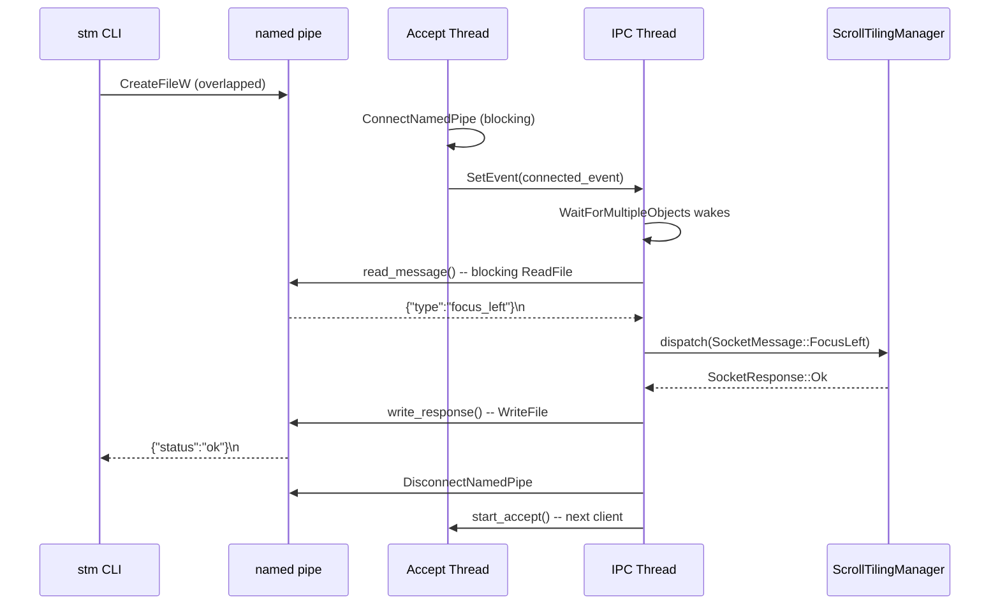
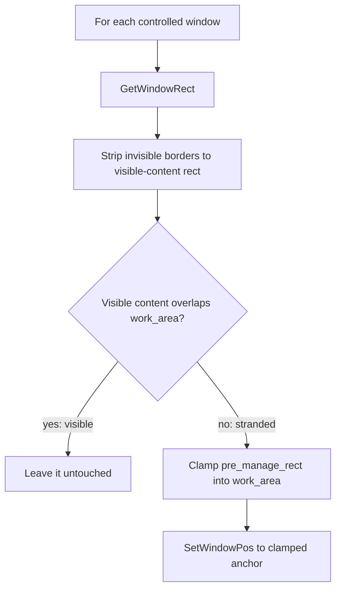

# IPC and Watchdog

The `stm` CLI communicates with the `stmd` daemon over a single Windows named pipe
using newline-delimited JSON. The daemon listens for one client at a time on a
background accept thread, while the main IPC thread processes hook events and
dispatches commands. A separate `stm-watchdog` binary is planned for crash recovery.

## Named-Pipe Protocol

The IPC transport uses the Windows named pipe `\\.\pipe\stm` (configurable via the
`STM_PIPE_NAME` environment variable for integration tests). The wire format is
newline-delimited JSON: each message is a single JSON object terminated by `\n`,
serialised by `serde_json`. The encoding and decoding helpers live in
[`src/ipc/message.rs`](../../src/ipc/message.rs).

The pipe uses byte mode (`PIPE_TYPE_BYTE | PIPE_READMODE_BYTE`) with duplex
access. The server accepts one client at a time (sequential, not concurrent).
After processing a request, the server disconnects and waits for the next
connection. The server is created with `FILE_FLAG_FIRST_PIPE_INSTANCE` so that a
second daemon instance fails fast with an address-in-use error instead of
silently replacing the first.

### Why a Named Pipe

A named pipe was chosen over TCP or Unix-domain sockets for three reasons:

- **Local-only** -- named pipes are inherently local to the machine. No network
  exposure, no firewall rules, no port conflicts.
- **Windows-native** -- `CreateNamedPipeW` / `ConnectNamedPipe` are the standard
  Win32 IPC primitives. No third-party dependency, no compatibility shim.
- **ACL-capable** -- the pipe can (and will, in a future hardening pass) accept a
  `SECURITY_ATTRIBUTES` structure to restrict access to the current user session.
  Currently any local process can connect (acceptable for the single-user MVP).

### Client-Side Timeout

The client opens the pipe with `FILE_FLAG_OVERLAPPED` so every read/write is
bounded by a 30-second deadline (`IPC_TIMEOUT` in
[`src/ipc/transport.rs`](../../src/ipc/transport.rs)). If the daemon accepts the
connection but never replies, `CancelIo` fires and the CLI returns a `TimedOut`
error instead of hanging forever. Each overlapped operation uses a Win32 manual-
reset event and `WaitForSingleObject` to await completion or cancellation. This
prevents integration tests from stalling when the daemon is stuck in layout
computation.

### Server-Side Architecture

The server side in [`src/ipc/transport.rs`](../../src/ipc/transport.rs) uses
synchronous (blocking) I/O -- appropriate because the daemon's clients are one-
shot `stm` invocations that always send immediately. The `PipeServer` struct
manages a background accept thread: `start_accept()` spawns a short-lived thread
that blocks in `ConnectNamedPipe`, then signals a Win32 event to wake the main
thread's `WaitForMultipleObjects`. See [threading model](threading-model.md) for
how the connected event coexists with the hook signal in the main loop.

All pipe handles are wrapped in `PipeHandle` (RAII, closes on drop) and a
similar `EventHandle` wrapper manages Win32 event handles, preventing kernel
handle leaks on early returns.

## Message Surface

### SocketMessage (CLI -> Daemon)

Commands are grouped by purpose. All variants use serde's externally-tagged enum
format with a `"type"` field and snake_case variant names.

| Group | Variants | Description |
|-------|----------|-------------|
| Control | `Stop`, `ReloadConfig`, `CheckConfig` | Daemon lifecycle and config |
| Focus | `FocusLeft/Right/Up/Down` | Move focus between windows |
| Swap (per-window) | `SwapLeft/Right/Up/Down` | Swap focused window with neighbour |
| Swap (column) | `SwapColumn { direction }` | Swap entire focused column |
| Semantic move | `MoveWindow { direction }` | Daemon resolves concrete action by state |
| Scroll | `ScrollLeft`, `ScrollRight` | Slide the viewport |
| Column resize | `ExpandColumn`, `ShrinkColumn`, `SetColumnWidth { width_px }` | Adjust column widths |
| Window state | `ToggleFloat`, `ToggleMonocle`, `PlaceAbove`, `Promote`, `CloseWindow` | Per-window operations |
| Workspace | `SwitchWorkspace { workspace_id }`, `SwapWorkspace { workspace_id }`, `MoveWindowToWorkspace { workspace_id }` | niri-style virtual desktops (`Switch`/`Move` implemented; `Swap` stub) |
| Query | `QueryWindowsAll`, `QueryLayoutVirtual`, `QueryLayoutActual`, `QueryState` | Read-only introspection |
| Config mutation | `SetConfigValue { key, value }` | Runtime config change |
| App preferences | `ForgetApp { exe }`, `ForgetAllApps` | Clear per-app learned state |

The `MoveWindow` variant is deliberately semantic: for tiled windows moving
left or right it delegates to `SwapColumn`, but the daemon owns the translation
so keybindings stay stable as floating support lands. Vertical movement
(within-column swap) and floating-window nudging are deferred — only the
tiled left/right path is wired today.

Of the three workspace variants, `SwitchWorkspace` and `MoveWindowToWorkspace`
are fully implemented (see [Workspace Hierarchy](./workspace.md) for the
vertical-packing switch animation). Only `SwapWorkspace` returns
`unimplemented_command` — its protocol shape is locked in, but its animation
model (two workspaces exchanging positions in the packed stack) is still
undecided.

### SocketResponse (Daemon -> CLI)

| Variant | Fields | When |
|---------|--------|------|
| `Ok` | -- | Command succeeded |
| `Error` | `message: String` | Command failed |
| `Data` | `payload: serde_json::Value` | Response to a query command |

Responses use a `"status"` tag (`"ok"`, `"error"`, `"data"`), distinct from the
message `"type"` tag. A response-shaped JSON will not parse as a `SocketMessage`
and vice versa -- the tests in [`src/ipc/message.rs`](../../src/ipc/message.rs)
enforce this explicitly.

## The `stm` CLI Client

The CLI ([`src/bin/stm.rs`](../../src/bin/stm.rs)) is built with `clap` and
structured into four top-level command groups. Every dispatch command sends a
single `SocketMessage` and prints a one-line success or error message. The CLI
does no layout computation -- it is a thin transport layer. See
[event pipelines](event-pipelines.md) for what happens on the daemon side after
a command arrives.

### Lifecycle

| Command | Action |
|---------|--------|
| `stm start [--config <dir>] [--log-file <path>]` | Spawn `stmd.exe` detached, poll until pipe is ready |
| `stm stop` | Send `Stop` via named pipe |

`stm start` locates `stmd.exe` next to the current executable, spawns it with
`CREATE_NEW_PROCESS_GROUP | CREATE_NO_WINDOW` (falling back to plain `spawn()`
under WSL interop), then polls the pipe at 200 ms intervals for up to 5 seconds.
The `--config` flag sets `STM_CONFIG_DIR` in the current process before spawning
so the child inherits it; the `--log-file` flag is forwarded as a CLI argument.

### Config

| Command | Action |
|---------|--------|
| `stm config init` | Create config dir + write default files (no daemon contact) |
| `stm config reload` | Send `ReloadConfig` to daemon |
| `stm config edit` | Open config dir in `$EDITOR` / `VISUAL` / `notepad.exe` |
| `stm config path` | Print resolved config directory path |
| `stm config check` | Validate config files locally |

All config commands except `reload` operate on local files without contacting the
daemon. The config directory resolution chain is documented in
[config and persistence](config-and-persistence.md).

### Query

| Command | Action |
|---------|--------|
| `stm query all` | Send `QueryWindowsAll`, pretty-print JSON response |

### Dispatch

| Command | Maps to |
|---------|---------|
| `stm dispatch focus left/right/up/down` | `FocusLeft/Right/Up/Down` |
| `stm dispatch swapcolumn left/right` | `SwapColumn` |
| `stm dispatch movewindow left/right` | `MoveWindow` |
| `stm dispatch expandcolumn` | `ExpandColumn` |
| `stm dispatch shrinkcolumn` | `ShrinkColumn` |
| `stm dispatch closewindow` | `CloseWindow` |
| `stm dispatch switchworkspace <id>` | `SwitchWorkspace` |
| `stm dispatch swapworkspace <id>` | `SwapWorkspace` (stub) |
| `stm dispatch movetoworkspace <id>` | `MoveWindowToWorkspace` |

The dispatch commands that change layout flow through the daemon's 3-stage
pipeline (mutate, project, animate) as described in
[architecture](architecture.md). The `CloseWindow` command is a special case:
it only queues `WM_CLOSE` and lets the `EVENT_OBJECT_DESTROY` hook handle the
actual layout removal, avoiding a race between the synchronous IPC response
and the asynchronous window destruction.

## Graceful-Shutdown Window Rescue

`stm stop` sends the `Stop` command, the event loop exits, and then -- before the
daemon process tears down -- [`ScrollTilingManager::rescue_stranded_windows`]
runs once. Its job is to bring windows that became **physically inaccessible**
during this STM session back onto the screen, without disturbing anything the
user can currently see.

### Why rescue is needed

STM parks non-active workspaces off-screen (one monitor height above or below
the active one) and scrolls windows horizontally across the infinite tiling
canvas. If the daemon simply exited, every window on a non-active workspace --
plus any window scrolled into the off-screen packing region of the active
workspace -- would be left stranded where STM put it: visible to Win32 (so a
future STM run would re-classify them as already-tiled) but unreachable to the
user, who has no way to scroll to a workspace that no longer exists.

### The visibility rule

The rescue pass treats the **operating system as ground truth**, not STM's own
bookkeeping. For each controlled window it calls `GetWindowRect` to find the
window's current rect, then asks: does the window's **visible content** overlap
the active monitor's `work_area`?

- **Yes (visible)** -- the user can see this window right now. Leave it exactly
  where it is. The user has almost certainly rearranged things by hand since STM
  started; rewinding their work would be hostile.
- **No (stranded)** -- the window is off-screen purely because STM moved it.
  Bring it back.

The visible-content rect is the raw `GetWindowRect` rect with the window's
invisible borders stripped (`InvisibleBounds::window_to_visible`). This step is
not cosmetic: `GetWindowRect` includes the ~7px invisible borders Windows 10/11
draw for drop shadows, while the layout engine parks columns flush against the
`work_area` edge in **visible** coordinates. Without the conversion, a window
parked exactly at the edge would bleed a few pixels of invisible border into the
`work_area` and read as "visible" -- so the rescue pass would leave it stranded
in the packing region of the active workspace. Stripping the borders recovers
the true visible rect, which only *touches* the edge and is correctly treated as
stranded. See `roadmap.md` ("GetWindowRect Includes Invisible Borders") for
background.

Touching edges do not count as overlapping, matching Win32 `IntersectRect`
semantics (see `Rect::overlaps`).

### The rescue target: `pre_manage_rect`

Each controlled window remembers the rect it had **when STM first noticed it**
(stored as `pre_manage_rect` at registration time). The rescue moves stranded
windows back to that anchor, then clamps the anchor into the `work_area` in case
the anchor itself is off-screen (e.g. the window came from a now-detached
monitor, or the work area changed because the taskbar moved).

Clamping shrinks-and-shifts rather than discards: a window larger than the work
area collapses to the work area's size; otherwise the original size is preserved
and only the position is nudged on-screen.

### Tiles and floats are unified

There is no special-casing between tiling and floating: every window STM is
actively positioning -- a `Tiling(Active)` or `Floating(Active)` window -- goes
through the same loop. `Minimized`, `Hidden`, and `Ignored` windows never reach
it. STM does not actively place minimized/hidden windows, so their position is
the OS's and the user's responsibility; leaving them alone on shutdown avoids
surprising the user by moving windows they intentionally hid.

### The "pre-this-run" contract

`pre_manage_rect` is the position the window held **before this STM run**, not
before the very first STM run in history. Consequences:

- If the previous STM session was killed **uncleanly** (crash, `taskkill /f`,
  Ctrl-C), windows it had tiled remain at their tiled positions. The next run
  captures *those* as the new baseline. The desktop self-heals after **one
  clean** `stm stop`.
- Minimized/hidden windows are out of scope entirely (see above); float windows
  lose any in-run drag history (acceptable for v1), restoring to their
  registration-time anchor.

The unclean-shutdown case -- where the daemon process is gone and cannot run the
rescue pass -- is exactly what the [`stm-watchdog`](#stm-watchdog-stub) is
planned for: it will restore from an on-disk snapshot without needing the daemon
alive.

### Code path

| Step | Location |
|------|----------|
| Wired after the event loop exits | [`src/main.rs`](../../src/main.rs) -- `stm.run()` then `stm.rescue_stranded_windows()` |
| The rescue loop | [`src/daemon/shutdown.rs`](../../src/daemon/shutdown.rs) |
| Which windows are controlled | `WindowRegistry::restorable_windows` in [`src/registry/core.rs`](../../src/registry/core.rs) |
| Clamp geometry | `Rect::clamped_into` in [`src/common/types.rs`](../../src/common/types.rs) |

## `stm-watchdog` (Stub)

[`src/bin/stm-watchdog.rs`](../../src/bin/stm-watchdog.rs) is a planned crash-
recovery helper. When the daemon exits unexpectedly, the watchdog is expected to
restore windows from a recovery snapshot so they are not stranded off-screen.

The binary currently prints `"not yet implemented"` and exits. When implemented,
it will be spawned by `stmd` as a child process with `--parent-pid` and
`--recovery-path` arguments. The watchdog will poll the parent PID and, on exit,
read the recovery snapshot (`stm-recovery.json`) and call `SetWindowPos` on
each HWND to restore windows to their pre-manage geometry.

### Why a Separate Binary

The watchdog must survive even if the daemon is corrupted, hung, or crashed. A
separate binary gives it:

- **Separate process lifetime** -- the OS reaps the daemon; the watchdog keeps
  running.
- **No dependency on daemon state** -- it reads a file and calls Win32 APIs.
  No shared memory, no locks, no complex initialisation.
- **Minimal code path** -- focused only on recovery, with nothing that can
  deadlock or panic in a way that blocks the restore.

A Windows service was considered but rejected: it requires admin privileges for
installation and introduces a service control manager dependency. A child
process is simpler, more portable, and sufficient for a single-user desktop tool.

## Cross-References

- [Threading model](threading-model.md) -- the IPC thread's `WaitForMultipleObjects`
  loop and how pipe connections coexist with hook events
- [Event pipelines](event-pipelines.md) -- the IPC command dispatch path through
  the 3-stage layout pipeline
- [Architecture](architecture.md) -- subsystem overview showing where the IPC
  server fits inside the daemon
