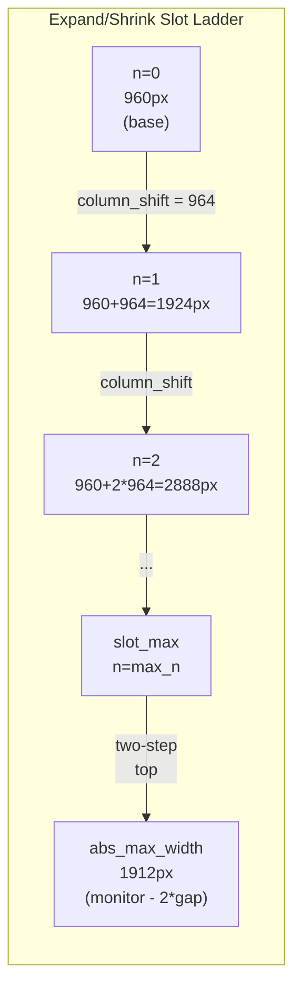

# Mutations

Every layout change in ScrollingTilingManager is expressed as a **pure function** that takes the current `VirtualLayout` and returns a new one. There is no in-place mutation, no side effects, no Win32 calls — every function is `#[must_use]` and fully unit-testable on any platform. The `src/layout/mutations.rs` module contains the complete catalog of these operations, each consuming only the virtual layout and a [`MutationConfig`](../../src/layout/mutations.rs) struct that carries the monitor dimensions, column width, gap settings, and the precomputed expand/shrink ladder.

## Mutation catalog

| Group | Operation | Pure function | Effect |
|-------|-----------|--------------|--------|
| Navigation | Focus left/right | `focus(layout, focused, dir, config)` | Moves focus to the nearest window in the given direction. Shifts the camera if the target column is off-screen (via `ensure_column_visible`). Vertical focus is always on-screen. |
| Navigation | Focus up/down | `focus(layout, focused, dir, config)` | Moves focus within the same column. Never shifts the camera. |
| Navigation | Scroll left | `scroll_left(layout, config)` | Decrements `viewport_offset` by one visible column step. Clamped to 0. |
| Navigation | Scroll right | `scroll_right(layout, config)` | Increments `viewport_offset` by one visible column step. Clamped to the max offset where the rightmost column edge meets the viewport right edge. |
| Structural | Swap column | `swap_column(layout, focused, dir, config)` | Swaps the focused window's entire column with its left or right neighbor. Calls `ensure_column_visible` to scroll if the focused column moved off-screen. Vertical directions return `None`. |
| Structural | Swap window | `swap_window(layout, focused, dir, config)` | Swaps the focused window with a specific adjacent window. For left/right, picks the nearest row in the adjacent column. For up/down, swaps rows within the same column. |
| Structural | Add window | `add_window(layout, window, config)` | Appends a new column to the right end of the canvas at `column_width`. No viewport adjustment — the caller decides whether to scroll. |
| Structural | Insert after focused | `insert_window_after_focused(layout, focused, window, config)` | Inserts a new column immediately after the focused window's column. Calls `ensure_column_visible` on the new column. |
| Structural | Add to column | `add_window_to_column(layout, col_idx, window)` | Appends a window as a new row in an existing column. |
| Structural | Remove window | `remove_window(layout, window, config)` | Removes a window from its column. If the column becomes empty, the column is removed entirely. Clamps `viewport_offset` to prevent scrolling past the new rightmost column. |
| Structural | Initialize windows | `initialize_windows(ids, config, focus_idx, widths)` | Builds the initial layout from a list of window IDs. Each becomes a single-row column. When `widths` is `Some`, each width is quantized to the nearest slot-ladder rung (clamped to `[column_width, abs_max_width]`); when `None`, all columns use `column_width`. Sets `viewport_offset` via the canvas-width fit predicate (see [Center behaviors](#center-behaviors-three-modes)). |
| Sizing | Expand column | `expand_column(layout, focused, config)` | Grows the focused column by one rung on the slot ladder. Two-step top jumps to `abs_max_width`. No-op if already at `abs_max_width`. |
| Sizing | Shrink column | `shrink_column(layout, focused, config)` | Shrinks the focused column by one rung. Reverses the two-step top. No-op if already at `column_width` (ladder floor). |
| Sizing | Set column width | `set_column_width(layout, focused, target_px, config)` | Sets the focused column to an explicit pixel width (free-form, not snapped to ladder). Bounded by `[min_column_width_px, abs_max_width]`. Calls `ensure_column_visible`. |
| Sizing | Resize column | `resize_column(layout, focused, delta_px, config)` | Adds a pixel delta to the current width and delegates to `set_column_width`. Used by drag-resize. |
| State | Toggle monocle | `toggle_monocle(layout, focused, saved, config)` | Enters monocle by setting the focused column to `abs_max_width` and saving the previous width. Exits monocle by restoring the saved width (defaults to `column_width`). |
| Viewport center | Center focused column | `center_viewport_on_focused(layout, focus_col, config)` | Computes a free-form `viewport_offset` that places the focused column's center at the monitor midpoint, using prefix-sum canvas positions (variable-width aware). **Always** centers, even when all columns already fit. Exposed as the `stm dispatch center` command. |
| Viewport center | Center canvas | `center_viewport_canvas(layout, config)` | Computes a free-form `viewport_offset` that centers the entire canvas in the monitor: `(canvas_width - monitor_width) / 2`. May return a negative offset when the canvas is narrower than the monitor (projection handles this). Used by `initialize_windows` (fit case) and the move-to-workspace auto-center hook (fit case). |

## The F4-ladder slot model

Expand and shrink move along a discrete **slot ladder** rather than by arbitrary pixel increments. This ensures the `window_gap` is always preserved between columns as widths change.



The ladder is defined by: `column_shift = column_width + window_gap` (one slot step), and rungs at `column_width + n * column_shift` for `n` in `[0, max_n]`. The `abs_max_width = monitor_width - 2 * window_gap` sits above the top regular rung (`slot_max`) as a **two-step top** — the leftover pixels between `slot_max` and `abs_max_width` are smaller than one `column_shift`, so they get absorbed in a single jump to full width. This is the monocle width.

Expand snaps **up** to the next rung using `floor((W - column_width) / column_shift)` to find the current rung, then advancing `n` by 1. Shrink snaps **down** using the same logic in reverse with `ceil`. Free-form widths from drag-resize that fall between rungs are handled gracefully: expand snaps them up to the next boundary, shrink snaps them down.

## Key algorithms

### `ensure_column_visible`

This function is the camera-adjustment primitive used by focus, swap, and insert operations. Given a column index, it computes the column's pixel range on the canvas (via prefix-sum), checks whether it overlaps the viewport `[offset, offset + monitor_width]`, and shifts the camera if not.

The offset adjustment is **free-form** — it is the minimum pixel scroll that reveals the target column with a `window_gap` margin on the appropriate side, clamped to at least 0. It is not snapped to the column_shift grid. This produces smooth, precise scrolling behavior rather than quantized jumps.

- Column off-screen left: `new_offset = max(col_left - gap, 0)`.
- Column off-screen right: `new_offset = max(col_right + gap - monitor_width, 0)`.
- Column already visible: no change.

### `expand_column` / `shrink_column`

These are the rung-climbing functions. From a column width `W`:

1. If `W >= abs_max_width`, return `None` (already at the top).
2. If `W >= slot_max`, jump to `abs_max_width` (two-step top).
3. Otherwise, compute `n = floor((W - column_width) / column_shift)`, advance to `n + 1`, and set `width_px = column_width + target_n * column_shift`.

Shrink mirrors this: from `abs_max_width`, `ceil` lands back on `slot_max`. From between rungs, `ceil` snaps down. Below `column_width`, it is a no-op — widths in `[min_column_width_px, column_width)` are reachable only via drag-resize (`set_column_width`), never through the ladder.

### `add_window` vs `insert_window_after_focused`

Two insertion strategies exist. `add_window` simply appends a new column at the right end of the canvas — useful for batch initialization. `insert_window_after_focused` places the new column immediately after the focused window's column, so the user sees their newly opened window adjacent to where they were working. Both create the column at `column_width`; the insert variant also calls `ensure_column_visible` on the new column to scroll the viewport if needed.

### `remove_window`

When a window is removed, it is spliced out of its column's `rows` vector. If the column becomes empty (no remaining rows), the entire column is removed from the `columns` vector. The `viewport_offset` is then clamped to `max_offset = max(total_canvas - monitor_width, 0)` to prevent the viewport from scrolling past the (now shorter) canvas. Focus fallback — choosing which window to focus next after removal — is handled by `ScrollingSpace` using `next_available_window`, not by the mutation itself.

### `initialize_windows`

Builds the initial `VirtualLayout` from a list of `WindowId` values. Each window becomes a single-row column.

**Width assignment.** When `widths: Some(&[u32])` is provided (the init flow collects each window's `pre_manage_rect.width` from the registry scan), each width is passed through `quantize_to_ladder` and snapped to the nearest slot-ladder rung, clamped to `[column_width, abs_max_width]`. When `widths: None`, every column uses `column_width` (the original behavior, retained for tests that don't care about variable widths). Free-form widths between rungs are reachable only via drag-resize (`set_column_width`), exactly as before — initialization always lands on a ladder rung.

**Viewport offset.** The `viewport_offset` is decided by the canvas-width fit predicate (see [Center behaviors](#center-behaviors-three-modes)):

- If `canvas_width(layout, window_gap) ≤ monitor_width` (all columns fit), the canvas is centered via `center_viewport_canvas`.
- Else if a focus column is provided, `ensure_column_visible` shifts the viewport to reveal the focus column with a `window_gap` margin.
- Else (overflow with no focus), `viewport_offset = 0`.

The old `columns_per_screen` config field is retained for compatibility but is **not** consulted by this logic — fit is computed from actual canvas width, which is the only correct approach once columns can have different widths.

## Center behaviors: three modes

There are three viewport-centering behaviors, each driven by a different trigger. They all use **prefix-sum canvas positions** (the same math `projection::project` and `ensure_column_visible` already use) — none of them assume uniform column widths.

```mermaid
flowchart TD
    Trigger["Trigger: user runs `stm dispatch center`,<br/>or automated flow needs viewport adjustment"]
    Trigger --> Decision{"What should be centered?"}

    Decision -->|"Explicit user command"| Focused["**Center focused column**<br/>viewport_offset = canvas_x(focused)<br/>- (monitor_width - focused_width) / 2<br/><br/>Always centers, even when all columns fit."]
    Decision -->|"Automated flow + everything fits"| Canvas["**Center canvas**<br/>viewport_offset =<br/>(canvas_width - monitor_width) / 2<br/><br/>May be negative when canvas < monitor."]
    Decision -->|"Automated flow + overflow"| Ensure["**Ensure column visible**<br/>existing `ensure_column_visible`<br/>(free-form min-scroll, gap margin)<br/><br/>No centering — just reveal the column."]

    Focused -.->|Used by| FC["`stm dispatch center` command<br/>(dispatch_center → ScrollingSpace::center_focused_column)"]
    Canvas -.->|Used by| CC["`initialize_windows` fit case<br/>move-to-workspace fit case<br/>(ScrollingSpace::center_canvas)"]
    Ensure -.->|Used by| EC["`initialize_windows` overflow case<br/>move-to-workspace overflow case<br/>(ScrollingSpace::ensure_focused_visible)"]
```

### `center_viewport_on_focused` — center the focused column

```
canvas_x(f) = Σ width[i] for i in 0..f + (f + 1) * window_gap
viewport_offset = canvas_x(focused) - (monitor_width - focused_width) / 2
```

The `(f + 1) * window_gap` term is the easy off-by-one trap: the canvas starts with a left-edge gap, then each column contributes its width plus a trailing gap, so column `f`'s left edge sits at `(f + 1)` gaps plus the widths of all preceding columns. `focused_width` is the focused column's **actual** `width_px` (read from the layout, not assumed) — this is the fix for the original bug where the old `center_viewport_grid`/`center_viewport_absolute` functions assumed uniform widths and computed `f * slot` instead.

This is the only behavior that centers **unconditionally** — the user explicitly asked for it via `stm dispatch center`. The other two behaviors are policy decisions made by automated flows.

### `center_viewport_canvas` — center the entire canvas

```
viewport_offset = (canvas_width(layout, window_gap) - monitor_width) / 2
```

Uses `projection::canvas_width` as the authoritative canvas math (`window_gap + Σ(width_px + window_gap)`). When the canvas is narrower than the monitor, this returns a negative offset — projection already supports this (the column's left edge is shifted right of the canvas origin by the gap, which compensates). Used when an automated flow knows everything fits and wants a clean visual midpoint.

### `ensure_column_visible` — reveal without centering (unchanged)

The existing free-form min-scroll primitive. Used by automated flows when the canvas overflows the monitor: rather than centering (which would push other useful columns off-screen), it shifts the viewport by the minimum amount needed to reveal the target column with a `window_gap` margin. See [`ensure_column_visible`](#ensure_column_visible) above.

### Why the old `center_viewport_grid` / `center_viewport_absolute` were removed

Both functions took `(num_columns, focus_col, config)` and computed positions as `f * slot` / `gap + N * slot`. They never saw `&VirtualLayout`, so once any column was expanded, shrunk, or drag-resized, the math was wrong. The refactor collapses them into the two prefix-sum primitives above (`center_viewport_on_focused` for the user command, `center_viewport_canvas` for the automated fit case), with `ensure_column_visible` covering the overflow case. The old "grid" vs "absolute" distinction (slot-aligned vs free-form) turned out to be a red herring: the real axis is "what should be centered" (focused column vs entire canvas vs nothing), not "is the offset quantized".

| Property | `center_viewport_on_focused` | `center_viewport_canvas` | `ensure_column_visible` |
|----------|------------------------------|--------------------------|-------------------------|
| Trigger | Explicit user command (`stm dispatch center`) | Automated flow, all columns fit | Automated flow, canvas overflows |
| Centers | Focused column at monitor midpoint | Entire canvas at monitor midpoint | Nothing — minimum-scroll reveal |
| Offset quantization | Free-form | Free-form | Free-form |
| Negative offset possible | Yes (when focused col is near canvas left) | Yes (when canvas < monitor) | No (clamped to ≥ 0) |
| Unconditional | Yes (always centers) | No (only used when fit predicate passes) | No (only used when target is off-screen) |

## The pure-function convention

Every mutation in the catalog follows the same signature pattern: `fn(&VirtualLayout, ...) -> Option<VirtualLayout>`. They never modify the input — they clone it internally and return a new value. This makes the mutation layer:

- **Composable** — the output of one mutation can be fed directly into another.
- **Testable** — unit tests construct a `VirtualLayout`, call a mutation, and assert on the result. No mocks, no Win32, no setup.
- **Deterministic** — the same input always produces the same output.

The `ScrollingSpace` orchestrator in [`src/workspace/scrolling_space.rs`](../../src/workspace/scrolling_space.rs) is the only code that calls these functions and applies the results. See [Pipeline](./pipeline.md) for how mutations flow into projection and animation.
