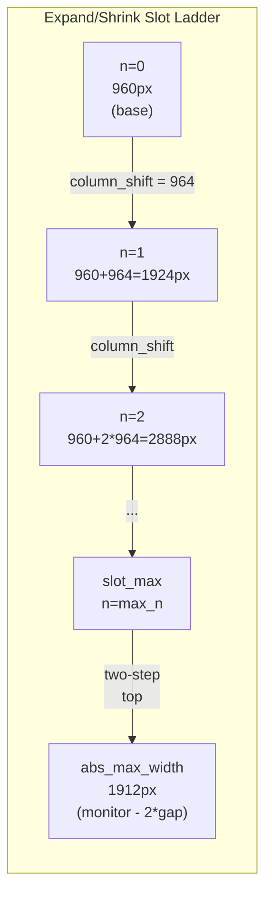

# Mutations

Every layout change in ScrollingTilingManager is expressed as a **pure function** that takes the current `VirtualLayout` and returns a new one. There is no in-place mutation, no side effects, no Win32 calls — every function is `#[must_use]` and fully unit-testable on any platform. The `src/layout/mutations.rs` module contains the complete catalog of these operations, each consuming only the virtual layout and a [`MutationConfig`](../../src/layout/mutations.rs) struct that carries the monitor dimensions, column width, gap settings, and the precomputed expand/shrink ladder.

## Mutation catalog

| Group | Operation | Pure function | Effect |
|-------|-----------|--------------|--------|
| Navigation | Focus left/right | `focus(layout, focused, dir, config)` | Moves focus to the nearest window in the given direction. Shifts the camera if the target column is off-screen (via `ensure_column_visible`). Vertical focus is always on-screen. |
| Navigation | Focus up/down | `focus(layout, focused, dir, config)` | Moves focus within the same column. Never shifts the camera. |
| Navigation | Scroll left | `scroll_left(layout, config)` | Decrements `viewport_offset` by one visible column step. Clamped to 0. |
| Navigation | Scroll right | `scroll_right(layout, config)` | Increments `viewport_offset` by one visible column step. Clamped to the max offset where the rightmost column edge meets the viewport right edge. |
| Structural | Swap column | `swap_column(layout, focused, dir, config)` | Swaps the focused window's entire column with its left or right neighbor. Calls `ensure_column_visible` to scroll if the focused column moved off-screen. Vertical directions return `None`. |
| Structural | Swap window | `swap_window(layout, focused, dir, config)` | Swaps the focused window with a specific adjacent window. For left/right, picks the nearest row in the adjacent column. For up/down, swaps rows within the same column. |
| Structural | Add window | `add_window(layout, window, config)` | Appends a new column to the right end of the canvas at `column_width`. No viewport adjustment — the caller decides whether to scroll. |
| Structural | Insert after focused | `insert_window_after_focused(layout, focused, window, config)` | Inserts a new column immediately after the focused window's column. Calls `ensure_column_visible` on the new column. |
| Structural | Add to column | `add_window_to_column(layout, col_idx, window)` | Appends a window as a new row in an existing column. |
| Structural | Remove window | `remove_window(layout, window, config)` | Removes a window from its column. If the column becomes empty, the column is removed entirely. Clamps `viewport_offset` to prevent scrolling past the new rightmost column. |
| Structural | Initialize windows | `initialize_windows(ids, config, focus_idx)` | Builds the initial layout from a list of window IDs. Each becomes a single-row column at `column_width`. Sets `viewport_offset` via `center_viewport_grid`. |
| Sizing | Expand column | `expand_column(layout, focused, config)` | Grows the focused column by one rung on the slot ladder. Two-step top jumps to `abs_max_width`. No-op if already at `abs_max_width`. |
| Sizing | Shrink column | `shrink_column(layout, focused, config)` | Shrinks the focused column by one rung. Reverses the two-step top. No-op if already at `column_width` (ladder floor). |
| Sizing | Set column width | `set_column_width(layout, focused, target_px, config)` | Sets the focused column to an explicit pixel width (free-form, not snapped to ladder). Bounded by `[min_column_width_px, abs_max_width]`. Calls `ensure_column_visible`. |
| Sizing | Resize column | `resize_column(layout, focused, delta_px, config)` | Adds a pixel delta to the current width and delegates to `set_column_width`. Used by drag-resize. |
| State | Toggle monocle | `toggle_monocle(layout, focused, saved, config)` | Enters monocle by setting the focused column to `abs_max_width` and saving the previous width. Exits monocle by restoring the saved width (defaults to `column_width`). |
| Viewport center | Center grid | `center_viewport_grid(num_columns, focus_col, config)` | Computes a **slot-aligned** `viewport_offset` that centers the focus column while keeping all columns visible (all-fit case), or shows exactly `columns_per_screen` columns with the focus column centered (scroll case). Used by `initialize_windows` and the move-to-workspace auto-center hook. |
| Viewport center | Center absolute | `center_viewport_absolute(num_columns, focus_col, config)` | Computes a **free-form** `viewport_offset` that places the canvas midpoint (all-fit) or the focus column center (scroll) at the monitor midpoint. Not slot-aligned; may return a negative offset when the canvas is narrower than the monitor. Exposed as the `stm dispatch center` command. |

## The F4-ladder slot model

Expand and shrink move along a discrete **slot ladder** rather than by arbitrary pixel increments. This ensures the `window_gap` is always preserved between columns as widths change.

The ladder is defined by: `column_shift = column_width + window_gap` (one slot step), and rungs at `column_width + n * column_shift` for `n` in `[0, max_n]`. The `abs_max_width = monitor_width - 2 * window_gap` sits above the top regular rung (`slot_max`) as a **two-step top** — the leftover pixels between `slot_max` and `abs_max_width` are smaller than one `column_shift`, so they get absorbed in a single jump to full width. This is the monocle width.

Expand snaps **up** to the next rung using `floor((W - column_width) / column_shift)` to find the current rung, then advancing `n` by 1. Shrink snaps **down** using the same logic in reverse with `ceil`. Free-form widths from drag-resize that fall between rungs are handled gracefully: expand snaps them up to the next boundary, shrink snaps them down.

## Key algorithms

### `ensure_column_visible`

This function is the camera-adjustment primitive used by focus, swap, and insert operations. Given a column index, it computes the column's pixel range on the canvas (via prefix-sum), checks whether it overlaps the viewport `[offset, offset + monitor_width]`, and shifts the camera if not.

The offset adjustment is **free-form** — it is the minimum pixel scroll that reveals the target column with a `window_gap` margin on the appropriate side, clamped to at least 0. It is not snapped to the column_shift grid. This produces smooth, precise scrolling behavior rather than quantized jumps.

- Column off-screen left: `new_offset = max(col_left - gap, 0)`.
- Column off-screen right: `new_offset = max(col_right + gap - monitor_width, 0)`.
- Column already visible: no change.

### `expand_column` / `shrink_column`

These are the rung-climbing functions. From a column width `W`:

1. If `W >= abs_max_width`, return `None` (already at the top).
2. If `W >= slot_max`, jump to `abs_max_width` (two-step top).
3. Otherwise, compute `n = floor((W - column_width) / column_shift)`, advance to `n + 1`, and set `width_px = column_width + target_n * column_shift`.

Shrink mirrors this: from `abs_max_width`, `ceil` lands back on `slot_max`. From between rungs, `ceil` snaps down. Below `column_width`, it is a no-op — widths in `[min_column_width_px, column_width)` are reachable only via drag-resize (`set_column_width`), never through the ladder.

### `add_window` vs `insert_window_after_focused`

Two insertion strategies exist. `add_window` simply appends a new column at the right end of the canvas — useful for batch initialization. `insert_window_after_focused` places the new column immediately after the focused window's column, so the user sees their newly opened window adjacent to where they were working. Both create the column at `column_width`; the insert variant also calls `ensure_column_visible` on the new column to scroll the viewport if needed.

### `remove_window`

When a window is removed, it is spliced out of its column's `rows` vector. If the column becomes empty (no remaining rows), the entire column is removed from the `columns` vector. The `viewport_offset` is then clamped to `max_offset = max(total_canvas - monitor_width, 0)` to prevent the viewport from scrolling past the (now shorter) canvas. Focus fallback — choosing which window to focus next after removal — is handled by `ScrollingSpace` using `next_available_window`, not by the mutation itself.

### `initialize_windows`

Builds the initial `VirtualLayout` from a list of `WindowId` values. Each window becomes a single-row column at `column_width`. The `viewport_offset` is set by `center_viewport_grid`, which uses the user's `columns_per_screen` config to decide whether all columns fit on screen (left-aligned with focus centered) or scrolling is needed (show exactly `columns_per_screen` columns with the focus column as centered as possible). The offset is always slot-aligned for initialization.

### `center_viewport_grid` vs `center_viewport_absolute`

Two viewport-centering operations exist because they optimize for different visual goals, and the same distinction powers the move-to-workspace auto-center hook.

**`center_viewport_grid`** — slot-aligned. The result is always a multiple of `column_shift = column_width + window_gap`, so column boundaries land exactly on slot boundaries. This is the variant used during initialization and the auto-center hook when a window moves into a sparse destination workspace (destination column count strictly less than `columns_per_screen`). It degenerates to `0` when no slot-aligned offset can keep all columns visible: a single column on a wide monitor would need a *negative* multiple of `column_shift` to be visually centered, but that would push the column's left edge before the canvas origin, so the function falls back to offset `0` (left-aligned).

**`center_viewport_absolute`** — free-form. The result is computed directly as the midpoint between canvas and monitor — `(canvas_width - monitor_width) / 2` for the all-fit case, or `focus_center - monitor_width / 2` for the scroll case — with no slot quantization. This variant **does not degenerate**: the single-column-wide-monitor case returns a negative offset that visually centers the column even though the camera slides before the canvas origin. Projection already handles negative offsets (it is the same path used by the all-fit centering during initialization).

The contrast is intentional. Grid centering keeps column boundaries on the slot grid — which is what `ensure_column_visible` and scroll-step operations expect — at the cost of a degenerate left-aligned case when the canvas is much narrower than the monitor. Absolute centering prioritizes visual centering over grid alignment, and is exposed as a user-invoked command (`stm dispatch center`) for when the user explicitly wants the focus column at the monitor midpoint regardless of grid alignment. The grid variant is the default for automated flows (`initialize_windows`, move-to-workspace) because it never produces surprising mid-slot positions.

| Property | `center_viewport_grid` | `center_viewport_absolute` |
|----------|------------------------|----------------------------|
| Offset quantization | Multiple of `column_shift` | Arbitrary pixel value |
| All-fit case | Slot-aligned, keeps all columns visible | Canvas midpoint; may slide before origin (negative offset) |
| Scroll case | Shows exactly `columns_per_screen` columns, focus near center slot | Focus column center at monitor midpoint |
| Degenerate case (1 col, wide monitor) | Returns `0` (no valid slot-aligned offset) | Returns negative offset (visually centered) |
| Used by | `initialize_windows`, move-to-workspace auto-center | `stm dispatch center` command |

## The pure-function convention

Every mutation in the catalog follows the same signature pattern: `fn(&VirtualLayout, ...) -> Option<VirtualLayout>`. They never modify the input — they clone it internally and return a new value. This makes the mutation layer:

- **Composable** — the output of one mutation can be fed directly into another.
- **Testable** — unit tests construct a `VirtualLayout`, call a mutation, and assert on the result. No mocks, no Win32, no setup.
- **Deterministic** — the same input always produces the same output.

The `ScrollingSpace` orchestrator in [`src/workspace/scrolling_space.rs`](../../src/workspace/scrolling_space.rs) is the only code that calls these functions and applies the results. See [Pipeline](./pipeline.md) for how mutations flow into projection and animation.
