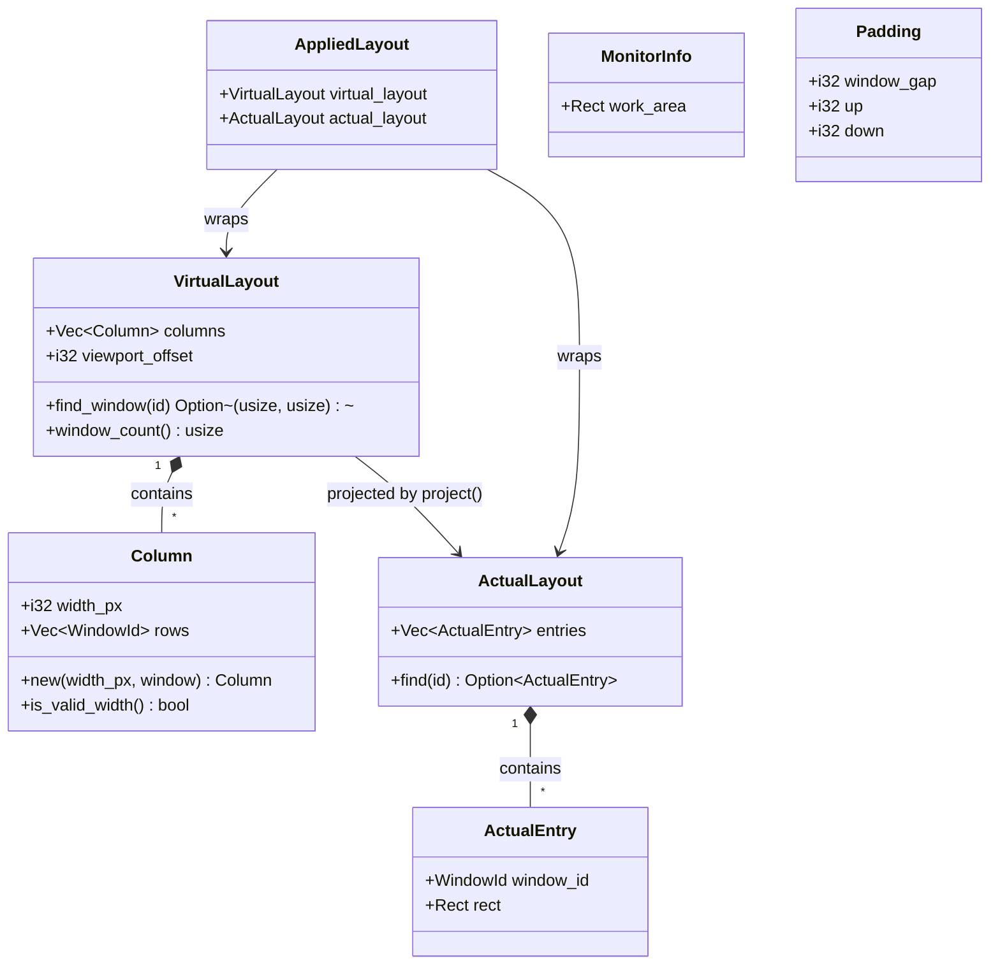
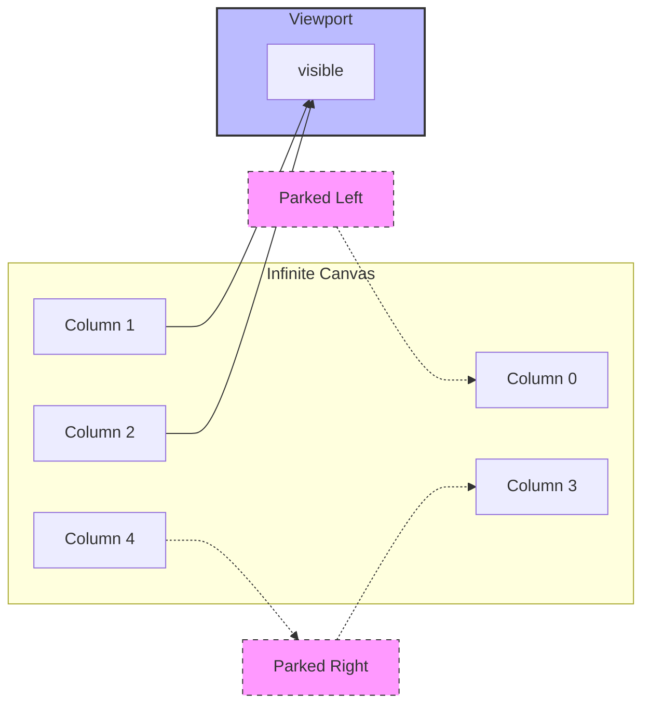

# Layout Overview

The layout engine models a tiling window manager as an **infinite horizontal canvas** that the user scrolls through. Columns of stacked windows extend left and right without bound; a sliding camera determines which slice of that canvas is visible on screen. The entire layout module ([`src/layout/`](../../src/layout/mod.rs)) is pure Rust with zero Win32 dependencies, making every operation fully unit-testable on any platform.

## Two-layer model

The system splits cleanly into a **virtual layer** and an **actual layer**. The virtual layer describes *what exists* on the canvas — columns, their pixel widths, and a camera offset — but stores no absolute x-coordinates for any window. The actual layer is the projected output: concrete pixel rectangles that Windows OS renders. This separation keeps mutations simple (they operate on the virtual canvas, never on screen coordinates) and makes projection a single deterministic function.

[`VirtualLayout`](../../src/layout/types.rs) holds the ordered `columns` vector and a `viewport_offset` — the camera position measured in pixels from the canvas origin. [`Column`](../../src/layout/types.rs) stores only a `width_px` and a `rows` list; it carries no x-position. [`ActualLayout`](../../src/layout/types.rs) is produced by the projection step and contains one [`ActualEntry`](../../src/layout/types.rs) per window, each with a concrete `Rect` in screen coordinates. [`AppliedLayout`](../../src/layout/types.rs) bundles both the new virtual and actual layouts together — the animation layer diffs every window's target rect against its real on-screen position to decide what needs tweening.

## The camera model

`viewport_offset` on `VirtualLayout` acts as a camera sliding along the infinite canvas. A value of 0 means the camera is flush with the left edge of the first column. Increasing it scrolls the viewport rightward. Many operations — scrolling, focusing an off-screen window, swapping columns — are implemented by adjusting this offset rather than moving individual windows. The projection step then computes screen coordinates from the offset plus the column geometry.

Columns outside the viewport are **parked** at deterministic off-screen positions — one column-width beyond the nearest viewport edge. Windows OS does not gracefully ignore windows placed at extreme off-screen coordinates, so parking them nearby keeps the window manager well-behaved and enables smooth scroll-in/out animations. See [Projection](./projection.md) for the full parking algorithm.

## Why position is implicit

Column x-positions are never stored. Instead they are computed on the fly via prefix-sum of widths: column 0 starts at `window_gap`, column *i* starts at the right edge of column *i-1* plus `window_gap`. This design has a direct practical benefit — swapping two columns is a simple `Vec::swap` with zero coordinate arithmetic. Adding or removing a column shifts all downstream windows automatically because the prefix-sum recomputes from scratch on every projection.

## Pixel widths, not eighths

Column widths are stored directly as pixel values (`width_px`). An earlier revision used eighths of the configured `column_width` to stay resolution-independent. That quantization had a subtle bug: `expand_column` computed the correct target width (`column_width + window_gap`), but converting back to eighths rounded the gap away (it was smaller than one eighth), so each expand step grew by exactly `column_width` instead of `column_width + window_gap`. Pixel widths make the gap observable at every step and let expand/shrink advance by the true `column_shift`. See [Design Decisions](../design-decisions.md) for the full trade-off analysis.

## Padding at projection time

Padding — the uniform `window_gap` between windows and screen edges, plus optional `up`/`down` top/bottom margins — is applied exclusively during the [projection](./projection.md) step. Neither `VirtualLayout` nor `Column` stores padding. This keeps the virtual canvas model clean: columns are pure containers of windows with widths, and the spatial realities of screen edges, gaps, and margins are deferred to the one function that converts canvas geometry to screen coordinates.

## What lives where

The `src/layout/` module contains only the pure math: type definitions, mutation functions, and the projection function. There is no orchestrator here. [`ScrollingSpace`](../workspace.md) (in `src/workspace/scrolling_space.rs`) owns the current `VirtualLayout`, calls mutation functions to produce new virtual layouts, passes them through projection, and wraps the result in an `AppliedLayout` for the animation layer. This separation means the layout math can be tested in isolation from any workspace or Win32 state.

The full data-flow pipeline — mutation, projection, animation — is described in [Pipeline](./pipeline.md). The mutation catalog and their algorithms are covered in [Mutations](./mutations.md).
