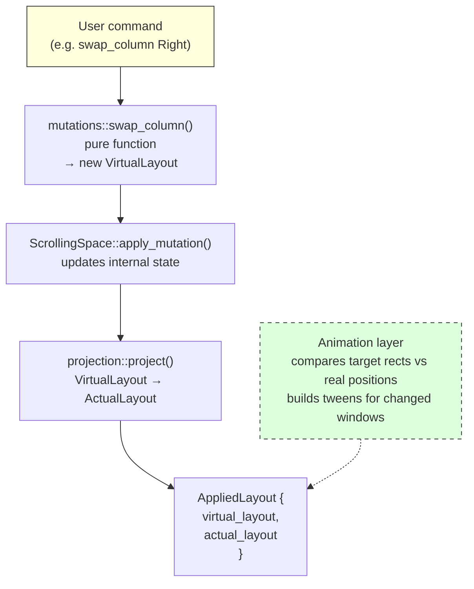
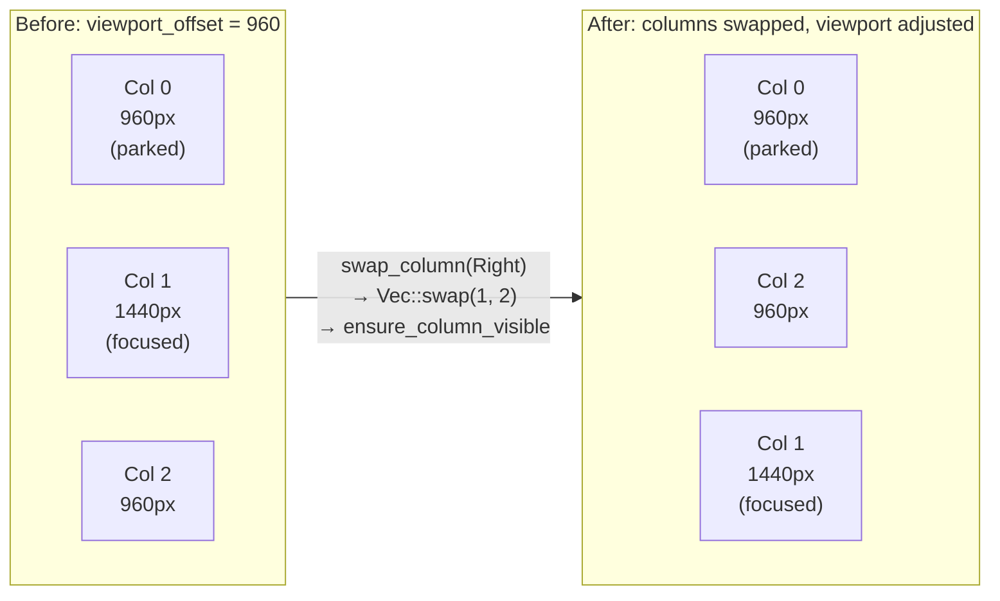

# The Mutation Pipeline

Every layout change in ScrollingTilingManager follows the same three-stage pipeline: **mutate**, **project**, then **animate**. A pure mutation function transforms the current `VirtualLayout` into a new one; the projection function converts that virtual layout into pixel-accurate screen rectangles; and the animation layer tweens windows from their current on-screen positions to their new targets. This functional, declarative approach means there is no mutable "update position, propagate, re-render" loop — each stage is a single deterministic function with no side effects.



## The glue: `apply_mutation`

[`ScrollingSpace`](../../src/workspace/scrolling_space.rs) — the orchestrator in `src/workspace/` — owns the current `VirtualLayout` and the last-projected `ActualLayout`. Every public method on `ScrollingSpace` (scroll, focus, swap, resize, add/remove) follows the same internal pattern: call a pure mutation function from `src/layout/mutations.rs` to get a new `VirtualLayout`, pass it to `apply_mutation`, which calls `projection::project` to produce the new `ActualLayout`, then wraps both into an `AppliedLayout` and returns it.

```rust
fn apply_mutation(&mut self, new_layout: VirtualLayout) -> AppliedLayout {
    let new_actual = projection::project(&new_layout, &self.monitor, &self.config.padding);
    let result = AppliedLayout {
        actual_layout: new_actual.clone(),
        virtual_layout: new_layout,
    };
    self.virtual_layout = result.virtual_layout.clone();
    self.actual = new_actual;
    result
}
```

`apply_mutation` is the only code path that updates `ScrollingSpace`'s internal state. It swaps in the new virtual and actual layouts atomically and returns the `AppliedLayout` for the caller (the daemon event loop) to pass to the animation layer. Because the mutation functions are pure and `apply_mutation` is the single state-update point, there is no risk of partial or inconsistent layout state.

## Why `AppliedLayout` carries both virtual and actual

`AppliedLayout` bundles the new `VirtualLayout` *and* the new `ActualLayout` together. The animation layer needs the full actual layout — every window's target rect — because it diffs each target against the window's *real* on-screen position (which may be mid-flight from a previous animation). If the engine emitted only the windows whose *target* changed, a rapid second mutation during an in-flight animation would miss windows that are physically mid-tween, stranding them mid-screen.

By returning the full `ActualLayout`, the animation layer always sees every window and makes its own no-op filtering decision. The virtual layout is included because the orchestrator stores it as the new authoritative canvas state (and callers sometimes need it for query purposes).

## No logical diff inside the engine

An earlier design had the layout engine compute a `Vec<WindowMove>` — a diff between old and new actual layouts — and hand that to the animation layer. That approach failed under rapid mutation bursts: a window animating toward its old target would be absent from the diff on the next mutation, and the animation layer would drop it. The current design pushes the diff responsibility outward. The engine produces a complete snapshot of the desired end state; the animation layer compares that snapshot against real-world positions (which include in-flight windows) and decides what to tween. This keeps the layout engine pure and stateless — it has no opinion about what is or is not currently animating.

See [`AppliedLayout`](../../src/layout/types.rs) for the full design decision rationale.

## Worked example: `swap_column(Right)`

Tracing a column swap from user input through the full pipeline makes the data flow concrete. Consider a canvas with three columns — widths 960, 1440, 960 — with the viewport showing columns 1 and 2. Focus is on a window in column 1.



**Step 1 — Mutation.** The daemon receives a `SwapColumn(Right)` command and calls `ScrollingSpace::swap_column(Direction::Right)`. That method calls `mutations::swap_column(&virtual_layout, focused, Right, &config)`, which finds the focused window's column index (1), swaps columns 1 and 2 in the `Vec<Column>`, then calls `mutations::ensure_column_visible` to adjust `viewport_offset` if the focused window's new column would be off-screen. The result is a new `VirtualLayout` with columns reordered and the camera offset updated.

**Step 2 — Projection.** `apply_mutation` passes the new `VirtualLayout` to `projection::project`. The projection function computes prefix-sum column left edges, determines which columns overlap the viewport `[offset, offset + monitor_width]`, computes row rects for visible columns, and parks off-screen columns just beyond the nearest viewport edge. The output is a complete `ActualLayout` — every window has a pixel `Rect`.

**Step 3 — Animation.** `apply_mutation` wraps both layouts into an `AppliedLayout` and returns it to the daemon. The daemon passes it to the animation layer, which iterates every `ActualEntry`, queries the window's real on-screen position via Win32, and builds a tween for any window whose real position differs from the target. The swapped windows animate to their new positions; the parked window moves to its off-screen parking spot (or stays parked if already there).

The entire cycle — from mutation to animation batch — completes in a single synchronous call on the main thread. There are no background tasks, no deferred updates, no stale state windows.

## Focus: a special case

The `focus` method on `ScrollingSpace` has a slight variation on the standard pipeline. It calls `mutations::focus`, which returns a `FocusResult` containing the newly focused window ID and a potentially-modified `VirtualLayout` (the camera may have shifted if the target was off-screen). `ScrollingSpace::focus` checks whether the viewport offset actually changed: if it did, it calls `apply_mutation` to project and return the `AppliedLayout`; if not, it returns `None` for the layout, since no windows moved and no animation is needed. This optimization avoids running projection when the user is just moving focus between two on-screen windows.

See [Mutations](./mutations.md) for the catalog of all mutation functions and their algorithms.
