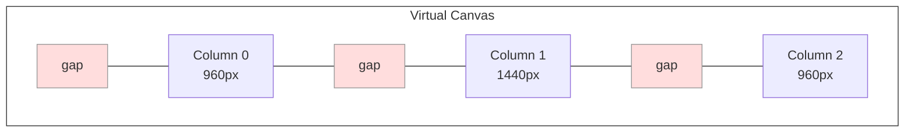
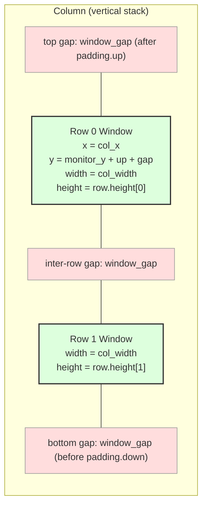
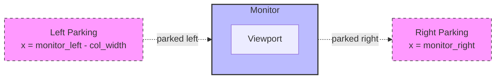

# Projection

The projection function converts the abstract virtual canvas into concrete pixel rectangles that Windows OS can render. Given a `VirtualLayout`, a `MonitorInfo`, and a `Padding`, the [`project`](../../src/layout/projection.rs) function computes an `ActualLayout` containing one entry per window with an exact screen-coordinate `Rect`. This is the only place in the layout module where pixel coordinates materialize — and the only place where padding is applied.

## The slot model

Columns are laid out in **slots** on the virtual canvas. Each slot is the column's own `width_px` plus a `window_gap` on the right. The canvas starts at `window_gap` (the initial left-edge gap), and the last column's trailing gap serves as the right-edge gap. This structure means the inter-column gap emerges from the layout itself, not from insetting individual windows.



Column x-positions are a **prefix sum**, not a uniform stride. The canvas accumulator starts at `window_gap` and advances by `col.width_px + window_gap` per column. This is important because columns can have different widths (after expand/shrink or drag-resize), so a uniform stride would not work.

## Camera shift: canvas to screen

For each column, projection computes its canvas range `[canvas_left, canvas_right]` and checks whether it overlaps the viewport `[viewport_offset, viewport_offset + monitor_width]`. Visible columns are translated to screen coordinates by subtracting the camera offset:

```
screen_x = monitor_left + (canvas_col_left - viewport_offset)
```

This subtraction is the entire camera mechanism. The `viewport_offset` on the `VirtualLayout` shifts the slice of canvas that maps onto the physical screen. A column whose canvas x-position is less than the offset gets a negative (or off-screen-left) screen x; a column far to the right gets a screen x beyond the monitor right edge.

## Visibility test

A column is visible when its canvas range partially overlaps the viewport:

```
visible = (canvas_col_right > viewport_left) && (canvas_col_left < viewport_right)
```

This is a standard interval overlap test. Columns that overlap even by one pixel are projected at their real screen coordinates; columns with no overlap are parked.

## Row rects: source-of-truth heights

Each `Row` in a column carries its own `height: i32` field, and projection consumes that value **verbatim** as the window's pixel height. There is no equal-division step here, no recomputation, no rescaling, no inset — projection simply stacks the rows. Equal-height distribution is performed exactly once, at mutation time, by [`distribute_heights`](../../src/layout/mutations.rs) (see [Mutations](./mutations.md)). Between mutations, row heights are intentionally stable so that future drag-resize or IPC-driven continuous-height adjustment can preserve user-customized heights.

The vertical stacking model: starting at `y = monitor_y + padding.up + window_gap`, each row occupies `row.height` pixels, and a single `window_gap` separates consecutive rows:

```
y_cursor = monitor_y + padding.up + window_gap
for row in column.rows:
    window.rect = (col_x, y_cursor, col_width, row.height)
    y_cursor += row.height + window_gap
```

This produces one `window_gap` between adjacent rows, one `window_gap` above the topmost row (after `padding.up`), and one trailing `window_gap` below the bottommost row (before `padding.down`). The `row.height` values are the sole determinant of where each window lands vertically.

## The container model: from column cell to window rect

Because `row.height` is consumed as the literal window height, there is **no inset within a row cell**. Horizontally, the window fills the full `col_width` — the gap between columns comes from the slot model (the `window_gap` between slots), not from insetting the window. Vertically, each window's height is exactly `row.height`, and the gaps between windows come from the `+ window_gap` term in the stacking formula above.



This is a deliberate departure from the earlier "equal cell division + inset" model. The new contract is: *the value on `Row.height` is the HWND height that Windows receives*. Anything that wants to change a window's height — equal redistribution, drag-resize, explicit IPC — must write to `Row.height` through the mutation layer; projection never second-guesses it.

## Screen-level margins

The `padding.up` and `padding.down` fields are screen-level margins that reserve space above and below the tiling area. They reduce the available height for row calculation: `available_height = monitor_height - up - down`. Windows never extend into these margin zones. This is distinct from `window_gap` (which applies between windows and between windows and screen edges within the tiling area) — `up`/`down` are for external UI elements like custom title bars or taskbar clearance.

## Parking

Columns that are not visible are **parked** at deterministic off-screen positions rather than left at their unreachable virtual canvas coordinates. Windows OS does not gracefully handle windows placed at extreme off-screen positions — they can cause rendering artifacts, accessibility issues, and broken animation transitions.



There are two parking zones:

- **Left parking**: `monitor_left - col_width`. For columns whose canvas right edge is at or before the viewport left edge.
- **Right parking**: `monitor_right`. For columns whose canvas left edge is at or beyond the viewport right edge.

Parked windows use the same `row.height`-stacking logic as visible windows, so when a column scrolls from parked to visible (or vice versa), its windows animate smoothly with consistent dimensions — there is no sudden resize or padding change at the boundary.

## Why projection is the only place padding lives

Padding is applied exclusively during projection and never stored on `Column`, `VirtualLayout`, or individual windows. This design choice keeps the virtual canvas model clean: columns are pure containers of windows with widths, and the spatial realities of screen edges, gaps, and margins are deferred to the one function that converts canvas geometry to screen coordinates. The `ActualEntry` rects produced by projection are the **final HWND rects** — they can be passed directly to `SetWindowPos` without any further adjustment.

This separation has a practical benefit: the mutation layer operates on a padding-agnostic model. Swap, expand, shrink, and scroll never need to know about gaps or margins. Only the projection function — a single deterministic function with no side effects — handles the translation from the abstract to the physical.

See [Overview](./overview.md) for the VirtualLayout/ActualLayout type relationship and [Mutations](./mutations.md) for the operations that produce the `VirtualLayout` inputs to projection.
