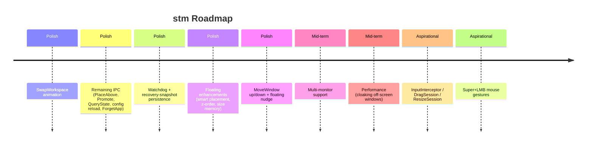

# Roadmap and Future Work

Where `stm` is headed. The core tiling engine, the scrolling canvas, the
floating space, and niri-style workspace switching are all implemented and
exercised end-to-end. What remains is polish, the long tail of IPC commands,
multi-monitor support, and the aspirational input-driven features.

## Timeline Overview

## Implemented Baseline

The `mutate → project → animate` pipeline, the window registry, and the
Win32 hook thread are all in place and driving real window management:

- **Window lifecycle**: create, destroy, minimize, restore, show/hide,
  foreground, plus the `STATECHANGE` (maximize/fullscreen recovery) and
  `NAMECHANGE` (late-title recovery) hooks. See
  [Event Pipelines](./event-pipelines.md).
- **Dispatch surface**: focus, per-window swap, column swap, semantic move,
  scroll, expand/shrink/set column width, center, monocle toggle, close
  window. See [IPC & Watchdog](./ipc-and-watchdog.md).
- **Floating windows**: tile↔float transitions (`set-window float|tile|cycle`),
  centered default placement, and merged scroll+float animation batches. See
  [Floating Space](./floating-space.md).
- **Workspaces**: ten workspaces per monitor; `switch-workspace` and
  `move-to-workspace` animate a vertical-packing switch (animate / teleport /
  skip partitioning). See [Workspace Hierarchy](./workspace.md).
- **Classification**: DWM-cloak, iconic, Alt-Tab visibility, and owner
  pre-filters, plus the four-layer user/learned/default/`default_action`
  rule pipeline. See [Classification & Learned Rules](./classification.md).
- **Animation**: 31 named easing curves plus arbitrary CSS cubic-bezier,
  `RetargetFromCurrent` mid-flight retargeting, and a `MockBackend` for
  tests. See [Animation](./animation.md).

## Near-term: Polish and Completeness

The wiring-heavy work is finished. The remaining near-term items close gaps
in the IPC surface and round out the floating and workspace feature sets.

### Workspace: SwapWorkspace

`SwapWorkspace` is the only workspace command still routed to
`unimplemented_command`. `SwitchWorkspace` and `MoveWindowToWorkspace` are
fully implemented with a vertical-packing animation model; `SwapWorkspace`
needs its own animation decision because it exchanges two workspaces'
positions in the packed stack rather than sliding between them. Its protocol
shape (`SwapWorkspace { workspace_id }`) is already locked in.

### Remaining IPC Commands

Several `SocketMessage` variants are declared and parsed by the CLI but
return `unimplemented_command` on the daemon side. Their wire formats are
stable so external tooling and keybindings can target them now:

| Command | Purpose |
|---|---|
| `PlaceAbove` | Raise the focused floating window's z-order (`SetWindowPos` with `HWND_TOPMOST`/restore) |
| `Promote` | Move the focused window to the master (first) position in its column |
| `QueryState` | Read-only introspection of daemon/registry state beyond `QueryWindowsAll` |
| `ReloadConfig` / `CheckConfig` / `SetConfigValue` | Runtime config mutation without a daemon restart |
| `ForgetApp` / `ForgetAllApps` | Programmatic clearing of learned rules (today this requires hand-editing `history-stm-rules.toml`) |

See [Classification & Learned Rules](./classification.md) for the learned-rules
model that `ForgetApp` would expose programmatically.

### Watchdog and Recovery-Snapshot Persistence

`stm-watchdog` ([`src/bin/stm-watchdog.rs`](../../src/bin/stm-watchdog.rs))
is still a stub — it prints `"stm-watchdog: not yet implemented"` and exits.
The planned design: `stmd` spawns the watchdog with `--parent-pid` and
`--recovery-path`; the watchdog polls the parent PID and, on exit, reads a
`stm-recovery.json` snapshot and calls `SetWindowPos` to restore each window
to its pre-manage geometry. The `Window` struct already carries
`pre_manage_rect` for this purpose; the atomic write-to-temp-then-rename
persistence path is what is missing. See
[IPC & Watchdog](./ipc-and-watchdog.md).

### Floating Window Enhancements

The floating space is functional; the open work is quality-of-life. See the
"Future Work" section of [Floating Space](./floating-space.md) for the full
list, summarised here:

- **Smart placement** — cascade or offset new floats so they don't fully
  overlap.
- **Per-window float size memory** — remember each window's last floating
  rect and restore it on subsequent tile→float transitions.
- **Z-order raising** — `PlaceAbove` to bring the focused float to the top
  of the z-order (depends on the IPC command above).
- **Floating gap management** — reserve padding around floats at workspace
  edges.

### Semantic Move: Up/Down and Floating Nudge

`MoveWindow` currently resolves only the tiled left/right path (delegating
to `SwapColumn`). Two deferred paths remain:

- **Tiled up/down** — a within-column window swap (delegates to
  `dispatch_swap_window`).
- **Floating, any direction** — a pixel nudge by a configurable shift.

The branching structure already lives behind a single delegation point in
`dispatch_move_window`, so these land without changing the IPC protocol or
keybindings.

## Mid-term

### Multi-Monitor Support

The workspace hierarchy already models `Vec<Monitor>` with
`active_monitor: usize`, and every IPC command routes through
`active_scrolling()` so multi-monitor can land without touching call sites.
The current constructor hard-codes a single monitor derived from
`get_primary_monitor_info()` ([`src/daemon/new.rs`](../../src/daemon/new.rs)).
Expanding to multiple monitors requires iterating `EnumDisplayMonitors` /
`MonitorFromPoint` + `GetMonitorInfoW`, building a `Monitor` per display,
and adding `stm dispatch focusmonitor` / `move-to-workspace <id> <monitor>`
plumbing.

### Performance: Cloaking Off-Screen Windows

Parked (off-screen) tiled windows are kept one column-width beyond the
nearest viewport edge so they animate smoothly when scrolled into view.
They are, however, still rendered. A future optimisation can apply
`DWMWA_CLOAK` (`SetWindowCompositionAttribute`) to parked windows so the
DWM skips compositing them, reducing GPU work on large canvases. The
classification pipeline already inspects `DWMWA_CLOAKED`; the write side
is the new work.

## Aspirational: Deliberately Deferred

These features are acknowledged as valuable but **not planned** for the
current development cycle.

### InputInterceptor, DragSession, ResizeSession

Full mouse-driven tiling where `Super + Left Mouse Button` initiates a drag
or resize session with layout snapping. This was described in the original
spec but has no active implementation work — the `src/input/` module does
not exist. The daemon's input surface today is the IPC pipe; mouse-driven
tiling would add an in-process global input hook alongside the existing
WinEvent hooks.

### Super+LMB Mouse Gestures

Mouse gestures (drag to tile, drag to edge to snap, etc.) build on the
`DragSession` infrastructure above and share its dependency on an
unimplemented input hook.

## Explicitly Removed: Keybindings

Keybinding handling was **intentionally removed** from both the config and
the codebase. The rationale: external tools like AutoHotkey, PowerToys, or
Komorebi's keybinding layer are better at translating physical keypresses
into IPC commands than a re-implemented keyboard hook. `stm`'s role is the
layout engine and window manager — not the input layer. See
[Design Decisions](./design-decisions.md) for more on this separation of
concerns.

Users map their preferred hotkeys to `stm dispatch` CLI calls via their
chosen keybinding tool. This keeps `stm`'s attack surface small and avoids
duplicating well-tested input infrastructure.

## Known Win32 Limitations

These are not bugs — they are inherent properties of the Windows rendering
model.

### SetWindowPos vs DeferWindowPos

`stm` uses `SetWindowPos` (immediate positioning) rather than
`DeferWindowPos` (batch positioning). `DeferWindowPos` batches multiple
repositions into a single repaint, but it is atomic: a single elevated
admin window (protected by UIPI) fails the entire batch with
`ERROR_ACCESS_DENIED`. Individual `SetWindowPos` calls mean one failure
logs a warning but does not block the remaining windows. See
[Animation](./animation.md) for the per-backend rationale.

### GetWindowRect Includes Invisible Borders

`GetWindowRect` returns a rect that includes a hidden ~7px border on the
left, right, and bottom edges. This is not the visual rect of the window.
`stm` works around this via the `InvisibleBounds` tracking in the registry.
See the [Window Registry](./window-registry.md) chapter for how invisible
bounds are measured and how `visible_to_window()` compensates.

### Applications Own Their Render

`stm` can request a window position via `SetWindowPos`, but the application
controls its own rendering. Some apps (especially UWP and Electron-based)
may not immediately respect position changes or may reposition themselves
autonomously. This is a fundamental constraint of the Windows windowing
model.

## Warning System (Planned)

If `komorebi`, `GlazeWM`, or another tiling window manager is detected as
running, `stm` should display a warning and ask the user to close the
conflicting manager before using `stm`. Coexistence with another WM that
also moves windows will produce unpredictable results.

## Window Restoration

When `stm` exits (gracefully or via crash), tiled windows may be positioned
off-screen. The planned `stm-watchdog` (see above) handles crash recovery;
on graceful shutdown the daemon performs the equivalent restore inline —
querying all window positions and moving any off-screen windows to the
nearest screen edge using `SetWindowPos` (no animation needed).
