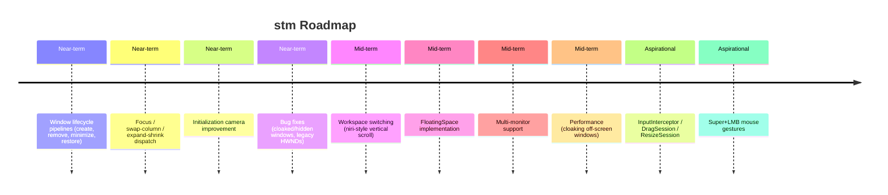

# Roadmap and Future Work

Where stm is headed: near-term polish and workspace operations, mid-term multi-monitor
and floating support, and the features deliberately deferred or removed.

## Timeline Overview

## Near-term: Completing the Core Pipelines

The daemon skeleton and the `mutate → project → animate` pipeline are in place.
The remaining work is **wiring** — connecting hook events and IPC dispatch to the
pure layout operations that already exist in `ScrollingSpace`.

### Window Lifecycle Pipelines

Each of these follows the standard post-mutation pattern:
`ensure_column_visible → actual_layout → laydiff → animate`.

| Pipeline | Trigger | Key Logic |
|---|---|---|
| Create window | `HookEvent::Created` | Insert right of focused window, shift rightward columns by one `column_shift`, focus the new window |
| Remove window | `HookEvent::Destroyed` | Shift rightward columns leftward, `next_available_window` to pick focus (prefer left, then right) |
| Close window | `stm dispatch closewindow` | Equivalent to user clicking close — triggers destroy event |
| Minimize | `HookEvent::MinimizeStart` | Remove from virtual layout (same as destroy) |
| Restore | `HookEvent::MinimizeEnd` | Re-insert and animate back |

`stm dispatch movewindow left/right/up/down` translates its meaning based on
context: on a tiled window, `left/right` maps to `swapcolumn`, `up/down` swaps
within the same column. On a floating window, it shifts position by a
user-defined amount.

### Dispatch and CLI Polish

The `stm dispatch` subcommand tree needs extension. Commands are nested
(`stm dispatch focus left`, `stm dispatch swapcolumn right`) with per-subcommand
help, so the CLI stays discoverable and extensible. See `TODO.md` for the full
dispatch inventory including `expandcolumn`, `shrinkcolumn`, and `switchworkspace`.

### Initialization Camera

When the number of tiling windows exceeds `columns_per_screen`, the startup
camera should fill all visible columns rather than centering the focused window
with blank columns. If the focused window is near the left edge, the viewport
should start there; if near the right, it should end there. No blank columns
should ever appear on screen during initialization.

### Classification Fixes

Several window-classification bugs need attention (see `TODO.md`):

- **Cloaked and hidden windows**: Apps like Discord "hide" rather than destroy
  windows on close. The classification pipeline should check `DwmGetWindowAttribute`
  (`DWMWA_CLOAKED`), `IsIconic`, and `IsWindowVisible` — the same heuristics
  `komorebi` uses (tracked in komorebi issue #750).
- **Legacy HWNDs**: Chrome and VS Code create invisible "Chrome Legacy Window"
  / `Chrome_RenderWidgetHostHWND` secondary HWNDs. These are already classified
  by the registry but should be verified.
- **Windows Terminal**: Does not tile automatically — classification rule gap.

### Known Bugs

- `action_to_state()` hardcodes `col: 0, row: 0` — layout engine positions are
  never written back to registry state. A regression test already catches this.
- JSON round-trip in `visible_rect_json` serializes to JSON then immediately
  deserializes back. A cleaner path would keep the `Rect` directly from
  `get_window_rect`.

## Mid-term: Workspace and Multi-Monitor

### Workspace Switching (niri-style)

The workspace hierarchy (`Vec<Monitor>` → `Vec<Workspace>` → `ScrollingSpace` +
`FloatingSpace`) is already scaffolded. See the [workspace chapter](workspace.md)
for the current skeleton invariant: exactly **one** monitor, **one** workspace
(`WorkspaceId(1)`).

The planned workspace operations are:

- `stm dispatch switchworkspace <id>` — animate vertical slide between workspaces
- `stm dispatch movetoworkspace <id>` — move focused window to another workspace
- `stm dispatch swapworkspace <id>` — swap two workspaces' content (rarely offered
  by other tiling managers)

The animation design uses a vertical offset: inactive workspaces above the active
one sit at `y = -(monitor_height + gap)`, those below at `y = +(monitor_height + gap)`.
A workspace switch computes `ActualLayout` for both the source and target
workspaces, applies the offset, and feeds both sets of window targets to the
animator in a single batch. See `TODO.md` for the full `MoveToWorkspace` animation
algorithm (which also mutates both virtual layouts before projecting).

### FloatingSpace

Currently an empty stub in [`src/workspace/floating_space.rs`](../../src/workspace/floating_space.rs).
Floating windows are tracked by the registry but positioned by the OS. Future work
may add smart placement, stacking order, and `movewindow` support for floating
windows.

### Multi-Monitor Support

The hierarchy already supports `Vec<Monitor>` with `active_monitor: usize`. The
current skeleton hard-codes a single monitor derived from `SystemParametersInfoW(
SPI_GETWORKAREA)`. Expanding to multiple monitors requires replacing that call
with `MonitorFromPoint` + `GetMonitorInfoW` and per-monitor work areas.

## Aspirational: Deliberately Deferred

These features are acknowledged as valuable but **not planned** for the current
development cycle.

### InputInterceptor, DragSession, ResizeSession

Full mouse-driven tiling where `Super + Left Mouse Button` initiates a drag or
resize session with layout snapping. This was described in the original spec
(Phase 5) but has no active implementation work. The Win32 input hooks module
(`src/input/`) is also unimplemented.

### Additional Animation Easings

Only `ease-out-expo` is supported today. The schema should eventually support
`ease-in`, `ease-out`, `ease-in-out`, and `linear`, but this is a polish item
with no timeline.

## Explicitly Removed: Keybindings

Keybinding handling was **intentionally removed** from both the config and the
codebase. The rationale: external tools like AutoHotkey, PowerToys, or
Komorebi's keybinding layer are better at translating physical keypresses into
IPC commands than a re-implemented keyboard hook. stm's role is the layout
engine and window manager — not the input layer. See [design decisions](design-decisions.md)
for more on this separation of concerns.

Users map their preferred hotkeys to `stm dispatch` CLI calls via their chosen
keybinding tool. This keeps stm's attack surface small and avoids duplicating
well-tested input infrastructure.

## Known Win32 Limitations

These are not bugs — they are inherent properties of the Windows rendering model.

### SetWindowPos vs DeferWindowPos

stm uses `SetWindowPos` (immediate positioning) rather than `DeferWindowPos`
(batch positioning). `DeferWindowPos` batches multiple repositions into a single
repaint, but not all windows are deferrable, and applications own their own
render. For a tiling manager that needs guaranteed immediate placement,
`SetWindowPos` is the safer choice. See [`src/win32.rs`](../../src/win32.rs).

### GetWindowRect Includes Invisible Borders

`GetWindowRect` returns a rect that includes a hidden 7px border on the left,
right, and bottom edges. This is not the visual rect of the window. stm works
around this via the `InvisibleBounds` tracking in the registry. See the
[window registry chapter](window-registry.md) for how invisible bounds are
measured and how `window_to_visible()` compensates.

### Applications Own Their Render

stm can request a window position via `SetWindowPos`, but the application controls
its own rendering. Some apps (especially UWP and Electron-based) may not
immediately respect position changes or may reposition themselves autonomously.
This is a fundamental constraint of the Windows windowing model.

## Warning System (Planned)

If `komorebi`, `GlazeWM`, or another tiling window manager is detected as
running, stm should display a warning and ask the user to close the conflicting
manager before using stm. Coexistence with another WM that also moves windows
will produce unpredictable results.

## Window Restoration

When stm exits (gracefully or via crash), tiled windows may be positioned off-
screen. A standalone `stm restore` CLI command should query all window positions
and move any off-screen windows to the nearest screen edge using `SetWindowPos`
(no animation needed). This same function runs automatically on graceful
shutdown.
