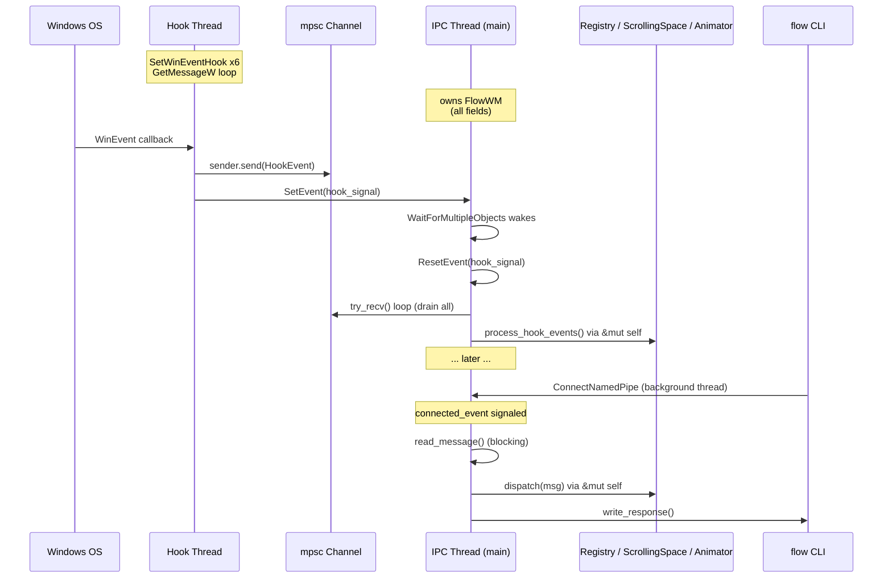
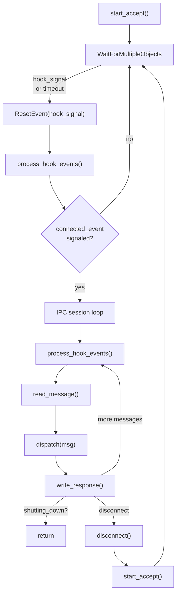

# Threading Model

The `flowd` daemon uses exactly two threads and zero runtime locks. The hook thread
runs Win32 event hooks in the background; the IPC thread owns all application state
and processes both hook events and IPC commands. There is no `Arc<Mutex<T>>` anywhere
in the daemon — the borrow checker enforces exclusive access at compile time, which
is strictly safer than `Mutex` (runtime-only enforcement, potential deadlocks).

## The Two Threads

### Hook Thread (background)

- Registers six `SetWinEventHook` callbacks covering window lifecycle (create,
  destroy), focus changes, minimize/restore, show/hide, state changes, and name
  changes. `EVENT_OBJECT_LOCATIONCHANGE` is deliberately excluded — it fires on
  every pixel of movement and would flood the channel.
- Runs a `GetMessageW` message loop (required for `WINEVENT_OUTOFCONTEXT`).
- On each callback: sends a typed `HookEvent` through the `mpsc::Sender` and
  signals a Win32 manual-reset event (`SetEvent`) to wake the IPC thread.
- **Never touches any daemon state.** It does not hold references to
  `FlowWM`, the registry, or the layout. Its entire output is the
  `HookEvent` enum and a signal.
- Cleaned up by dropping the `HookThreadHandle`, which posts `WM_QUIT` to the
  hook thread's message loop. All hooks are unregistered before the thread exits.

### IPC Thread (main)

- Owns `FlowWM` and all subsystems directly — no `Arc`, no `Mutex`.
- Runs the main event loop via `WaitForMultipleObjects`, waiting on two handles:
  1. **hook_signal** (index 0, highest priority) — wakes when any `HookEvent` is sent.
  2. **connected_event** (index 1) — wakes when a CLI client connects.
- Calls `process_hook_events()` to drain the channel, then processes any IPC
  session if a client connected.
- All subsystem methods are called with `&mut self` — the borrow checker
  guarantees exclusive access at compile time.

## Why No `Arc<Mutex>`

The previous architecture (before `FlowWM` was introduced) used
`Arc<Mutex<WindowRegistry>>` because the IPC loop and hook events were consumed by
different parts of the code with no single coordination point. This had several
problems:

1. **Runtime-only safety.** `Mutex` only catches data races at runtime. A missed
   lock or a lock held too long causes undefined behavior or deadlocks — errors
   the compiler cannot see.
2. **No ownership clarity.** When every subsystem is behind an `Arc<Mutex>`,
   it is unclear *who* is responsible for routing events between them.
3. **Deadlock risk.** Nested locking (lock A, then B in one code path; B then A
   in another) is easy to introduce and hard to detect.

With `FlowWM` owning everything on one thread, all subsystem methods
take `&mut self`:

- The borrow checker rejects any code that would access a subsystem while another
  part of the code holds a mutable reference to it.
- There is no possibility of deadlock because there is no locking.
- Event routing is centralized — the daemon is the only place that calls subsystem
  methods, so the flow is always visible in one place.

The trade-off is that hook events are not processed *instantly* in the callback —
they are dispatched asynchronously through the channel and drained on the next
loop iteration. In practice, the signal event wakes `WaitForMultipleObjects`
within microseconds, so the latency is imperceptible.

## The Main Event Loop

The `run()` method in [`src/daemon/run.rs`](../../src/daemon/run.rs) implements the
event-driven loop:

Key details:

- **Race-free drain.** `ResetEvent` is called *before* `try_recv()`. Any event
  pushed between the reset and the drain is caught by `try_recv`. Any event
  pushed after the drain sets the signal again, so the next `WaitForMultipleObjects`
  wakes immediately. No events are lost.
- **Pending-creation retries.** `EVENT_OBJECT_CREATE` fires before windows are
  fully initialized (not yet visible, no title, styles not finalized). Windows
  that fail classification are added to `pending_creations` and retried on each
  `process_hook_events()` call. When this list is non-empty, the wait timeout
  is 100 ms instead of infinite, ensuring retries happen even without new events.
- **IPC is one-shot.** The CLI connects, sends one command, reads the response,
  and disconnects. The inner loop rarely runs more than once.
- **Hook events are drained between IPC reads.** Inside the IPC inner loop,
  `process_hook_events()` runs before every `read_message()`, so layout changes
  from hook events are never delayed by an active IPC session.

## Hook Registration

Six hooks are registered as four ranges and two single-event hooks. The single-
event registration for `STATECHANGE` and `NAMECHANGE` is deliberate — there is a
noisy event (`EVENT_OBJECT_LOCATIONCHANGE` at `0x800B`) between them that would
flood the channel if registered as a range.

| Hook | Event Range | Purpose |
|------|-------------|---------|
| Create / Destroy | `0x8000` -- `0x8001` | Window lifecycle |
| Foreground | `0x0003` | Focus changes |
| Minimize / Restore | `0x0016` -- `0x0017` | Minimize and restore |
| Show / Hide | `0x8002` -- `0x8003` | Tray-hide, DWM cloak, re-show |
| State Change | `0x800A` (single) | Maximized/fullscreen recovery |
| Name Change | `0x800C` (single) | Late-title recovery |

The recovery hooks (`STATECHANGE` and `NAMECHANGE`) handle windows that
`EVENT_OBJECT_CREATE` misses — see [Event Pipelines](./event-pipelines.md) for the
full recovery flows.
