# Tile Drag

Users can drag tiled windows by their title bar to reposition them in the
layout. As the window moves, other windows reflow in real time to show where
the dragged window will land. On release, the window snaps to its new tiled
position. The feature is always on — there is no config flag.

This chapter covers the drag lifecycle, how Win32 events flow during a drag,
the drop-zone algorithm that determines where a window lands, the two data-flow
paths (preview and commit), and the safety mechanisms that prevent the
animator and IPC commands from fighting the user's mouse.

## Drag Lifecycle

The drag is driven entirely by Win32's built-in move/resize system. When the
user grabs a tiled window's title bar, Windows sends `EVENT_SYSTEM_MOVESIZESTART`;
when they release, `EVENT_SYSTEM_MOVESIZEEND`. Between those two signals, a
stream of `EVENT_OBJECT_LOCATIONCHANGE` events reports every pixel of movement.

```mermaid
stateDiagram-v2
    [*] --> Idle

    Idle --> Dragging : MoveSizeStart on Tiling::Active window

    Dragging --> Dragging : LocationChange (border follows, zone detection, preview reflow)

    Dragging --> Committing : MoveSizeEnd
    Committing --> Idle : layout committed or snap-back

    Dragging --> Idle : window destroyed (clean cancel)
    Dragging --> Idle : workspace switch denied by busy gate
```

The `Dragging` state is represented by `Option<DragState>` on the `FlowWM`
struct. Three handler methods — `on_drag_start`, `on_drag_move`, `on_drag_end`
— are called from `process_hook_events` in response to the three hook events.

Abort paths are straightforward: if the dragged window is destroyed while the
user is mid-drag, the `Destroyed` hook fires, removes the window from the
registry, and the next `on_drag_move` call finds the window gone and returns
early. On `MoveSizeEnd`, `drag_state` is `take()`n unconditionally, so a
double-fire or spurious end is harmless.

## Event Pipeline

The hook thread registers `EVENT_SYSTEM_MOVESIZESTART` (0x000B) through
`EVENT_SYSTEM_MOVESIZEEND` (0x000C) as a range hook, which produces two new
`HookEvent` variants: `MoveSizeStart` and `MoveSizeEnd`. The existing
`EVENT_OBJECT_LOCATIONCHANGE` hook is extended with a second filter condition
so it also forwards events for the dragged tiled window.

`DRAGGED_HWND` is a static `AtomicIsize` (default 0) that bridges the hook
thread and the main thread without shared mutable state in the callback. The
daemon sets it via `set_dragged_hwnd` (Release store) on `MoveSizeStart` and
clears it via `clear_dragged_hwnd` (Release store, writes 0) on `MoveSizeEnd`.
The hook callback reads it with an Acquire load.

The LOCATIONCHANGE filter in the hook callback now has two conditions — it
forwards when either is true:

- `(is_float_hwnd(hwnd) && FLOAT_TRACKING_ACTIVE)` — the pre-existing float
  filter.
- `hwnd == DRAGGED_HWND.load(Acquire)` — the dragged tiled window.

All other LOCATIONCHANGE events are dropped. The callback itself remains
stateless — it reads two atomics and a `Mutex`-guarded `HashSet`, then pushes
a `HookEvent` through the mpsc channel. No daemon state is touched on the hook
thread.

On the main thread, `process_hook_events` routes the three new events:

```mermaid
sequenceDiagram
    participant Win as Win32
    participant Hook as Hook Thread
    participant Chan as mpsc Channel
    participant flow as FlowWM Main Loop

    Win->>Hook: EVENT_SYSTEM_MOVESIZESTART
    Hook->>Chan: HookEvent::MoveSizeStart
    Chan->>flow: try_recv() drain
    flow->>flow: on_drag_start(hwnd)
    flow->>flow: set_dragged_hwnd(hwnd)

    loop For each pixel of movement
        Win->>Hook: EVENT_OBJECT_LOCATIONCHANGE
        Hook->>Note: DRAGGED_HWND == hwnd? yes, forward
        Hook->>Chan: HookEvent::LocationChange
        Chan->>flow: try_recv() drain
        flow->>flow: on_drag_move(hwnd)
    end

    Win->>Hook: EVENT_SYSTEM_MOVESIZEEND
    Hook->>Chan: HookEvent::MoveSizeEnd
    Chan->>flow: try_recv() drain
    flow->>flow: on_drag_end(hwnd)
    flow->>flow: clear_dragged_hwnd()
```

For the general hook pipeline architecture — how the hook thread, the mpsc
channel, and `WaitForMultipleObjects` interact — see (event-pipelines.md).

## Drop Zone Algorithm

As the window moves, the daemon hit-tests the dragged window's center point
against the column rects of the committed layout to determine which `DropZone`
it is over.

### The four zones

Each column defines four zones in an i3-style scheme. Within a column's
x-range, the width is split into thirds:

```
┌─────────────────────────┐
│  ColLeftEdge    │  SlotUpper   │  ColRightEdge  │
│  (insert col     │  (prepend    │  (insert col    │
│   before this)   │   to this)   │   after this)   │
│                  │───────────────────┤                │
│                  │  SlotLower   │                │
│                  │  (append     │                │
│                  │   to this)   │                │
└─────────────────────────┘
     left 1/3       middle 1/3      right 1/3
```

The middle third is split by the column's y-midpoint: above → `SlotUpper`
(prepends the window to the column), below → `SlotLower` (appends it). The
left third → `ColLeftEdge(t)` (creates a new column before column `t`). The
right third → `ColRightEdge(t)` (creates a new column after column `t`).

The `DropZone` enum maps directly to layout mutations:

| Zone | Layout mutation |
|------|----------------|
| `ColLeftEdge(t)` | Insert new column at index `t` |
| `ColRightEdge(t)` | Insert new column at index `t + 1` |
| `SlotUpper(t)` | Prepend to column `t` |
| `SlotLower(t)` | Append to column `t` |

### `hit_test_drop_zone`

`hit_test_drop_zone(center_x, center_y, column_rects)` is a pure function
with no Win32 calls and no mutation of any live state. It takes the dragged
window's center coordinates and a slice of `(column_ordinal, Rect)` pairs
(left-to-right) and returns `Option<DropZone>`. `None` means the center is
outside all columns, which triggers a snap-back on release.

The algorithm is a linear scan:

1. Find the rightmost column whose left edge is `<= center_x`. If none,
   clamp to the first column's left edge (`ColLeftEdge(0)`).
2. If `center_x` is past the column's right edge, the cursor is in a gap
   between columns. Bisect by distance: pick the nearer edge. If it's the
   last column, clamp to its right edge (`ColRightEdge`).
3. Within a column, split into thirds. Left third → `ColLeftEdge`, right
   third → `ColRightEdge`. Middle third → split by y-midpoint → `SlotUpper`
   or `SlotLower`.

### Jitter guard

`on_drag_move` stores the current zone in `DragState::current_zone`. On each
call, it recomputes the zone and compares. If the zone is unchanged, the call
is a no-op — no reflow, no animation submission. This prevents the animator
from receiving thousands of identical retargets per second during slow drags
within a single zone.

## Preview vs Commit Data Flow

During a drag, two distinct data-flow paths operate. The *preview path* runs
on every zone change (not every pixel — see the jitter guard above). The
*commit path* runs once on `MoveSizeEnd`.

```mermaid
flowchart TB
    subgraph Preview[Preview path — on each zone change]
        GWR["GetWindowRect dragged, visible_rect"]
        BF["border.set_geometry float_border_rect — border follows mouse"]
        HT["hit_test_drop_zone center, new_zone"]
        JG{"zone unchanged?"}
        PM["preview_move virtual_layout, dragged_id, zone, config, monitor  PURE"]
        ALE["animate_layout_excluding_dragged preview  no registry sync"]

        GWR --> BF
        GWR --> HT
        HT --> JG
        JG -- yes --> SKIP["return jitter guard"]
        JG -- no --> PM
        PM --> ALE
    end

    subgraph Commit[Commit path — on MoveSizeEnd]
        TAKEdrag["drag_state.take — clears DragState"]
        CLEAR["clear_dragged_hwnd"]
        ZONE{"current_zone is Some?"}
        PM2["preview_move virtual_layout, dragged_id, zone, config, monitor"]
        COMMIT["commit_layout new_virtual  pushes to ScrollingSpace"]
        ANIMALL["animate_layout applied  ALL windows snap to final positions"]
        SNAPBACK["animate_layout current committed layout  ALL windows return"]

        TAKEdrag --> CLEAR
        CLEAR --> ZONE
        ZONE -- yes --> PM2
        PM2 --> COMMIT
        COMMIT --> ANIMALL
        ZONE -- "no snap-back" --> SNAPBACK
    end
```



The preview path calls `preview_move`, a pure function in `src/layout/preview.rs`
that clones the virtual layout, removes the dragged window, re-inserts it at
the target zone, and projects to actual pixel coordinates — all without
touching any live state or Win32 APIs. The resulting `AppliedLayout` is
ephemeral; it is fed to `animate_layout_excluding_dragged` which submits
animation targets for every window *except* the dragged one.

The preview path does **not** sync the registry's tiling slots or tiled rects.
The registry reflects the committed state only. This is why
`animate_layout_excluding_dragged` exists as a separate method from
`animate_layout` — it builds the same target list but skips the registry
sync step.

On the commit path, `on_drag_end` calls `drag_state.take()` *before* anything
else. This is critical: by removing the `DragState`, the exclusion filter in
`animate_layout` (see [The Exclusion Filter](#the-exclusion-filter)) no longer
triggers, so the dragged window is included in the animation batch and snaps
from its current mouse position to its final tiled slot. If a zone is active,
the previewed layout becomes the new committed layout via
`ScrollingSpace::commit_layout`; if no zone, the committed layout is unchanged
and all windows animate back (snap-back).

The animator's `RetargetFromCurrent` interrupt policy (see (animation.md))
ensures that rapid zone changes during a fast drag produce smooth continuous
motion. Each zone change retargets the reflowing windows from wherever they
currently appear on screen, not from their original position.

## Border Following — The Fourth Movement Path

(borders.md) documents three ways border overlays move: the animator path
(for tiled windows), the float-hook path (for floating drags), and the
teleport path (for workspace switches). Tile-drag adds a fourth.

During a drag, `on_drag_move` reads the window's current position via
`GetWindowRect`, translates it to a visible rect, and calls
`border.set_geometry(float_border_rect(...))` directly — the same pattern the
float-hook path uses. The border follows the mouse in real time, one
`SetWindowPos` per `LOCATIONCHANGE`.

Why not route the dragged window's border through the animator like the other
tiled windows? Because the animator is busy animating *other* windows' reflow.
The dragged window's position is controlled by the user's mouse, not by the
layout engine. Sending it through the animator would fight the user's drag —
the animator would try to tween it back to a tiled slot while the user is
actively moving it. The direct `set_geometry` call bypasses the animator
entirely for the dragged window's border, just as it does for floating
windows.

| Path | When | How |
|------|------|-----|
| Animator | Tiled window animates | Flattened into `Vec<WindowTarget>` alongside window |
| Float hook | Floating window dragged | `set_geometry(visible_rect)` after registry update |
| Teleport | Bystander workspace switch | `set_geometry(visible_rect)` directly |
| **Tile drag** | **Tiled window being dragged** | **`set_geometry(float_border_rect)` directly** |

## The Exclusion Filter

`animate_layout` in `src/daemon/animation.rs` contains a safety filter near the
top: if `self.drag_state` is `Some`, it extracts the dragged window's
`WindowId` and border HWND, then skips both when building the animation
target list.

This filter exists because the drag preview path is not the only code that
calls `animate_layout` during a drag. Win32 hook events for *other* windows —
a `Created` event, a `Destroyed` event, a `MinimizeStart` on a different
window — continue to arrive normally while the drag is active. Those handlers
call `animate_layout` to reflow the remaining windows. Without the filter,
`animate_layout` would submit a target for the dragged window at its committed
tiled position, and the animator would try to move it there — fighting the
user's mouse.

The filter is lifted automatically by `on_drag_end`'s `drag_state.take()`,
which runs *before* the final `animate_layout` call. On the commit path, the
`DragState` is gone, so the filter does not trigger, and the dragged window is
included in the batch that snaps it to its final position.

## The Busy Gate

During a drag, the layout is in a transient state — the committed virtual
layout does not reflect the user's intent until they release. Layout-mutating
IPC commands are rejected to prevent corruption.

At the top of `dispatch()`, before matching on the `SocketMessage` variant,
the daemon checks:

```
if self.drag_state.is_some() && msg.is_layout_mutating() {
    return SocketResponse::Busy;
}
```

`SocketMessage::is_layout_mutating()` returns `true` for commands that
touch window positions, focus, layout state, or workspace assignment: focus
moves, swaps, scrolls, column resizes, mode toggles, workspace switches,
promote/merge, `set-window`, `close-window`, and `reload-config`. Read-only
queries (`QueryWindowsAll`, `QueryLayoutVirtual`, `QueryLayoutActual`,
`QueryState`), daemon lifecycle commands (`Stop`, `CheckConfig`), and
runtime config that doesn't move windows (`SetConfigValue`) pass through
normally.

The client receives `{"status":"busy"}` and may retry.

## Future: Alt+Drag Generalization

The `DragState` seam generalizes beyond native title-bar drags. The middle of
the pipeline — zone detection, preview reflow, border following, and commit —
shares the same `DragState`, `hit_test_drop_zone`, `preview_move`, and
`animate_layout_excluding_dragged` regardless of how the drag is initiated.

Native title-bar drag uses `MOVESIZESTART`/`MOVESIZEEND` — Win32 manages the
window's position, and flow observes via `LOCATIONCHANGE`. A future Alt+drag
mode would instead use an IPC `drag-begin`/`drag-end` pair plus a
`WH_MOUSE_LL` low-level mouse hook. flow would call `SetWindowPos` to move
the window itself (which still generates `LOCATIONCHANGE`), and the same
`DRAGGED_HWND` atomic would gate the hook callback. The entry points change,
but everything from zone detection onward is shared.

## Cross-References

- (event-pipelines.md) — the general Win32 hook pipeline and IPC command pipeline.
- (borders.md) — the first three border movement paths and the overlay architecture.
- (animation.md) — the `RetargetFromCurrent` policy that smooths rapid zone changes.
- (layout/pipeline.md) — how `AppliedLayout` is produced by the mutate-then-project pipeline.
