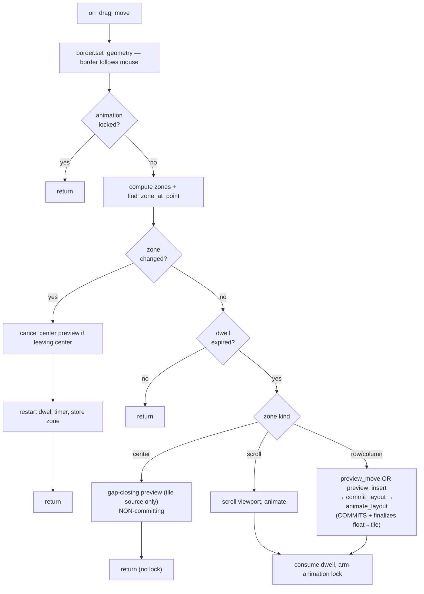

# Tile Drag

Users can drag windows by their title bar to reposition them. The drag works
in both directions across the tile/float boundary:

- **Tile → tile**: reposition a tiled window within the layout. Other windows
  reflow in real time to show where it will land.
- **Tile → float**: release over the uncovered center region to pop the window
  out of the layout into a floating position.
- **Float → tile**: drag a floating window over a tiled column to drop it back
  into the layout at that position.

As the cursor moves, drop zones light up under it; a short dwell timer fires
each zone so a quick sweep does not commit anything. The feature is always on
— there is no config flag.

This chapter covers the drag lifecycle, how Win32 events flow during a drag,
the drop-zone algorithm, the dwell-and-commit model that drives zone
activation, the center-region float-promotion preview, the float→tile path,
and the safety mechanisms that prevent the animator and IPC commands from
fighting the user's mouse.

## Drag Lifecycle

The drag is driven entirely by Win32's built-in move/resize system. When the
user grabs a window's title bar, Windows sends `EVENT_SYSTEM_MOVESIZESTART`;
when they release, `EVENT_SYSTEM_MOVESIZEEND`. Between those two signals, a
stream of `EVENT_OBJECT_LOCATIONCHANGE` events reports every pixel of movement.

```mermaid
stateDiagram-v2
    [*] --> Idle

    Idle --> Dragging : MoveSizeStart on Tiling::Active or Floating::Active

    Dragging --> Dragging : LocationChange (border follows, zone detection, dwell-fire)

    Dragging --> Committing : MoveSizeEnd
    Committing --> Idle : snap to tile, promote to float, or persist float rect

    Dragging --> Idle : window destroyed (clean cancel)
    Dragging --> Idle : workspace switch denied by busy gate
```

The `Dragging` state is represented by `Option<DragState>` on the `FlowWM`
struct. `DragState` records the dragged window's id and HWND, a `DragSource`
(`Tile` or `Float`) captured at start, the drop zone currently under the
cursor, the dwell timer, the animation lock, and a flag for the live center
preview. Three handler methods — `on_drag_start`, `on_drag_move`,
`on_drag_end` — are called from `process_hook_events` in response to the three
hook events.

The outcome on release depends on the drag source and where the cursor is:

| Source | Cursor at release | Outcome |
|--------|-------------------|---------|
| Tile | directional zone | `snap_dragged_to_tile` — layout already committed by dwell-fires; the dragged window animates from its mouse position to its tile |
| Tile | center / uncovered | `promote_dragged_to_float` — removed from layout, registered in `FloatingSpace`, remaining tiles reflow to fill the gap |
| Float | directional zone (dwell-fired) | `snap_dragged_to_tile` — the float was already inserted into the layout by its first directional dwell-fire |
| Float | center / uncovered (never promoted) | `store_float_rect` — the OS moved the window during the drag; the final rect is persisted as its float position |

Abort paths are straightforward: if the dragged window is destroyed while the
user is mid-drag, the `Destroyed` hook fires, removes the window from the
registry, and `on_drag_end` finds it gone and returns early. On `MoveSizeEnd`,
`drag_state` is `take()`n unconditionally, so a double-fire or spurious end is
harmless.

## Event Pipeline

The hook thread registers `EVENT_SYSTEM_MOVESIZESTART` (0x000B) through
`EVENT_SYSTEM_MOVESIZEEND` (0x000C) as a range hook, which produces two new
`HookEvent` variants: `MoveSizeStart` and `MoveSizeEnd`. These fire for **every**
window — tiled or floating — and route to `on_drag_start` / `on_drag_end`, which
gate internally on window state (only `Tiling::Active` or `Floating::Active`
windows enter `DragState`).

`DRAGGED_HWND` is a static `AtomicIsize` (default 0) that bridges the hook
thread and the main thread without shared mutable state in the callback. The
daemon sets it via `set_dragged_hwnd` (Release store) on `MoveSizeStart` and
clears it via `clear_dragged_hwnd` (Release store, writes 0) on `MoveSizeEnd`.
The hook callback reads it with an Acquire load.

The existing `EVENT_OBJECT_LOCATIONCHANGE` hook forwards an event when either
condition is true:

- `(is_float_hwnd(hwnd) && FLOAT_TRACKING_ACTIVE)` — the pre-existing float
  sync filter (float windows outside a drag).
- `hwnd == DRAGGED_HWND.load(Acquire)` — the dragged window, tile or float.

All other LOCATIONCHANGE events are dropped. The callback itself remains
stateless — it reads two atomics and a `Mutex`-guarded `HashSet`, then pushes
a `HookEvent` through the mpsc channel. No daemon state is touched on the hook
thread.

On the main thread, `process_hook_events` routes the events:

```mermaid
sequenceDiagram
    participant Win as Win32
    participant Hook as Hook Thread
    participant Chan as mpsc Channel
    participant flow as FlowWM Main Loop

    Win->>Hook: EVENT_SYSTEM_MOVESIZESTART
    Hook->>Chan: HookEvent::MoveSizeStart
    Chan->>flow: try_recv() drain
    flow->>flow: on_drag_start(hwnd)
    flow->>flow: set_dragged_hwnd(hwnd)

    loop For each pixel of movement
        Win->>Hook: EVENT_OBJECT_LOCATIONCHANGE
        Hook->>Note: DRAGGED_HWND == hwnd? yes, forward
        Hook->>Chan: HookEvent::LocationChange
        Chan->>flow: try_recv() drain
        flow->>flow: on_drag_move(hwnd)
    end

    Win->>Hook: EVENT_SYSTEM_MOVESIZEEND
    Hook->>Chan: HookEvent::MoveSizeEnd
    Chan->>flow: try_recv() drain
    flow->>flow: on_drag_end(hwnd)
    flow->>flow: clear_dragged_hwnd()
```

### Why float drags need no special routing

The LOCATIONCHANGE router on the main thread is exclusive on `is_dragged`
(`drag_state.dragged_hwnd == hwnd`): if true, the event goes to `on_drag_move`;
otherwise it goes to the normal float-rect sync path. Because a float-source
drag sets `DragState` on start, every LOCATIONCHANGE for that float window
during the drag routes to `on_drag_move` instead — the float sync path is
**bypassed** for the duration of the drag. This is why `on_drag_end` for a
non-promoted float must call `store_float_rect` itself: nobody else persisted
the moved rect.

For the general hook pipeline architecture — how the hook thread, the mpsc
channel, and `WaitForMultipleObjects` interact — see (event-pipelines.md).

## Drop Zone Algorithm

As the window moves, `on_drag_move` computes a set of `(DropZone, Rect)` pairs
for the visible columns and hit-tests the cursor against them.

### Zone layout

Each visible column (except the dragged window's own column — a tile cannot be
dropped back onto its origin) contributes:

- A **Left** strip, `left_right_zone_ratio` of the column width →
  `Column { col }` — insert a new single-row column *before* this one.
- A **Right** strip, same width, on the right edge → `Column { col + 1 }` —
  insert a new column *after* this one.

Each window inside those columns additionally contributes (inside the Left/Right
strips, i.e. the central band):

- An **Upper** strip, `upper_lower_zone_ratio` of the window height →
  `Row { col, row }` — insert as a new row *above* this window.
- A **Lower** strip, same height, on the bottom edge → `Row { col, row + 1 }` —
  insert *below* this window.

Two scroll zones span the monitor's left and right edges (`edge_scroll_width`
pixels wide) → `ScrollLeft` / `ScrollRight`, which scroll the viewport rather
than mutate the layout.

```
┌──────────────────────────────────┐
│ L │        Upper         │   R   │   L,R = Column insert (left/right
│   ├──────────────────────┤       │       strips, lr_ratio wide each)
│   │        Lower         │       │   Upper/Lower = Row insert
│   │                      │       │       (ul_ratio tall each, central band)
└──────────────────────────────────┘
        ↕ scroll zones at monitor left/right edges (edge_scroll_width px)
```

The four ratios/widths come from `config.drag` (`DragConfig`):

| Field | Default | Meaning |
|-------|---------|---------|
| `dwell_time_ms` | 50 | How long the cursor must rest in a zone before it fires |
| `left_right_zone_ratio` | 0.25 | Fraction of column width for each L/R strip |
| `upper_lower_zone_ratio` | 0.35 | Fraction of window height for each U/L strip |
| `edge_scroll_width` | 30 | Pixel width of the monitor-edge scroll zones |

### Float sources exclude nothing

`compute_window_zones` skips the dragged window's own column, located via
`VirtualLayout::find_window`. A float window is **not** in the virtual layout, so
`find_window` returns `None` and no column is excluded — every visible column is
a valid drop target for a float→tile drag.

### `find_zone_at_point` priority

`find_zone_at_point(zones, x, y)` resolves overlapping rects in three passes:
**Column** zones first, then **Row** zones, then **Scroll** zones. It returns
`None` when the point lies outside every zone rect — the **center / uncovered
region**. That `None` is what drives float promotion (for a tile source) or is
simply inert (for a float source).

### Jitter guard

`on_drag_move` stores the current zone in `DragState::current_zone` and
recomputes it each call. If the zone is unchanged, the call only continues into
the dwell check — it does not re-submit animations. This prevents the animator
from receiving thousands of identical retargets per second during a slow drag
within a single zone.

## Dwell and Commit Model

Zone activation is **dwell-based** and **directional zones commit immediately
on fire**. This is the core of how a drag updates the layout.



### The dwell timer

The cursor must rest inside a zone for `dwell_time_ms` before that zone "fires".
On entering a zone the dwell timer starts; if the cursor leaves (the zone
changes) the timer resets for the new zone. This means a fast sweep across the
layout commits nothing — the user has to *pause* to indicate intent.

### Directional zones commit on fire

When a `Row` or `Column` zone's dwell expires, `on_drag_move`:

1. Computes a prospective layout. If the dragged window is already in the
   virtual layout (a tile, or a float promoted by an earlier fire) it calls
   `preview_move` (remove-then-reinsert). If it is not in the layout (a float
   source on its first directional fire) it calls `preview_insert`
   (insert-only).
2. **Commits** the prospective virtual layout via `ScrollingSpace::commit_layout`
   — this pushes the new layout into the committed state immediately, not
   ephemerally. For a float source, `finalize_float_to_tile` also removes the
   window from `FloatingSpace` and the float-tracking set.
3. Calls `animate_layout`, which syncs the registry's tiling slots/rects to the
   new committed layout and submits animation targets for every window *except*
   the dragged one (see [The Exclusion Filter](#the-exclusion-filter)).

Because the commit happens during dwell-fire, subsequent zone detection sees
the new layout — including the dragged window's new column (which is now
excluded from zones). `MoveSizeEnd` does **not** re-commit: it only snaps the
dragged window visually from its mouse position to its already-committed tile
(`snap_dragged_to_tile`).

### The animation lock

After a directional (or scroll) zone fires, detection is locked for the
animation duration (`config.animation.duration_ms`). While locked,
`on_drag_move` returns early after border-following; on unlock the dwell timer
restarts for the current zone. This lets the reflow animation play out before
the next activation. Crucially, the **center preview does not arm the lock** —
it must stay interruptible the instant the cursor re-enters a directional zone.

### Two pure helpers in `layout/preview.rs`

`preview_move` and `preview_insert` are pure functions: they clone the virtual
layout, perform the structural mutation (remove+reinsert, or insert-only),
project to actual pixel coordinates, and return an `AppliedLayout` — without
touching any live state or Win32 API. `preview_gap_close` (below) is the third
pure helper. All three are unit-tested in `src/layout/preview.rs`.

## Center Region: Float Promotion Preview

When a **tile** source dwells in the center / uncovered region, the daemon shows
a **gap-closing preview**: the remaining tiles animate to fill the gap the
dragged window would leave behind, so the user sees exactly what the layout will
look like if they release here and promote the window to float.

This preview is deliberately **non-committing**:

- `preview_gap_close` clones the virtual layout, removes the dragged window,
  projects to actual coordinates (preserving the viewport offset), and returns
  the gap-closed `AppliedLayout` — but the committed `ScrollingSpace` and the
  registry are **not touched**.
- `animate_gap_close_preview` submits the animation through the same pipeline as
  `animate_layout` (the extracted `submit_animation` helper) but skips the
  registry-sync step entirely.

The preview is tracked by `DragState::center_preview_active` and reversed the
moment it should stop showing:

- **Cursor leaves the center** (zone change away from `None`) →
  `cancel_center_preview` re-animates the intact committed layout. Because the
  preview never desynced the registry, `animate_layout`'s registry sync is a
  no-op and the tiles simply animate back to their real positions.
- **A directional zone fires** → the directional commit fully overrides the
  preview; `center_preview_active` is cleared defensively.

On release in the center, the existing `promote_dragged_to_float` path runs: it
reads the drop rect, removes the window from the tiling layout (committing its
absence), registers it in `FloatingSpace`, and animates the remaining tiles to
fill the gap — the same end state the preview hinted at.

### Why floats have no center preview

A float source in the center is simply staying a float. There is no gap to close
(nothing in the tiling layout is being removed), so the center region is inert
for float drags — the border just follows the mouse. `fire_center_preview` is
gated by the caller on `source == DragSource::Tile`.

## Float → Tile Drags

A floating window can be dragged back into the tiling layout. The integration is
almost free thanks to the shared `DragState` seam: `on_drag_start` accepts a
`Floating::Active` window (setting `DragSource::Float`), and from there the
event routing, border-following, zone detection, and dwell machinery are
identical to a tile drag.

The differences, all localized:

- **No column is excluded.** A float is not in the virtual layout, so every
  visible column is a valid drop target (see [Drop Zone Algorithm](#drop-zone-algorithm)).
- **Insert, not move.** The first directional dwell-fire calls `preview_insert`
  (insert-only) rather than `preview_move` (remove-then-reinsert). After that
  fire the window is in the layout, so subsequent fires use `preview_move`.
- **Float bookkeeping on promotion.** `finalize_float_to_tile` runs on that first
  fire: it removes the window from `FloatingSpace` and the float-tracking set.
  The registry's tiling state (`Tiling::Active { col, row }`) is then assigned by
  `animate_layout`'s `update_tiling_slots_from_layout`, reading col/row from the
  just-committed virtual layout.
- **Cancel persists the drop rect.** If the user releases in the center (never
  promoting), the float sync path was bypassed for the whole drag, so
  `on_drag_end` calls `store_float_rect` to record the window's final OS-moved
  rect as its float position.

## Border Following — The Fourth Movement Path

(borders.md) documents three ways border overlays move: the animator path
(for tiled windows), the float-hook path (for floating drags), and the teleport
path (for workspace switch). Tile-drag adds a fourth.

During a drag, `on_drag_move` reads the window's current position via
`GetWindowRect`, translates it to a visible rect, and calls
`border.set_geometry(float_border_rect(...))` directly — the same pattern the
float-hook path uses. The border follows the mouse in real time, one
`SetWindowPos` per `LOCATIONCHANGE`.

Why not route the dragged window's border through the animator like the other
tiled windows? Because the animator is busy animating *other* windows' reflow.
The dragged window's position is controlled by the user's mouse, not by the
layout engine. Sending it through the animator would fight the user's drag —
the animator would try to tween it back to a tiled slot while the user is
actively moving it. The direct `set_geometry` call bypasses the animator
entirely for the dragged window's border, just as it does for floating windows.

| Path | When | How |
|------|------|-----|
| Animator | Tiled window animates | Flattened into `Vec<WindowTarget>` alongside window |
| Float hook | Floating window dragged (outside a drag) | `set_geometry(visible_rect)` after registry update |
| Teleport | Bystander workspace switch | `set_geometry(visible_rect)` directly |
| **Tile/float drag** | **Window being dragged** | **`set_geometry(float_border_rect)` directly** |

## The Exclusion Filter

`animate_layout` in `src/daemon/animation.rs` contains a safety filter near the
top: if `self.drag_state` is `Some`, it extracts the dragged window's `WindowId`
and border HWND, then skips both when building the animation target list.

This filter exists because the drag's dwell-fire commits are not the only code
that calls `animate_layout` during a drag. Win32 hook events for *other* windows
— a `Created` event, a `Destroyed` event, a `MinimizeStart` on a different
window — continue to arrive normally while the drag is active. Those handlers
call `animate_layout` to reflow the remaining windows. Without the filter,
`animate_layout` would submit a target for the dragged window at its committed
tiled position, and the animator would try to move it there — fighting the
user's mouse.

The filter is lifted automatically by `on_drag_end`'s `drag_state.take()`,
which runs *before* the final `animate_layout` call. On the commit path, the
`DragState` is gone, so the filter does not trigger, and the dragged window is
included in the batch that snaps it to its final position.

> **Note:** the center gap-closing preview (`animate_gap_close_preview`) shares
> the same `submit_animation` body, so the exclusion filter applies there too —
> the dragged window's border keeps following the mouse while the other tiles
> animate to their gap-closed positions.

## The Busy Gate

During a drag, the layout is in a transient state — the committed virtual
layout does not reflect the user's intent until they release. Layout-mutating
IPC commands are rejected to prevent corruption.

At the top of `dispatch()`, before matching on the `SocketMessage` variant,
the daemon checks:

```
if self.drag_state.is_some() && msg.is_layout_mutating() {
    return SocketResponse::Busy;
}
```

`SocketMessage::is_layout_mutating()` returns `true` for commands that
touch window positions, focus, layout state, or workspace assignment: focus
moves, swaps, scrolls, column resizes, mode toggles, workspace switches,
promote/merge, `set-window`, `close-window`, and `reload-config`. Read-only
queries (`QueryWindowsAll`, `QueryLayoutVirtual`, `QueryLayoutActual`,
`QueryState`), daemon lifecycle commands (`Stop`, `CheckConfig`), and
runtime config that doesn't move windows (`SetConfigValue`) pass through
normally.

The client receives `{"status":"busy"}` and may retry.

## Future: Alt+Drag Generalization

The `DragState` seam generalizes beyond native title-bar drags. The middle of
the pipeline — zone detection, dwell-fire, commit, border following — is shared
regardless of how the drag is initiated, and float→tile drags already exercise
that generality: a different `DragSource` produces different insert/cancel
behavior while reusing every other piece.

Native title-bar drag uses `MOVESIZESTART`/`MOVESIZEEND` — Win32 manages the
window's position, and flow observes via `LOCATIONCHANGE`. A future Alt+drag
mode would instead use an IPC `drag-begin`/`drag-end` pair plus a
`WH_MOUSE_LL` low-level mouse hook. flow would call `SetWindowPos` to move the
window itself (which still generates `LOCATIONCHANGE`), and the same
`DRAGGED_HWND` atomic would gate the hook callback. The entry points change,
but everything from zone detection onward is shared.

## Cross-References

- (event-pipelines.md) — the general Win32 hook pipeline and IPC command pipeline.
- (borders.md) — the first three border movement paths and the overlay architecture.
- (animation.md) — the `RetargetFromCurrent` policy that smooths rapid zone changes.
- (layout/pipeline.md) — how `AppliedLayout` is produced by the mutate-then-project pipeline.
