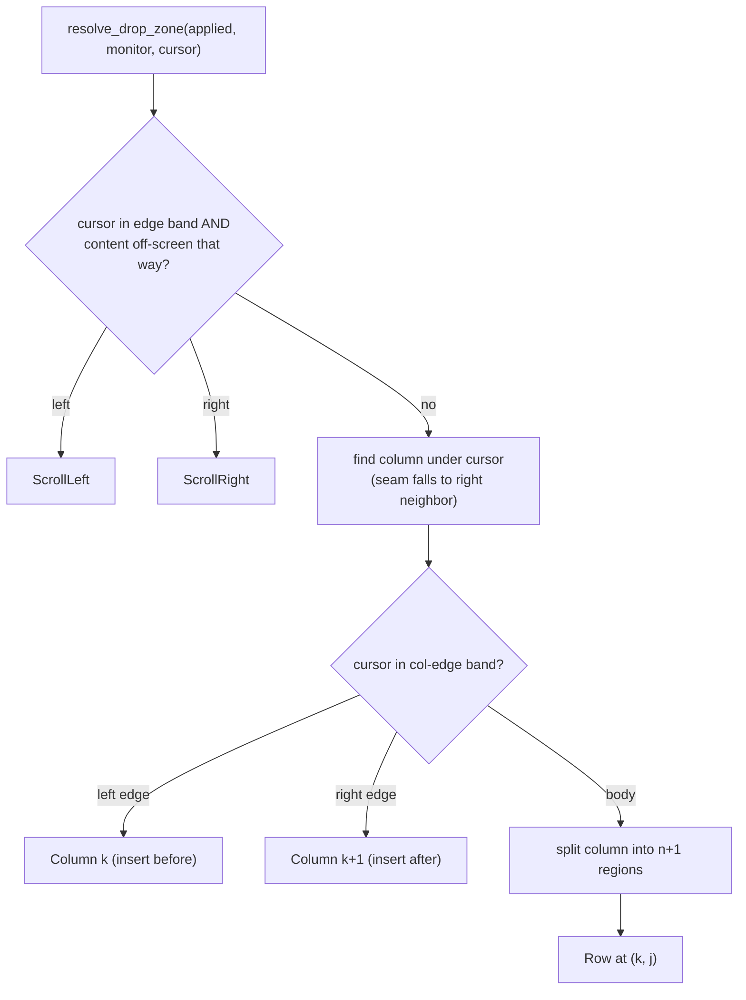

# Tile Drag

FlowWM lets the user reposition a tiled window by dragging its title bar. As
the cursor moves, the *other* windows reflow in real time to show where the
dragged window will land; on release the layout commits and the dragged
window snaps into its tile.

The drag works **entirely within the tiling model**. A tile never becomes a
float mid-drag, and a float never becomes a tile. Dragging a floating window
is handled by the ordinary float-sync path (`store_float_rect`), not by this
module. There is no config flag — the feature is always on.

This is a deliberate departure from the earlier design, which converted the
dragged window to a float for the duration of the drag and converted it back
to a tile on release. That round-trip pulled in a `DragSource` enum, a center
"promotion" region, a dwell timer, an animation lock, and several
cancel-path hazards — none of which bought any structural capability the
cursor→layout map cannot express directly. The rationale is laid out at the
end of this chapter.

## Drag Lifecycle

The drag is driven by Win32's built-in move/resize system. Grabbing a title
bar fires `EVENT_SYSTEM_MOVESIZESTART`; releasing fires
`EVENT_SYSTEM_MOVESIZEEND`; between them, a stream of
`EVENT_OBJECT_LOCATIONCHANGE` events reports every pixel of movement.

```mermaid
stateDiagram-v2
    [*] --> Idle
    Idle --> Dragging: MoveSizeStart (Tiling::Active)
    Dragging --> Dragging: LocationChange
    Dragging --> Committing: MoveSizeEnd
    Committing --> Idle: commit zone, animate (incl. dragged)
    Dragging --> Idle: window destroyed (clean cancel)
```

Each `LocationChange` while dragging does three things — follow the dragged
window's border to the mouse, resolve the drop zone under the cursor, and
re-submit a non-committing preview of how the *other* windows would reflow.
Details in *Continuous Preview & Commit-on-Release* below.

The `Dragging` state is `Option<DragState>` on the `FlowWM` struct.
`DragState` (`src/daemon/drag.rs`) holds only three fields:

- `dragged_id: WindowId` — the dragged window's layout-engine identity.
- `dragged_hwnd: isize` — its Win32 HWND, used for `GetWindowRect` and for
  the `DRAGGED_HWND` global that bridges the hook thread and the main loop.
- `current_zone: Option<DropZone>` — the drop zone currently under the
  cursor. `None` until the first `on_drag_move`; this is the value committed
  on release.

There is no `DragSource`, no dwell timer, no animation lock, no center-preview
flag — those belonged to the float-conversion and dwell models and are gone.

Three handlers on `FlowWM` (`src/daemon/drag.rs`) respond to the three hook
events:

- `on_drag_start` — only a `Tiling::Active` window enters `DragState`. Any
  other window state causes an early return. This single guard is the entire
  reason floating drags need no special routing (see *Event Pipeline* below).
- `on_drag_move` — follows the border, resolves the zone, submits a
  non-committing preview. Never mutates the committed layout's window
  placement.
- `on_drag_end` — the **sole** point at which window placement is committed.
  Runs the final `preview_move`, calls `ensure_column_visible` to scroll the
  dropped window's column into view if it landed off-screen, commits the
  resulting virtual layout, and animates — this time *including* the dragged
  window, which snaps from its mouse-following position into its tile.

**Abort paths.** If the dragged window is destroyed mid-drag (closed from the
taskbar, monitor detached, etc.), `on_drag_end` finds it absent from the
registry and returns early — after `clear_dragged_hwnd` has already released
the global, so the `DRAGGED_HWND` bridge never leaks. `MoveSizeEnd` always
`take()`s the `DragState`, so a duplicate or spurious end event is harmless.

## Event Pipeline

The drag rides on Win32's standard move/resize mechanism — the same events
that let the OS draw the moving window also drive FlowWM's layout preview. No
low-level mouse hook is involved.

**Hook registration.** The hook thread registers an
`EVENT_SYSTEM_MOVESIZESTART` (0x000A) through `EVENT_SYSTEM_MOVESIZEEND`
(0x000B) range hook, producing two `HookEvent` variants: `MoveSizeStart` and
`MoveSizeEnd`. These fire for every window — tiled or floating — and route to
`on_drag_start` / `on_drag_end`, which gate internally on window state.

**`DRAGGED_HWND`.** A static `AtomicIsize` (default 0) that bridges the hook
thread and the main thread without sharing mutable state through the callback.
The daemon sets it (`set_dragged_hwnd`, `Release` store) on `MoveSizeStart`
and clears it (`clear_dragged_hwnd`, writes 0) on `MoveSizeEnd`. The hook
callback reads it with an `Acquire` load.

**`LOCATIONCHANGE` forwarding.** The existing `EVENT_OBJECT_LOCATIONCHANGE`
hook forwards an event when either condition is true:

- `(is_float_hwnd(hwnd) && FLOAT_TRACKING_ACTIVE)` — the pre-existing
  float-sync filter (float windows outside a drag).
- `hwnd == DRAGGED_HWND.load(Acquire)` — the dragged tile.

All other `LOCATIONCHANGE` events are dropped. The callback remains
stateless.

```mermaid
sequenceDiagram
    participant Win as Win32
    participant Hook as Hook Thread
    participant Chan as mpsc Channel
    participant Loop as FlowWM Main Loop

    Win->>Hook: EVENT_SYSTEM_MOVESIZESTART
    Hook->>Chan: HookEvent::MoveSizeStart
    Chan->>Loop: drain
    Loop->>Loop: on_drag_start(hwnd)

    loop every pixel of movement
        Win->>Hook: EVENT_OBJECT_LOCATIONCHANGE
        Hook->>Hook: DRAGGED_HWND == hwnd?
        Hook->>Chan: HookEvent::LocationChange
        Chan->>Loop: drain
        Loop->>Loop: on_drag_move(hwnd)
    end

    Win->>Hook: EVENT_SYSTEM_MOVESIZEEND
    Hook->>Chan: HookEvent::MoveSizeEnd
    Chan->>Loop: drain
    Loop->>Loop: on_drag_end(hwnd)
```

**Main-thread routing.** `process_hook_events` dispatches the drained events.
For `LOCATIONCHANGE`, the router (`src/daemon/run.rs`) is exclusive on
`is_dragged`:

```text
if drag_state.dragged_hwnd == hwnd { on_drag_move(hwnd)              }
else                               { on_float_location_changed(hwnd) }
```

`MoveSizeStart` routes to `on_drag_start`; `MoveSizeEnd` to `on_drag_end`.

### Why float drags need no special routing

Because `on_drag_start` early-returns for any window that is not
`Tiling::Active`, a floating window's `drag_state` is never set. Its
`LOCATIONCHANGE` events therefore continue routing to
`on_float_location_changed` → `store_float_rect` for the entire drag — the
float follows the mouse in real time, exactly as it does outside a drag. That
is the whole float-drag behavior, with zero wiring in this module.

For the general hook pipeline architecture — how the hook thread, the mpsc
channel, and `WaitForMultipleObjects` interact — see *Event Pipelines*
(`docs/src/dev-guide/event-pipelines.md`).

## The Drop-Zone Map: `resolve_drop_zone`

The core of the drag is a **pure function** that maps the cursor position to a
target drop zone, given the current layout. It lives in `src/layout/preview.rs`
alongside `preview_move` (which goes the other way — zone → layout); it reads
only its arguments and touches no live state or Win32 API.



The function returns a `DropZone` (`src/layout/preview.rs`) — one of four
variants:

- `Row { col, row }` — insert as row `row` of column `col`.
- `Column { col }` — insert a new single-row column at index `col`.
- `ScrollLeft` / `ScrollRight` — scroll the viewport.

The map is layered, highest priority first.

**1. Edge scroll.** A band `edge_scroll_width` pixels wide on each monitor
edge. The cursor in the left band maps to `ScrollLeft`, but only if there is
content scrolled off-screen to the left (`viewport_offset > 0`);
`ScrollRight` only if the column content extends past the right viewport
edge. The right-edge check uses `content_right = canvas_width − gap` rather
than the raw canvas width, because `canvas_width` includes a trailing
right-edge gap that is not scrollable content — once the last column is flush
with the viewport, scrolling right would reveal nothing, so the band falls
through to column targeting instead.

**2. Column-edge band → column insert.** For the column under the cursor,
`band = max(1, min(col_edge_ratio · column_width, col_edge_max_px))`. The
cursor in the left band maps to `Column { col: k }` (insert a new column
*before* column k); the right band maps to `Column { col: k + 1 }` (insert
*after*). The `min` clamp means narrow columns still expose a usable band
(capped by the pixel limit), while wide columns don't grow an oversized one;
the `max(1)` floor guarantees even a sub-pixel band still registers.

**3. Column body → (n+1) row regions.** If the cursor is in the body of
column k (which currently has n rows), the column's height is split into
**n+1 equal regions**. The cursor's region index is

```text
j = clamp(floor((my − col.y) / (col.height / (n+1))), 0, n)
```

mapping to `Row { col: k, row: j }`.

**The (n+1) split is the key geometric insight.** A column of n rows has
exactly n+1 insertion slots — above row 0, between rows, or below row n−1.
Splitting the column height into n+1 regions makes the map a clean bijection:
every cursor y in the column maps to exactly one structural outcome, and
every outcome has a contiguous region that produces it. There are no ties and
no gaps.

**Seams and gaps.** If the cursor lands in the inter-column gap (a seam),
`resolve_drop_zone` treats it as a column insert at the right neighbor
(`Column { col: right_neighbor }`). Left of the first column maps to
`Column { col: 0 }`; right of the last column maps to append.

**Totality.** Every cursor position in the work area maps to a zone. The
function returns `None` only for the empty-workspace degenerate (no columns),
which cannot arise during a tile drag — the dragged window is itself a column
member.

**Own-column allowed.** The dragged window's own column is *not* excluded
from the map. This enables within-column reordering (drag a window down past
its sibling to swap their rows) and makes totality trivial to guarantee.
No-op drops — where the resolved zone is the window's current position — are
harmless: `preview_move` returns `None` and the preview simply resets to the
committed layout (see *Continuous Preview & Commit-on-Release* below).

## Continuous Preview & Commit-on-Release

The behavioral contract that makes the drag feel responsive without ever
corrupting the layout:

- **Window placement is frozen during the drag.** `on_drag_move` never mutates
  the committed `ScrollingSpace` layout. The *other* windows see only
  animation targets — they slide around to preview where the dragged window
  would land, but the layout engine's committed state is untouched.
- **The sole placement commit is on release.** `on_drag_end` runs
  `preview_move` one final time with the stored `current_zone`, then calls
  `ensure_column_visible` so a drop that lands off-screen auto-scrolls the
  viewport to bring the dropped column into view, commits the resulting
  virtual layout via `ScrollingSpace::commit_layout`, and calls
  `animate_layout` — which this time *includes* the dragged window (because
  `drag_state` has been `take()`n). The dragged window visibly snaps from its
  mouse-following position into its tile.

### `on_drag_move`: always submit, never commit

On each `LOCATIONCHANGE`, `on_drag_move` (`src/daemon/drag.rs`):

1. Reads the window's rect and sets its border geometry directly (see *Border
   Following* below).
2. Reads the cursor position.
3. Snapshots the committed layout and resolves the drop zone via
   `resolve_drop_zone`.
4. Updates `DragState::current_zone` (so `on_drag_end` knows where to commit).
5. **Always submits a candidate layout to the animator** — no zone-change
   gate:
   - `ScrollLeft` / `ScrollRight` → `scroll_left` / `scroll_right` +
     `animate_layout`. Viewport scroll commits live — see *Edge Scroll During
     Drag* below.
   - `Row` / `Column` → `preview_move` + `animate_preview` (non-committing).
     If `preview_move` returns `None` (the window is already at the target),
     the *committed* layout is submitted instead, resetting any stale reflow
     from a prior zone.
   - `None` (empty workspace) → nothing.

There is deliberately **no zone-change gate**. Re-submitting the same zone
every move is harmless: `preview_move` is idempotent per zone, and the
animator drops windows whose position hasn't changed (see *The Animator's Two
Properties* below). A gate would optimize an already-free operation — and,
worse, it would break edge-scrolling: a scroll zone is *cumulative* (each move
in the band should scroll another column), but a zone-equality gate would
suppress every scroll after the first.

### Why dwell is gone

The previous model used a dwell timer (`dwell_time_ms`) that required the
cursor to rest in a zone before it "fired," and directional zones **committed
on fire**. That model existed to gate mid-drag commits. Once nothing commits
mid-drag, every justification for dwell dissolves:

- **Anti-jitter.** Re-submitting the same preview is free (animator no-op).
- **Anti-accident.** A fast sweep across the layout commits nothing, because
  nothing *can* commit until release, dwell or no dwell.
- **Mid-drag commit gating.** Moot — the only commit is on release.

Removing dwell also retired the animation lock, the center "promotion"
machinery, and a class of "did the timer fire before or after the zone
changed?" race bugs.

## The Animator's Two Properties

Two animator properties make the gateless continuous-preview design work.

### The drag-exclusion filter

`submit_animation` (`src/daemon/animation.rs`) builds the per-window animation
target list. Near its top it checks `self.drag_state`: if it is `Some`, it
extracts the dragged window's `WindowId` and its border HWND and **skips
both** when building the target list. The dragged window's border keeps
following the mouse via the direct `set_geometry` call; the animator never
tries to tween it back to a tiled slot.

This filter exists because `animate_layout` is called during a drag by *other*
code paths too — a `Created`, `Destroyed`, or `MinimizeStart` event for a
different window still arrives and triggers a reflow. Without the filter, those
reflows would submit a target for the dragged window at its committed tile
position, fighting the user's mouse.

The filter is lifted automatically by `on_drag_end`'s `drag_state.take()`,
which runs *before* the final `animate_layout`. On release `DragState` is
gone, the filter does not trigger, and the dragged window is included in the
batch that snaps it into its tile.

> `animate_preview` (the non-committing preview path, renamed from the old
> `animate_gap_close_preview`) goes through the same `submit_animation`, so the
> exclusion filter applies there too — the dragged window keeps following the
> mouse while the other tiles animate to the preview.

### No-op filtering — why "always submit" is free

The animator's `build_tweens` (`src/animation/batch.rs`) drops every window
whose `from == to` position, and `start_batch` (`src/animation/animator.rs`)
early-returns when the resulting tween list is empty — no batch is started,
no `animating` flag is set, nothing is rendered.

That means submitting a layout whose windows are already at their targets is
genuinely zero-cost. Which is why `on_drag_move` can re-submit the preview on
every move without a zone-change gate: if the cursor hasn't actually changed
the outcome, the animator filters the batch down to nothing and returns. The
animator is the natural dedupe point — it already compares `from`/`to` to
build tweens — so pushing the dedupe into the drag controller would just
duplicate that work, and would risk staleness (if a viewport scroll shifted
the visible rects while the zone label stayed the same, a controller-side gate
would skip the re-preview the animator would have caught).

## Border Following — The Fourth Movement Path

(borders.md) documents three ways a border overlay moves: the animator path
(for tiled windows), the float-hook path (for floating drags), and the
teleport path (for workspace switch). Tile-drag adds a fourth.

During a drag, `on_drag_move` reads the window's current screen rect via
`GetWindowRect`, translates it to a visible rect, and calls
`border.set_geometry(float_border_rect(...))` directly — one `SetWindowPos`
per `LOCATIONCHANGE`. The border follows the mouse in real time, bypassing
the animator entirely for the dragged window.

Why bypass the animator? Because the dragged window's position is controlled
by the user's mouse, not by the layout engine. Sending it through the animator
would fight the user: the animator would tween it back toward a tiled slot
while the mouse is actively pulling it away. The direct `set_geometry` call
hands the position over to Win32's own drag loop, exactly as it does for
floating windows. (This is the same reason the exclusion filter of the
previous section exists — the two mechanisms cooperate: the filter keeps the
animator from targeting the dragged window, and the direct `set_geometry`
puts the border where the mouse actually is.)

| Path | When | How |
|------|------|-----|
| Animator | Tiled window animates to a new slot | Flattened into `Vec<WindowTarget>` alongside the window |
| Float hook | Floating window dragged (outside a tile drag) | `set_geometry(visible_rect)` after registry update |
| Teleport | Bystander during a workspace switch | `set_geometry(visible_rect)` directly |
| **Tile drag** | **Tiled window being dragged** | **`set_geometry(float_border_rect)` directly** |

## Edge Scroll During Drag

Dragging the window against the left or right monitor edge scrolls the
viewport so the user can reach columns that are currently off-screen. This is
a **live commit**: `scroll_left` / `scroll_right` mutate `viewport_offset`
immediately, then `animate_layout` animates the *other* windows to their
scrolled slots. The dragged window's border keeps following the mouse (the
exclusion filter skips it); only the background canvas moves.

This is the one intentional exception to "the committed layout is frozen
during the drag." The freeze applies to **window placement** — which windows
sit in which columns and rows. The viewport offset is a **view** parameter:
the user expects the canvas to scroll when they drag to the edge, and they
expect it to stay scrolled. Treating viewport scroll as committed-live
matches that expectation, and matches Niri's behavior.

The scroll is **bounded by content**. `layout::mutations::scroll_left` /
`scroll_right` (`src/layout/mutations.rs`) return `None` once there is nothing
left to reveal (their own `viewport_offset <= 0` / `new_offset > max_offset`
checks), so holding the window at the edge scrolls until the content runs out
and then stops — no runaway.

> **Known limitation — stationary edge-scroll.** Edge-scroll fires on
> `LOCATIONCHANGE`, i.e. while the dragged window is *moving*. If the user
> holds the cursor perfectly still at the edge, no `LOCATIONCHANGE` is
> generated and scrolling stops. Continuous *stationary* edge-scroll would
> need a repeating timer (Niri uses one); it is not implemented here.

## The Busy Gate

During a drag the layout is in a transient state — the committed virtual
layout does not reflect the user's intent until they release. Layout-mutating
IPC commands are rejected to prevent them from racing the drag.

At the top of `dispatch()`, before matching on the `SocketMessage` variant,
the daemon checks (`src/daemon/dispatch.rs`):

```rust
if self.drag_state.is_some() && msg.is_layout_mutating() {
    return SocketResponse::Busy;
}
```

`SocketMessage::is_layout_mutating()` returns `true` for commands that touch
window positions, focus, layout state, or workspace assignment — focus moves,
swaps, scroll, column resize, mode toggles, workspace switch, promote/merge,
`set-window`, `close-window`, and `reload-config`. Read-only queries
(`query-*`, `get-*`) and daemon lifecycle commands (`ping`, `stop`) pass
through normally. The client receives `{"status":"busy"}` and may retry once
the drag ends.

## Config

The `[drag]` section (`DragConfig` in (`src/config/types.rs`)) has three
knobs:

| Field | Default | Meaning |
|-------|---------|---------|
| `edge_scroll_width` | `30` | Pixel width of the left/right monitor-edge scroll bands |
| `col_edge_ratio` | `0.18` | Fraction of column width used as the column-insert band floor |
| `col_edge_max_px` | `72` | Pixel cap on the column-insert band (`band = max(1, min(ratio · width, max_px))`) |

Per the project's config-defaults rule, **code is the single source of
truth**: the `Default` impl on `DragConfig` holds the authoritative defaults,
and `default-config.toml` is a hand-written example kept in sync by the
`default_config_toml_matches_compiled_defaults` test in (`src/config/types.rs`).

The three knobs removed in this redesign — `dwell_time_ms`,
`left_right_zone_ratio`, `upper_lower_zone_ratio` — belonged to the old
dwell-timer + Area2D-stripes model and have no role under `resolve_drop_zone`:
dwell is gone because nothing commits mid-drag, and the Area2D strips were a
different (and more ambiguous) cursor-partition than the layered
edge → column-edge → (n+1)-body map.

## Why This Design

A few words on the load-bearing decisions, since most of the complexity the
drag *could* have is complexity it deliberately does not have.

**No tile↔float conversion.** The cursor→layout map is sufficient to express
every tile-repositioning outcome (move, swap, column insert, column reorder,
edge-scroll). Letting a drag cross the tile/float boundary would add a mode
switch — a `DragSource` enum, float bookkeeping for the duration of the drag,
a center "promotion" region, and a cancel path that has to remember which
side to return to — for no structural capability the map cannot already
express. Floats already have their own real-time sync path; reusing it for
float drags is cheaper than special-casing them.

**The (n+1) row split.** A column of `n` rows has exactly `n+1` insertion
slots (above the first, between each pair, below the last). Splitting the
column height into `n+1` equal regions makes the map a clean bijection: every
cursor `y` in the column maps to exactly one structural outcome, and every
outcome has a region that produces it. There are no ties to break and no gaps
that fall through to a default.

**Always-submit + animator no-op, instead of a controller-side gate.** The
alternative — gating `on_drag_move` on "did the zone change?" — would save one
`preview_move` + projection per move but would introduce a latent bug: after a
viewport scroll the visible column rects shift even though the zone label has
not, so a gated preview would be stale. Pushing the dedupe into the animator
(which already compares `from`/`to` to build tweens) is both cheaper (no
duplicate work) and correct-by-construction. It also makes the scroll arms
trivially correct — a scroll zone is *cumulative*, and a gate that suppressed
re-entry into the same zone would cap scrolling at one column per band entry.

**Commit on release, not mid-drag.** The dragged window's screen position is
not on the layout grid while the user is moving it — it is wherever the mouse
is. Treating that as layout state would force the layout engine to reason
about a "free" window, which is exactly the complexity the no-conversion rule
exists to avoid. A single discrete commit on release is the only mutation
point, which makes the drag trivially atomic: either the layout changed
exactly once, in the way the preview promised, or it did not change at all.

## Cross-References

- (event-pipelines.md) — the general Win32 hook pipeline and the IPC command
  pipeline that the drag hooks into.
- (borders.md) — the first three border movement paths and the overlay
  architecture; this chapter documents the fourth.
- (animation.md) — the `RetargetFromCurrent` policy that smooths rapid
  retargets, and the batch/tween pipeline the exclusion filter and no-op
  filter live inside.
- (layout/pipeline.md) — how `AppliedLayout` is produced by the
  mutate-then-project pipeline that `resolve_drop_zone` reads and
  `preview_move` writes.
- (floating-space.md) — the float-sync path (`store_float_rect`) that handles
  floating-window drags; the tile drag never enters it.
