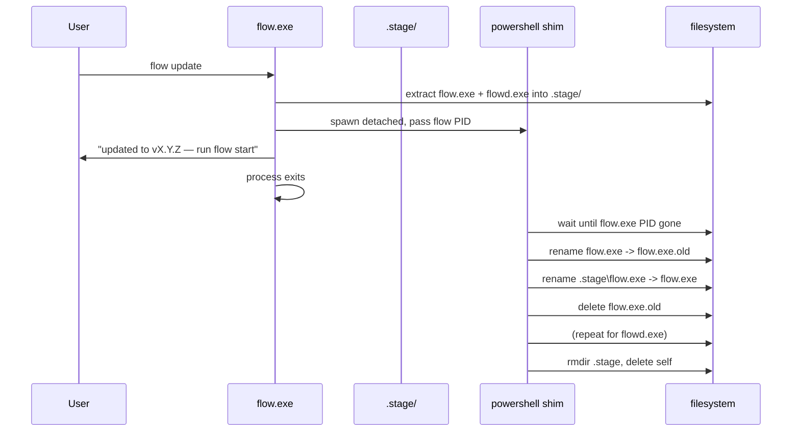

# Self-Update (`flow update`)

`flow update` pulls the latest release from GitHub, verifies it, and replaces the
running `flow.exe` and `flowd.exe` in place. It is a single command with one
optional flag:

| Command | Action |
|---------|--------|
| `flow update` | Download, verify, stage, and swap in the latest release |
| `flow update --check` | Print whether an update is available; exit non-zero if so. Safe while the daemon runs. |

The install path is self-located: `flow` updates whichever copy of itself is
running, via `std::env::current_exe().parent()`. No registry key, config file,
or `PATH` entry is consulted. This matches the existing
[`find_daemon_exe`](../../src/bin/flow.rs) convention — `flowd.exe` is assumed to
live next to `flow.exe`, and both are replaced together.

## The Windows File-Lock Problem

The central design constraint is that **Windows refuses to open a running `.exe`
for write**. While `flow.exe` is executing, its image file is locked by the
kernel; the same is true for `flowd.exe` while the daemon is running. A naive
updater that downloads a new binary and overwrites the old one in place fails
with `ERROR_SHARING_VIOLATION` on the very file it is trying to replace.

There is a narrow escape: **Windows does allow a running executable to be
renamed** (moved within the same volume) but not overwritten or deleted. This is
the primitive the updater exploits. The flow is:

1. Download the new archive into memory.
2. Extract the two binaries to a `.stage/` directory **next to** the install
   dir.
3. Spawn a detached helper process (the *shim*) that outlives `flow.exe`.
4. `flow.exe` exits.
5. The shim waits for `flow.exe`'s PID to disappear, then for each binary:
   - renames the running file to `<name>.old` (rename is allowed),
   - renames the staged file into place,
   - deletes `<name>.old`.
6. The shim removes `.stage/` and deletes itself.

By the time the shim renames anything, `flow.exe` has exited and `flowd.exe` is
guaranteed absent (see [Refuse-if-running](#refuse-if-running) below), so the
rename window is contention-free.

### Refuse-if-running

The updater refuses to proceed if `transport::is_daemon_running()` reports a live
daemon, telling the user to run `flow stop` first. This is a deliberate UX
choice rather than a technical limitation:

- It avoids a surprise window shuffle — `flow stop` runs
  [graceful-shutdown window rescue](ipc-and-watchdog.md#graceful-shutdown-window-rescue),
  which the user should see happen explicitly, not as a side effect of an update.
- It simplifies the shim: with `flowd.exe` guaranteed absent, the shim only
  needs to wait for **one** PID (`flow.exe` itself) before swapping.

`flow update --check` is exempt from this guard because it only queries the
GitHub releases API and never touches local files — it is safe to run any time,
including while the daemon is actively tiling.

## Version Comparison

Versions come from two sources:

- The running binary's version: `env!("CARGO_PKG_VERSION")` (e.g. `0.1.0`).
- The latest release's version: the `tag_name` field of the GitHub releases API
  response (e.g. `v0.1.1`).

Both are parsed into a `(u32, u32, u32)` tuple and compared with tuple ordering.
The leading `v` on the tag is stripped before parsing. This deliberately avoids
pulling in a semver crate — FlowWM uses plain `MAJOR.MINOR.PATCH` integers with
no pre-release suffixes, so a three-tuple is the exact model. `--check` returns
"up to date" when the tuples are equal; the install path returns early (a
no-op success) when not strictly newer, so re-running `flow update` after a
successful update is idempotent.

## Integrity Verification

Every release ships a SHA-256 sidecar (`<zipname>.sha256`) alongside the zip,
produced by `Get-FileHash` in the release workflow (see
[`.github/workflows/release.yml`](../../../.github/workflows/release.yml)). The
updater:

1. Downloads the sidecar first and parses the 64-hex-character hash out of its
   GNU-coreutils-style `<hash>  <filename>\n` format.
2. Downloads the zip into memory and computes `SHA256` over the bytes via the
   [`sha2`](../../src/updater/mod.rs) crate.
3. Compares the computed lowercase-hex digest against the sidecar hash
   (case-insensitively — `Get-FileHash` emits uppercase, the Rust digest is
   lowercase).
4. Aborts with `UpdateError::ShaMismatch` if they disagree.

The zip is never extracted or written to disk before the hash check passes.

## Edge-Case Guards

Two environment checks run before any download:

- **Running-from-zip**: if `current_exe()` resolves to a path containing
  `\TempN_` (Windows' temporary folder for opened-in-place zip extraction), the
  updater aborts with `UpdateError::RunningFromZip`. Updating a binary inside a
  transient extraction folder would "succeed" but be discarded the moment the
  user closes the zip viewer.
- **Read-only install directory**: a writability probe (create and delete a
  `.flow-write-probe` temp file) catches `Program Files` installs that need
  elevation. The updater reports `UpdateError::ReadOnlyDir` rather than failing
  mysteriously halfway through the swap.

## Code Path

| Step | Location |
|------|----------|
| Public entry points | `check_for_update`, `perform_update` in [`src/updater/mod.rs`](../../src/updater/mod.rs) |
| CLI wiring | `cmd_update` in [`src/bin/flow.rs`](../../src/bin/flow.rs) |
| Daemon-running guard | `transport::is_daemon_running` in [`src/ipc/transport.rs`](../../src/ipc/transport.rs) |
| Shim script builder + spawner | [`src/updater/shim.rs`](../../src/updater/shim.rs) |

The `updater` module is a sibling of the other top-level modules under `src/`
(registered in [`src/lib.rs`](../../src/lib.rs)). It depends only on
`flow_wm::ipc::transport` for the daemon-running guard — it does not touch the
layout engine, window registry, or config system.

## Cross-References

- [IPC](ipc-and-watchdog.md) -- the named-pipe transport used for the
  daemon-running guard and for `flow stop`
- [Architecture](architecture.md) -- subsystem overview
- [Roadmap](roadmap.md) -- future work (e.g. delta updates, package-manager
  integration)
