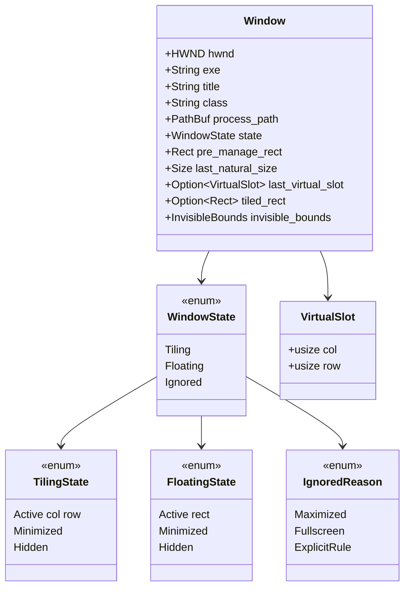
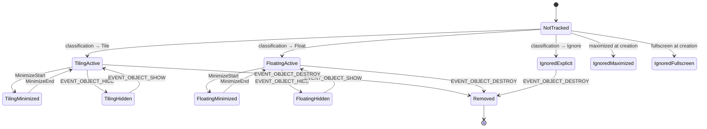
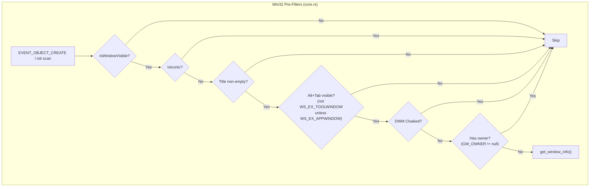
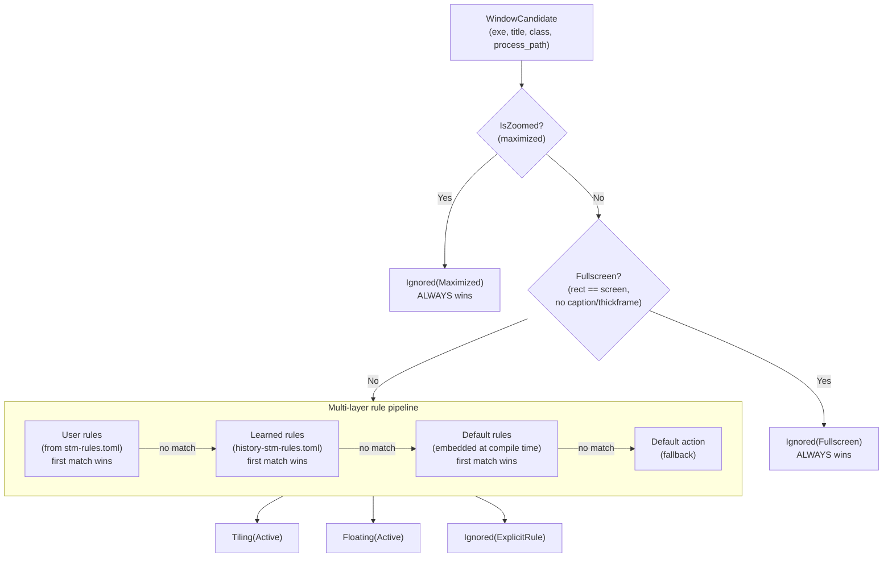

# Window Registry

The window registry is the bridge between the Windows OS and stm's internal
layout model. It hooks into Win32's `SetWinEventHook` system, classifies every
window as `Tiling`, `Floating`, or `Ignored`, and maintains per-window state
throughout the entire window lifecycle. All classification logic is pure Rust
with no Win32 dependencies, making it fully unit-testable.

## What the Registry Owns

`WindowRegistry` ([`src/registry/core.rs`](../../src/registry/core.rs)) is a
single struct that owns:

- A `HashMap<isize, Window>` — the authoritative map of HWND values (as `isize`
  for `Send` safety) to per-window metadata: exe name, title, class, process
  path, classification state, pre-manage rect, invisible bounds, and virtual-slot
  position.
- A `ClassificationPipeline` — pre-compiled user rules, default rules, and a
  fallback action, used to classify every new window.
- A `focused` field tracking the currently focused window.

The registry is owned directly by `ScrollTilingManager` on the IPC thread. The
hook thread never touches it — it only sends typed `HookEvent`s through an
`mpsc` channel. See [threading model](./threading-model.md) for the full
threading picture.

## Window State Model

The `Window` struct ([`src/registry/types.rs`](../../src/registry/types.rs)) is the
single record for every tracked window. Its `state` field determines how the
layout engine and animation layer interact with it. `VirtualSlot` bridges the
registry to the layout engine — when a tiled window is minimized, its column/row
position is saved here and restored on un-minimize.

### State Transitions

Three things are not yet implemented: transitions between `Tiling`,
`Floating`, and `Ignored` via user commands (toggle float, maximize while tiled),
and the reverse direction from `Ignored(Maximized)` back to tiling (a tiled window
becoming maximized). Only the recovery direction works: an `Ignored(Maximized)`
window restored by the user is re-classified via `STATECHANGE`.

## The Classification Algorithm — Deep Dive

Classification is the central decision pipeline that runs every time a window
appears. It determines whether the window participates in tiling, floats freely,
or is ignored entirely. The algorithm has two phases: **Win32 pre-filters**
(checked in the registry before any classification) and the **rule pipeline**
(pure logic in the `classification` module).

### Phase 1: Win32 Pre-Filters

Before the classification pipeline sees a window, the registry runs a series of
cheap Win32 checks. These are ordered from cheapest to most expensive to avoid
unnecessary process queries:

Each filter exists for a specific reason:

1. **Visibility** (`IsWindowVisible`) — invisible windows have no place in the
   layout. Note that minimized windows pass this check (`WS_VISIBLE` stays set),
   which is why the iconic check exists separately.

2. **Not iconic** (`IsIconic`) — minimized windows should not be tiled. They
   are caught later by `MinimizeStart` events instead.

3. **Non-empty title** (`GetWindowTextLengthW`) — titleless windows are
   typically internal containers or splash screens. This is the gate that causes
   late-titling apps (Windows Terminal) to be dropped on creation and recovered
   later via `NAMECHANGE`.

4. **Alt+Tab visibility** — a two-part check. First, the `WS_EX_TOOLWINDOW`
   extended style: windows with this style are hidden from Alt+Tab (tool
   windows, tray icons, floating toolbars). However, `WS_EX_APPWINDOW` forces
   visibility even if `WS_EX_TOOLWINDOW` is set. Second, a DWM cloak check
   (`DWMWA_CLOAKED`) filters out suspended UWP background frames like
   `ApplicationFrameHost.exe` that are technically "visible" to Win32 but not
   rendered on screen.

5. **No owner** (`GetWindow(GW_OWNER)`) — owned windows are dialogs or popups
   that belong to their parent. They should not be independently tiled.

### Phase 2: Rule Pipeline

Windows that survive the pre-filters enter the classification pipeline
([`src/registry/classification.rs`](../../src/registry/classification.rs)). The
pipeline is platform-independent — it receives a `WindowCandidate` (a plain Rust
struct with no HWND) and returns a `WindowState`.

Maximized and fullscreen overrides always take precedence over rules. A window
that is maximized will always be `Ignored(Maximized)` even if a config rule says
to tile it — maximized and fullscreen windows have their own management behavior
that conflicts with tiling.

### Rule Matching Details

Within each rule layer, rules are evaluated top-to-bottom with first-match-wins
semantics. Each rule has a `match` section with zero or more fields:

| Field | Match mode | Case sensitivity |
|-------|-----------|-----------------|
| `exe` | Exact | Case-insensitive |
| `exe_regex` | Regex (full string) | Case-insensitive |
| `title` | Exact | Case-sensitive |
| `title_contains` | Substring | Case-sensitive |
| `title_regex` | Regex (full string) | Case-sensitive |
| `class` | Exact | Case-sensitive |
| `class_regex` | Regex (full string) | Case-sensitive |
| `process_path` | Exact | Case-insensitive |
| `process_path_regex` | Regex (full string) | Case-insensitive |

AND logic applies: every specified (non-`None`) field in a rule must match. If a
regex pattern fails to compile, it logs a warning and treats the field as
non-matching rather than crashing the daemon. Inline regex flags like `(?i)` and
`(?-i)` let users override the default case sensitivity for specific patterns.

All regex patterns are pre-compiled at pipeline construction time into
`CompiledRule` structs, so the per-classification cost is pure matching with zero
allocations.

### Notable Default Rules

The embedded default rules (from
[`default-stm-rules.toml`](../../default-stm-rules.toml)) catch several
well-known Windows edge cases:

**Chromium Legacy Window filtering.** Every Chromium-based application (Chrome,
Edge, VS Code/Electron, Slack, Discord) spawns an invisible helper window with
class `Chrome_RenderWidgetHostHWND` and title "Chrome Legacy Window". This window
passes all Win32 pre-filters — it is "visible", titled, not tool-window, and not
cloaked — yet it is never shown to the user. Without an explicit ignore rule,
it would enter the tiling layout and cause layout churn every time Chromium opens
or closes a tab. The default rule matches on `class` (identical across all
Chromium hosts) rather than `exe` (which differs per application), so a single
rule covers every Chromium-based app. Class matching is also race-free — the
class is assigned at creation time, while the title may arrive milliseconds later.

**Taskbar, search, and system UI.** Windows like `Shell_TrayWnd` (the taskbar),
`Windows.UI.Core.CoreWindow` (Settings), and various system overlay windows are
ignored by default rules. These windows are either always-on-top or interact with
the shell in ways that conflict with tiling.

## The `InvisibleBounds` Concept

`GetWindowRect` returns the full window rectangle, but on Windows 10/11 this
includes invisible borders — typically ~7px on the left, right, and bottom
edges — used for drop shadows and resize hit-testing. This means `GetWindowRect`
is **not** the visual rect of the window.

The registry measures each window's invisible borders once at registration time
by comparing `GetWindowRect` against `DwmGetWindowAttribute(DWMWA_EXTENDED_FRAME_BOUNDS)`,
which returns the rect that the user actually sees. The difference is stored as an
`InvisibleBounds` struct (`{left, top, right, bottom}`) in the `Window`. If either
query fails (DWM unavailable, window destroyed mid-query), the bounds default to
zero (fail-open — the window may have slightly larger gaps, but this is preferable
to crashing).

The animation bridge later uses `InvisibleBounds` to translate between the
layout engine's visible-rect coordinates (what the user sees) and Win32's
window-rect coordinates (what `SetWindowPos` expects). See
[animation](./animation.md) for how this translation works.

## Hooks Used

The registry listens to eight Win32 events registered via `SetWinEventHook` on a
dedicated background thread:

| Hook | Win32 event | Meaning | Action |
|------|-----------|---------|--------|
| Create/Destroy range | `EVENT_OBJECT_CREATE` / `EVENT_OBJECT_DESTROY` | Window lifecycle | Classify and register, or remove from registry |
| Foreground | `EVENT_SYSTEM_FOREGROUND` | Focus changed | Update `focused` field |
| Minimize range | `EVENT_SYSTEM_MINIMIZESTART` / `EVENT_SYSTEM_MINIMIZEEND` | Minimize/restore | Transition Active to/from Minimized, save/restore virtual slot |
| Show/Hide range | `EVENT_OBJECT_SHOW` / `EVENT_OBJECT_HIDE` | Visibility | Reconcile visibility (tray-hide, DWM cloak, re-show) |
| StateChange | `EVENT_OBJECT_STATECHANGE` | State bits changed | Recovery: re-classify `Ignored(Maximized/Fullscreen)` windows when the user restores them |
| NameChange | `EVENT_OBJECT_NAMECHANGE` | Title changed | Recovery: re-attempt registration for windows not yet tracked (late-titling apps like Windows Terminal) |

`EVENT_OBJECT_LOCATIONCHANGE` is deliberately **not** hooked — it fires on every
pixel of window movement and would flood the event channel. Maximize/restore is
already covered by `STATECHANGE`.

`STATECHANGE` and `NAMECHANGE` are registered as single-event hooks (min == max)
so the intervening `LOCATIONCHANGE` (which sits between them numerically) is
excluded from the range.

### Recovery Hooks

Two hooks exist specifically to recover windows that `EVENT_OBJECT_CREATE`
misses. `CREATE` fires very early in the Win32 lifecycle — before a window is
visible, titled, or has finalized its styles. The recovery hooks give stm a
second chance:

- **NAMECHANGE recovery**: apps like Windows Terminal set their title
  asynchronously, often more than 500ms after creation. When the title finally
  lands, `NAMECHANGE` fires and the daemon re-attempts registration — but only
  for windows not already tracked, to avoid re-classifying every window on every
  title change.

- **STATECHANGE recovery**: a window that starts maximized is classified
  `Ignored(Maximized)`. When the user restores it, `WS_MAXIMIZE` flips and
  `STATECHANGE` fires. The daemon re-classifies the window (now not maximized)
  and adds it to the layout. Only windows currently `Ignored(Maximized|Fullscreen)`
  are re-evaluated, so the common-case cost is a single `HashMap` lookup.

## Recovery Snapshot (Planned)

The `stm-watchdog` binary ([`src/bin/stm-watchdog.rs`](../../src/bin/stm-watchdog.rs))
is designed to restore windows if the daemon crashes. The watchdog would read a
`stm-recovery.json` file written by the daemon on every state mutation and call
`SetWindowPos` for each entry to put windows back at their pre-manage positions.
This feature is currently a stub — the watchdog exists but the atomic
write-to-temp-then-rename persistence logic is not yet implemented. The `Window`
struct already carries `pre_manage_rect` for this purpose.

## Cross-References

- [Event pipelines](./event-pipelines.md) — how the daemon routes hook events
  to registry handlers and coordinates with the layout engine.
- [Config and persistence](./config-and-persistence.md) — the `stm-rules.toml`
  format for user-defined classification rules.
- [Animation](./animation.md) — how the `InvisibleBounds` on each `Window` are
  used to translate visible rects to window rects for `SetWindowPos`.
- [Workspace hierarchy](./workspace.md) — where classified windows end up
  (in the active workspace's `ScrollingSpace`).
