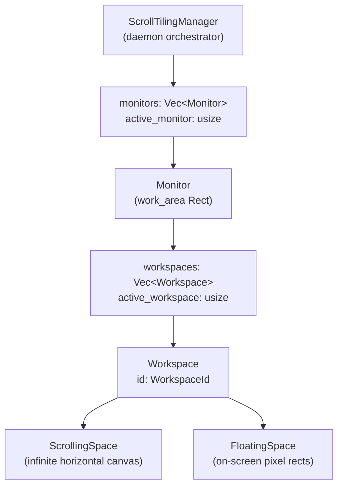

# Workspace Hierarchy

The workspace module models a niri-style virtual-desktop stack. A physical
monitor owns one or more workspaces, and each workspace splits into a tiled
half ([`ScrollingSpace`]) and a floating half ([`FloatingSpace`]). The daemon
owns the top-level `Vec<Monitor>` and routes every tiling operation through
the active monitor's active workspace.

## The Hierarchy

The tree has four levels, rooted on the daemon struct `ScrollTilingManager`:

`ScrollTilingManager` is defined in [`src/daemon/mod.rs`](../../src/daemon/mod.rs). It
holds `monitors: Vec<Monitor>` and `active_monitor: usize`, giving O(1) access
to the active monitor through [`active_scrolling()`] and [`active_scrolling_mut()`].

[`ScrollingSpace`]: ../../src/workspace/scrolling_space.rs
[`FloatingSpace`]: ../../src/workspace/floating_space.rs
[`active_scrolling()`]: ../../src/daemon/mod.rs
[`active_scrolling_mut()`]: ../../src/daemon/mod.rs

## Accessing the Active Scrolling Space

Every IPC command and hook-event handler ultimately calls one of two accessors
on `ScrollTilingManager`:

- `active_scrolling()` — immutable borrow of the active workspace's `ScrollingSpace`.
- `active_scrolling_mut()` — mutable borrow, used for mutations like
  `add_window`, `swap_column`, or `scroll`.

These accessors chain through two indirection layers:
`ScrollTilingManager` -> active `Monitor` -> active `Workspace` -> `ScrollingSpace`.
The daemon never exposes raw monitor or workspace indices to callers; the accessors
hide the traversal. See [`Monitor::active_scrolling`](../../src/workspace/monitor.rs)
for the implementation.

## Current Skeleton Invariant

At this stage the daemon creates exactly **one monitor** (the primary
display) carrying a fixed stack of **ten workspaces** (id `1..=10`,
1-indexed, default active = workspace 1). Multi-monitor support is future
work. Workspace 1 inherits the scrolling space built from the windows that
were already open at startup; workspaces 2..=10 start empty. All ten
workspaces share the same layout parameters so columns size consistently
when the user switches between them or moves windows across. The count is
hard-coded in [`src/daemon/new.rs`](../../src/daemon/new.rs)
(`WORKSPACE_COUNT = 10`) rather than read from config.

The monitor carries two rectangles: the full physical `screen_rect`
(taskbar included, used for parking non-active workspaces off-screen) and
the taskbar-excluded `work_area` (used for in-workspace tiling). The
`work_area` is also copied into each workspace's `ScrollingSpace`
(inside its `MonitorInfo`) for the projection pipeline. The duplication is
benign with a single monitor and will be rationalised when multi-monitor
lands.

## Two Coordinate Spaces

Each workspace contains two fundamentally different spatial models:

**ScrollingSpace** is an infinite horizontal canvas. Windows live in virtual
coordinates (columns, each with a width and vertical stack of windows). A
camera/viewport selects which slice of the canvas is visible, then the
projection pipeline maps those virtual coordinates to actual on-screen pixel
rectangles. This is the entire tiling engine; see [layout overview](./layout/overview.md)
for the virtual-to-actual pipeline.

**FloatingSpace** tracks literal on-screen pixel rectangles. It does not
participate in the virtual-to-actual pipeline at all — floating windows are
stored as `ActualEntry` values (the same type the projection produces) and
submitted directly to the animator. See [floating space](./floating-space.md)
for the full architecture: the tile↔float transitions, animation batch
merging, focus model, and configuration.

The key design consequence: a workspace never mixes the two spaces at the layout
level. When the daemon submits an animation batch, each workspace's scrolling
layout and floating layout are **merged** into a single `ActualLayout` so that
both tiles and floats ride together in the same `animate_workspaces` call.

## Vertical Scrolling Between Workspaces

The horizontal scrolling inside a `ScrollingSpace` (left/right across columns)
has a vertical analogue. Workspaces are stacked "above" and "below" the
active one — the same packing idea used horizontally between columns but
applied vertically between workspaces. Switching workspaces animates the
whole stack vertically.

Three IPC commands implement this surface:

- `stm dispatch switchworkspace <id>` — switch the active workspace.
  **Implemented.** Animates a vertical-packing switch: the source and
  destination workspaces slide between their parked y-offsets in a single
  coordinated animation batch.
- `stm dispatch movetoworkspace <id>` — move the focused window to another
  workspace. **Implemented.** Mutates both the source and destination
  layouts, then switches the camera to the destination so the moved window
  is brought into view.
- `stm dispatch swapworkspace <id>` — swap the active workspace with another.
  **Stub.** Its protocol shape is locked in, but its animation model (two
  workspaces exchanging positions in the packed stack) is not yet decided,
  so it currently returns `unimplemented_command`.

### Switch animation: animate / teleport / skip

Every non-empty workspace on the active monitor is classified into exactly
one of three buckets during a switch:

| Bucket | Workspaces | Action |
|--------|------------|--------|
| **Animate** | source (previously active) + destination | submitted to `animate_workspaces` as a single coordinated batch |
| **Teleport** | bystanders whose parked side changed (e.g. ws 3-7 when switching 2 → 8) | submitted to `teleport_workspaces` — instant `SetWindowPos`, no animator |
| **Untouched** | bystanders whose parked side stayed the same | skipped entirely |

Parked workspaces sit one full physical monitor height (plus one
`window_gap`) above or below the active workspace — the full height keeps
them completely off-screen past the taskbar strip. Teleport runs before
animate so the bystander "backdrop" snaps into place before the participant
transition begins. Floating windows merge with tiles per workspace and ride
along in the same batch. See `switch_active_workspace` in
[`src/daemon/dispatch.rs`](../../src/daemon/dispatch.rs) for the full
algorithm, and [roadmap](./roadmap.md) for the remaining `SwapWorkspace`
work.

## What Lives Here vs. What Doesn't

The workspace module is deliberately thin. It owns the container types (`Monitor`,
`Workspace`, `WorkspaceId`) and the two space types. It does **not** own:

- **Window metadata** — HWNDs, titles, classes, and process paths live in
  `WindowRegistry` (see [window registry](./window-registry.md)).
- **Tile/float/ignore classification** — the registry decides what state a
  window is in; the workspace only receives `WindowId`s that the daemon has
  already classified as tiling-eligible.
- **IPC plumbing and hooks** — these are direct fields on `ScrollTilingManager`.
  The hook thread sends `HookEvent`s over an `mpsc` channel; the daemon's IPC
  thread processes them and routes mutations to the workspace. See
  [event pipelines](./event-pipelines.md) for the full flow.
- **Animation** — `WindowAnimator` is a sibling field on the daemon, not
  something the workspace knows about. The daemon calls `animate_layout()` after
  every mutation that produces an `AppliedLayout`.

A workspace never touches Win32. It only knows about `WindowId`s, `Rect`s,
and layout math. This isolation keeps the tiling engine testable without any
Win32 mocking.
