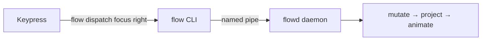

# Command Reference

This is the complete, annotated list of every `flow` command — what it does,
what arguments it takes, and (where relevant) the default hotkey it's bound to in
`flow.ahk`. For the guided tour, see the README's
[*Getting started*](https://github.com/CCpcalvin/flow-wm#getting-started).

## How a keypress reaches the daemon

Every hotkey in `flow.ahk` is a thin wrapper: it runs `flow dispatch <command>`,
which sends a single message over a Windows named pipe to the `flowd` daemon.
The daemon owns the whole layout pipeline (mutate → project → animate); the CLI
only chooses which message to send. So anything that can run a command on a
keypress — AutoHotkey, [whkd](https://github.com/LGUG2Z/whkd), PowerToys — can
drive FlowWM.



> **The modifier is configurable.** The default `flow.ahk` holds every chord with
> `Alt`. That's a single `ModKey` line at the top of the file — change it
> and every chord below follows. The hotkey column below assumes the default
> `Alt`; your setup may differ. (If `Alt` clashes with an app's menu shortcuts, see the README's *Can I use the Win key?* section.)

## Default hotkey map (quick reference)

| Hotkey (default) | Command |
|---|---|
| `Alt + h` / `j` / `k` / `l` | `focus left` / `down` / `up` / `right` |
| `Alt + Shift + h` / `j` / `k` / `l` | `move-window left` / `down` / `up` / `right` |
| `Alt + Ctrl + h` / `l` | `merge-column left` / `right` |
| `Alt + Ctrl + Shift + h` / `l` | `promote left` / `right` |
| `Alt + ,` | `shrink-column` |
| `Alt + .` | `expand-column` |
| `Alt + c` | `center` |
| `Alt + t` | `set-window cycle` |
| `Alt + q` | `close-window` |
| `Alt + 1`…`9`, `0` | `switch-workspace 1`…`10` |
| `Alt + Shift + 1`…`9`, `0` | `move-to-workspace 1`…`10` |
| `Alt + p` | `flow stop` (shuts the daemon down) |

Commands with **no default hotkey** (run them from the terminal, or bind them
yourself): `swap-column`, `swap-workspace`.

---

## Focus & navigation

### `focus <direction>`

Move focus to the neighbouring window.

- `focus left` / `focus right` — move focus to the **adjacent column** (or to the
  first/last window when at the canvas edge).
- `focus up` / `focus down` — move focus to the **window above/below** within the
  current column.

```powershell
flow dispatch focus right
flow dispatch focus up
```

Default hotkey: `Alt + h/j/k/l` (vim-style: h=left, j=down, k=up, l=right).

## Moving & rearranging windows

### `move-window <direction>`

A semantic "move" — the daemon decides the concrete effect from the focused
window's state and the direction:

- tiled, **left/right** → swap the focused column with its neighbour;
- tiled, **up/down** → swap the focused window with the one above/below inside the
  same column;
- floating → pixel nudge (deferred).

```powershell
flow dispatch move-window left
flow dispatch move-window down
```

Default hotkey: `Alt + Shift + h/j/k/l`.

### `swap-column <direction>`

Swap the entire focused column with its left or right neighbour. `direction` is
`left` or `right` only (columns are a horizontal axis).

```powershell
flow dispatch swap-column right
```

No default hotkey — bind it if you use it. (For single windows, prefer
`move-window`.)

### `merge-column <direction>`

The signature scroll move. Detach the focused window from its column and append it
as a new **bottom row** of the adjacent column, then redistribute both columns'
row heights. This is how you stack several windows into one column — the niri /
Hyprland move that makes scrolling feel better than a fixed grid.

```powershell
flow dispatch merge-column right
```

Default hotkey: `Alt + Ctrl + h` (left) / `Alt + Ctrl + l` (right).

### `promote <direction>`

Pull the focused window out of its column and place it as a new, single-window
column on the chosen side. No-op when the window is already alone in its column.

```powershell
flow dispatch promote right
```

Default hotkey: `Alt + Ctrl + Shift + h` (left) / `Alt + Ctrl + Shift + l` (right).

## Column sizing & the viewport

### `expand-column`

Widen the focused column to the next `column_width` boundary and animate. Every
column to its right slides further along the canvas.

```powershell
flow dispatch expand-column
```

Default hotkey: `Alt + .`

### `shrink-column`

Narrow the focused column to the previous `column_width` boundary and animate.

```powershell
flow dispatch shrink-column
```

Default hotkey: `Alt + ,`

### `center`

Slide the viewport so the focused column lands at the monitor midpoint. Uses the
variable-width prefix sum, so it stays correct even with expanded or shrunk
columns.

```powershell
flow dispatch center
```

Default hotkey: `Alt + c`

## Window mode (float ↔ tile)

### `set-window <mode>`

Change the focused window's tiling mode. `mode` is one of:

- `float` — detach the window from the layout and let it float freely.
- `tile` — insert the window into the scrolling column layout.
- `cycle` — toggle between float and tile (the most common choice).

FlowWM **remembers** your decision: it writes the app's tile/float choice to
`history-flow-rules.toml`, and the next time you open that app it tiles (or
floats) automatically. See
[*Classification & Learned Rules*](../dev-guide/classification.md).

```powershell
flow dispatch set-window tile
flow dispatch set-window cycle
```

Default hotkey: `Alt + t` (cycle).

## Workspaces

Workspaces are niri-style virtual desktops, stacked vertically; each one holds its
own horizontal scrolling canvas. `swap-workspace` is wired into the protocol but
the animation is still being finalised, so the daemon currently returns a
"not yet implemented" error for it.

### `switch-workspace <id>`

Switch the active workspace. The requested workspace slides into the viewport
while the previously active one parks above or below it, in one coordinated
animation. `<id>` is a positive integer (1-based).

```powershell
flow dispatch switch-workspace 2
```

Default hotkey: `Alt + 1`…`9`, `0` (0 = workspace 10).

### `swap-workspace <id>`

Exchange the positions of the active workspace and workspace `<id>` in the
vertical stack, with focus following the originally active workspace.

> **Status:** stub. The protocol shape is locked in so keybindings can stabilise;
> the daemon returns "not yet implemented" until the animation lands.

```powershell
flow dispatch swap-workspace 3   # not yet implemented
```

No default hotkey.

### `move-to-workspace <id>`

Move the focused window to workspace `<id>`. The window is detached from the
active workspace (with local focus succession — no OS foreground push) and
re-inserted into the target workspace after its focused column. Focus stays on
the source workspace.

```powershell
flow dispatch move-to-workspace 4
```

Default hotkey: `Alt + Shift + 1`…`9`, `0` (0 = workspace 10).

## Window & daemon lifecycle

### `close-window`

Ask the focused window to close itself **gently** via Win32 `WM_CLOSE` — the same
message Windows sends when you click the window's ✕ button — so the application
runs its normal shutdown logic (prompt to save, release resources, etc.). The
window is removed from the layout automatically once Win32 reports its
destruction.

```powershell
flow dispatch close-window
```

Default hotkey: `Alt + q`

---

## Beyond `dispatch` — the rest of the CLI

Everything above lives under `flow dispatch …` (the actions that change layout).
A few other top-level commands are worth knowing:

| Command | What it does |
|---|---|
| `flow start [--ahk] [--config <dir>] [--log-file <path>]` | Launch the daemon in the background. `--ahk` also starts `flow.ahk` once the daemon is listening. |
| `flow stop [--ahk]` | Stop the running daemon (and the AHK script, with `--ahk`). |
| `flow config init [--ahk]` | Write default `flow.toml` (and `flow.ahk`) into your config dir. Never overwrites existing files. |
| `flow config reload` | Tell the running daemon to re-read config from disk. |
| `flow config edit` | Open the config directory in your editor. |
| `flow config path` | Print the resolved config directory path. |
| `flow config check` | Validate `flow.toml` / `flow-rules.toml` without loading them. |
| `flow query all` | Dump every tracked window (state, rect, column/row, …) as JSON. |
| `flow enable-autostart [--ahk]` | Create the login shortcut in `shell:startup` (idempotent). |
| `flow disable-autostart` | Remove the login shortcut (idempotent). |

Browse them any time with `flow --help`, and the dispatch surface with
`flow dispatch help`.

For the daemon's internal handling of these — the named-pipe protocol, the
foreground-lock grant, crash recovery — see
[*IPC & Watchdog*](../dev-guide/ipc-and-watchdog.md).
